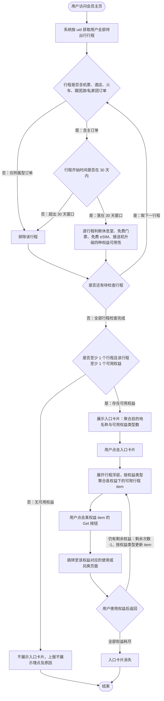

# PRD：会员页增加权益推荐模块

## 1. 文档信息

| 项 | 值 |
|----|----|
| 标题 | 会员页增加权益推荐模块 |
| 版本 | v0.1 |
| 状态 | 评审中 |
| 需求规模 | Normal |
| 业务域 | 主：会员权益；关联：行程、机票、酒店、火车 |
| 研发交付类型 | 主：客户端（App）；次：服务端（权益中台、行程聚合） |
| 更新日期 | 2026-08-12 |
| UI 链接 | [2026-H1/2025-H2_APP_Trip.com-Rewards-Page（会员主页入口 + 行程浮层）](https://www.figma.com/design/ADdYufM8o45CmrjqZBCUGA/2026-H1-2025-H2_APP_Trip.com-Rewards-Page?node-id=19269-115107&p=f&t=PAPdclqyBZxtWiru-0) |
| UX 链接 | 不适用（本需求交互与视觉同源，见 UI 链接） |
| 关联 PRD | [【PRD Demo】丰富会员页核心触点--增加多模块](https://trip.larkenterprise.com/docx/Id0qdKqDZojSVSx5ANGcdUmsnQb)（会员页整体规划）；[【PRD】休息室详情页增加可用航段](https://trip.larkenterprise.com/docx/OE5Yd2kPEogmNuxJ0YNcliJQnGh)（下迭代承接） |
| 依赖文档 | [行程接口字段说明](https://trip.larkenterprise.com/wiki/Mj8Hw09jWitXbhkYMOgcm9sAnBd)；[会员页数据摸排](https://trip.larkenterprise.com/wiki/WFxRwlenPicO9EkDhOhcoHIBnOe)；[iQuality 需求记录](http://iquality.ctripcorp.com/details?taskId=34572007&pid=undefined)；[002-对外投放链接（门票列表页跳转参数）](https://trip.larkenterprise.com/wiki/LlG0w00bbi6XNjkRoffcw8Rzn1g)；[通用标签契约文档（常驻地标签）](https://trip.larkenterprise.com/wiki/NfUtwHb5Ui3CFlkvTu5cPXtnn0b?from=space_search)；[目的地图片查询契约](http://contract.mobile.flight.ctripcorp.com/#/operation-detail/1285/89/districtGlobalizationDetail?lang=zh-CN)；[免费门票景点查询契约](https://contract.mobile.flight.ctripcorp.com/#/operation-detail/3670/63/marketingActivitySearch?lang=zh-CN)；[接送机导流查询契约](https://contract.mobile.flight.ctripcorp.com/#/operation-detail/5747/78/recommend?lang=zh-CN) |

## 2. TL;DR

**为有待出行行程的会员用户，在会员主页按「权益挂靠行程」提供权益推荐入口与浮层，让权益直接对应到即将出行的目的地。**

- 解决：用户下单后有权益使用诉求，但权益入口过深、无法与自己的行程对应。
- 价值：提升会员页渗透与会员心智，拉动会员权益核销（主测使用会员权益的订单数）。
- 时机：会员页来访用户中 40% 有近 60 天内待出行的机酒火订单，铂金及以上占 56%，dau 维度预估覆盖 2.4w 人。

## 3. 背景与目标

**背景与问题**

- **会员页渗透不足、会员心智偏弱**：会员页面 MAU 在大盘占比 11.1%（MAU 210w），是本次要拉动的基本盘。
- **用户下单后有权益使用诉求，但入口过深找不到**：现有会员页按等级罗列权益，用户无法把权益与自己即将出行的行程对上（来源：iQuality 需求记录）。
- **待出行行程与权益的重叠面足够大，值得做专门触点**：会员页来访用户中 40% 有近 60 天内待出行的机酒火订单，铂金及以上（有权益）用户占访问 UV 的 56%，dau 维度预估覆盖 2.4w 人。
- **用户行程天然多目的地，单一行程的表达不够用**：行程页用户中 60.3% 一趟旅行有 2 个以上目的地，20.6% 有 2 趟及以上旅行（来源：会员页数据摸排）。

**目标**

- G1：提升会员页面渗透 UV——大盘占比从 11.1% 提升至 12%，MAU 从 210w 提升至 227w。
- G2：强化会员心智——用户在会员主页可直接看到「下一趟行程能用哪些权益」。
- G3：提升权益核销——AB 主测指标为使用会员权益的订单数。

**北极星指标**：会员页面 MAU 在大盘的占比（四要素见「成功指标」）。

**非目标**

- N1：不做旅行打包/聚合逻辑——只取待出行行程做目的地维度处理，不使用行程聚合的「一段完整旅行」能力（2026.5.21 沟通结论）。
- N2：不把邮轮、船票订单类型纳入行程判断池。
- N3：除休息室权益详情页外，不改动其他权益子频道页。
- N4：本模块不承载权益的实际兑换与下单，只做推荐与跳转，兑换由各产线承接页完成。

## 4. 成功指标

| 指标 | 基线 | 目标 | 测量口径 | 时间窗 |
|------|------|------|----------|--------|
| 会员页面 MAU 占大盘比例 | 11.1% | 12% | 会员页面 MAU / 大盘 MAU | 月度 |
| 会员页面 MAU | 210w | 227w | 访问会员主页的去重用户数 | 月度 |
| 使用会员权益的订单数（AB 主测） | 原文未提供（待确认） | 实验组高于对照组 | 各组使用会员权益的订单数 | AB 实验观察期 |
| 全产线订单量（观测） | 原文未提供（待确认） | 不负向 | 累计订单量 | AB 实验观察期 |
| 会员页人均访问次数（观测） | 原文未提供（待确认） | 不负向 | 会员页访问次数 / 访问 UV | AB 实验观察期 |
| 会员页人均停留时长（观测） | 原文未提供（待确认） | 不负向 | 会员页停留总时长 / 访问 UV | AB 实验观察期 |
| 用户 D30 回访率（观测） | 原文未提供（待确认） | 实验组不低于对照组 | 实验组 vs 对照组 D30 回访用户占比 | 分组后 30 天 |

## 5. 用户与场景

- 目标用户：近 60 天有待出行订单、且该订单符合权益使用条件的会员用户；覆盖面测算以铂金及以上（有权益）用户为主。
- 核心场景：会员用户带着「马上要出行」的预期访问会员主页，希望一眼看到本趟行程能用哪些权益，并直接跳到可使用的位置。

**用户故事**

| 角色 | 诉求 | 价值 |
|------|------|------|
| 有待出行行程的铂金及以上会员 | 想知道即将出行的行程能用哪些权益 | 不必在各产线间翻找，权益与行程直接对应 |
| 多目的地 / 多趟行程的会员 | 想区分哪个目的地能用哪个权益 | 按权益类型聚合展示，一次看清全部可用项 |
| 已下单未使用权益的会员 | 想直接进入可兑换页面完成使用 | 从推荐位一步跳到承接页，减少路径流失 |

**覆盖面测算数据**（2026.5.20 切片，产线限定机酒火；此处为**覆盖面测算口径「近 60 天」**，区别于模块实际生效的**露出过滤口径「30 天」**，见 BR-001）

| 维度 | 数值 |
|------|------|
| 会员页访问 UV | 105,261 |
| 未来 60 天有待出行订单 UV | 42,129（占访问 UV 40.02%） |
| 铂金及以上（有权益用户）占访问 UV | 56% |
| 钻石+ 与黑钻访问人数 | 3,637；其中有待出行单 2,527（占该等级访问人数 69.48%） |

有待出行订单用户的订单笔数分布

| 订单笔数 | 全等级人数 | 占有待出行单用户 | 钻+/黑钻人数 | 占有单钻+/黑钻 |
|----------|-----------|------------------|--------------|----------------|
| 1 | 17,505 | 41.55% | 610 | 24.14% |
| 2 | 10,206 | 24.23% | 411 | 16.26% |
| 3 | 5,241 | 12.44% | 341 | 13.49% |
| 4 | 3,315 | 7.87% | 263 | 10.41% |
| 5 | 1,943 | 4.61% | 199 | 7.87% |
| 6 | 1,177 | 2.79% | 136 | 5.38% |
| 7 | 781 | 1.85% | 108 | 4.27% |
| 8 | 535 | 1.27% | 76 | 3.01% |
| 9 | 360 | 0.85% | 66 | 2.61% |
| 10+ | 1,066 | 2.53% | 317 | 12.54% |
| 合计 | 42,129 | 100% | 2,527 | 100%（占访问该等级 69.48%） |

## 6. 业务流程

整体采用**权益挂靠行程**方案，两层交互结构：会员主页的入口卡片给概览，点击后由行程浮层承载行程信息与权益推荐。

**主流程图**

**主流程步骤**

1. 用户访问会员主页 → 触发权益推荐模块的取数与判定（对应 REQ-001）。
2. 系统以 uid 请求公共行程接口，获取用户全部待出行行程 → 得到行程候选集（遵循 BR-001；数据项见「数据规则」）。
3. 系统过滤行程候选集：仅保留含机票、酒店、火车、跟团游/私家团主订单，且开始时间在 30 天内的行程 → 得到有效行程集（遵循 BR-001）。
4. 系统对每个有效行程逐一判断休息室、免费门票、免费 eSIM、接送机升级四种权益的可用性，直到全部有效行程检查完成 → 得到「有可用权益的行程」集合（遵循 BR-006、BR-007；逐权益条件见 REQ-003~REQ-006）。
5. 系统判断是否至少有 1 个行程且该行程至少有 1 个可用权益：满足则展示入口卡片，不满足则不展示 → 决定入口露出（遵循 BR-002；对应 REQ-001）。
6. 用户点击入口卡片 → 系统展开行程浮层，按权益类型聚合展示各权益下的可用行程 item（遵循 BR-003、BR-004、BR-008；对应 REQ-002）。
7. 用户点击具体权益 item 的「Get」按钮 → 系统跳转至该权益对应的使用或兑换页面（对应 REQ-003~REQ-006）。
8. 用户使用权益后返回 → 浮层按权益类型更新剩余次数与 item；入口卡片仅在权益种类或行程变化时变化，权益全部耗尽时入口卡片消失（对应 REQ-007）。

**异常与分支**

> 本表只收主流程层面的分支；单个权益 item 的兜底（目的地图片取不到、景点个数取不到、航段临近起飞不露出等）写在对应 REQ 的「异常处理」。

| 分支 / 异常 | 触发条件 | 处理 | 流转到 |
|-------------|----------|------|--------|
| 行程主订单类型过滤 | 行程不含机票、酒店、火车、跟团游/私家团订单（仅由租车、接送机、玩乐、餐厅等附属订单构成） | 排除该行程，不参与权益判断 | 下一待检查行程；无剩余行程时进入步骤 5 判定 |
| 行程时间窗过滤 | 行程开始时间超出访问当日起 30 天 | 排除该行程，不参与权益判断 | 下一待检查行程；无剩余行程时进入步骤 5 判定 |
| 无可用权益 | 全部有效行程均无可用权益，或用户无有效行程 | 不展示入口卡片，并上报不展示埋点及原因 | 结束 |
| 权益全部耗尽 | 用户全部权益剩余次数为 0 | 入口卡片消失 | 结束 |

## 7. 公共业务规则

> 仅收录跨 ≥2 个 REQ 复用的规则；只服务单个权益的规则写在对应 REQ 内。

| 编号 | 规则类型 | 规则内容 | 适用范围 | 备注 / 边界 |
|------|----------|----------|----------|-------------|
| BR-001 | 校验 / 时效 | 行程候选集过滤：① 仅保留含**机票、酒店、火车、跟团游/私家团**主订单的待出行行程；② 仅保留开始时间在 **30 天内**（行程开始日期 <= 访问当日 +30 天）的行程，按时间戳判断 | REQ-001, REQ-002, REQ-003, REQ-004, REQ-005, REQ-006 | 「30 天」做成配置项，不写死；主订单 = 能独立确认用户会去某目的地的产线，附属订单（租车、接送机、玩乐、餐厅）单独存在时出行意图不明确，不足以支撑推权益。本口径为**露出过滤口径**，与背景中「近 60 天」的**覆盖面测算口径**不同 |
| BR-002 | 校验 | 模块露出前置条件：完成 BR-001 过滤后，用户至少有 1 个行程**且**该行程中至少有 1 个可用的会员权益，才展示入口卡片与浮层 | REQ-001, REQ-002 | 不满足时入口不展示，并按埋点方案上报不展示原因 |
| BR-003 | 限制 | 权益展示优先级排序：休息室 > 免费门票 > 免费 eSIM > 接送机升级 | REQ-002, REQ-003, REQ-004, REQ-005, REQ-006 | 入口卡片的权益类型数与浮层的权益区块顺序均遵循该排序 |
| BR-004 | 计算 | 目的地名称聚合与截断：对通过 BR-001 的行程逐条判断四权益可用性 → 筛出有可用权益的行程 → 取其目的地城市去重 → 按行程开始时间从早到晚排列 | REQ-001, REQ-004, REQ-005, REQ-006 | 入口卡片标题最多露出 2 个目的地，超过 3 个用「, and more」表达；浮层各权益 item 的城市/国家名称最多露出 3 个，超过用「, and more」表达 |
| BR-005 | 计算 | 中转城市剔除：同一「去程」内的中转城市不计入目的地，不予露出 | REQ-004, REQ-005, REQ-006 | 例：上海-吉隆坡-珀斯，吉隆坡为中转城市，拆成两个航段并带相同去程标识，剔除吉隆坡；中转判断依据航段的 segment 与 sequence 关系（同 segment、sequence 递增为中转） |
| BR-006 | 时效 | 行程时效判定：权益 item 在行程未到**退场时间**前保持可露出 | REQ-003, REQ-004, REQ-005, REQ-006 | 休息室另有更严口径：以航段**起飞时间晚于当前时间 +60min** 为准，需同时区判断 |
| BR-007 | 校验 | 权益剩余次数校验：用户账户内该权益有剩余可用次数才露出对应权益区块 | REQ-003, REQ-004, REQ-005, REQ-006 | 休息室的「可用」判断已包含前置酒店订单、实名等条件；剩余次数为 0 时不展示该权益模块 |
| BR-008 | 限制 | item 折叠上限：单个权益下最多平铺展示 3 个 item，超出部分折叠 | REQ-003, REQ-004 | 休息室按航段计，免费门票按目的地城市计 |
| BR-009 | 限制 | 自定义行程支持范围：用户自定义行程仅支持机票、酒店、火车，无订单号但有产线与特殊标识；除休息室外的三个权益均可推荐 | REQ-003, REQ-004, REQ-005, REQ-006 | 休息室依赖航段与订单信息，自定义行程不可推 |

## 8. 功能需求

**功能列表总览**

| 编号 | 标题 | 优先级 | 关联公共业务规则 | 说明 |
|------|------|--------|------------------|------|
| REQ-001 | 会员主页权益推荐入口卡片 | P0 | BR-001, BR-002, BR-004 | 在会员主页露出行程摘要卡片，吸引用户点击进入浮层 |
| REQ-002 | 行程浮层按权益聚合展示 | P0 | BR-002, BR-003, BR-004, BR-008 | 点击卡片后展开浮层，按权益类型聚合可用行程 |
| REQ-003 | 休息室权益推荐 | P0 | BR-006, BR-007, BR-008, BR-009 | 按航段推荐可补订休息室，跳转补订页 |
| REQ-004 | 免费门票权益推荐 | P0 | BR-004, BR-005, BR-006, BR-007, BR-008, BR-009 | 按目的地城市推荐免费门票，跳转门票列表页 |
| REQ-005 | 免费 eSIM 权益推荐 | P0 | BR-004, BR-005, BR-006, BR-007, BR-009 | 按目的地国家推荐免费 eSIM，跳转指定兑换页 |
| REQ-006 | 接送机升级权益推荐 | P0 | BR-004, BR-005, BR-006, BR-007, BR-009 | 按机票行程推荐接送机车型免费升级，跳转导流链接 |
| REQ-007 | 权益使用后的状态更新 | P0 | BR-007 | 定义权益使用后浮层 item 与入口卡片的变化规则 |
| REQ-008 | 权益中台：航段维度休息室可用判断 | P0 | 不适用（中台能力，不复用露出侧规则） | 支持按机票行程查询各航段可用的休息室及类型 |
| REQ-009 | 权益中台：接送机可用判断 | P0 | 不适用（中台能力，不复用露出侧规则） | 在权益可用判断中增加接送机业务覆盖判断并返回跳转链接 |

### 8.1 REQ-001 会员主页权益推荐入口卡片

- 功能描述：在会员主页为有可用权益的待出行行程提供一个入口卡片，用一句话概览「哪些目的地有几个权益可用」，点击进入行程浮层。
- 关联：BR-001, BR-002, BR-004；业务流程步骤 1-5。
- 规则：
  - **露出位置**：当用户有符合条件的行程卡片时，露出在权益说明的上方；仅展示在用户当前等级内，切换到其他等级页不跟随。
  - **露出条件**：遵循 BR-001 完成行程过滤，并满足 BR-002 的「至少 1 个行程且至少 1 个可用权益」。
  - **组件标题**：固定文案（shark key），突出未来一段时间内待出行行程可用的 rewards，而非行程本身。
  - **卡片标题**：动态参数为目的地名称，取值遵循 BR-004；最多露出 2 个目的地，超过 3 个用「, and more」表达。
  - **卡片副标题**：动态参数为可用的权益类型数，最少 1 个、最多 4 个。
  - **插画图片**：取「有可用权益的行程」中开始时间最近的目的地图片（以 city id 查询目的地图片，取封面图字段）。
- 异常处理：图片接口对首选目的地无 url 返回时，顺位取第二个目的地的图片；仍取不到则使用设计提供的兜底图。
- 验收标准：

| 编号 | 场景 | Given（前置条件） | When（动作 / 事件） | Then（可验证结果） |
|------|------|-------------------|---------------------|--------------------|
| AC-001 | 有可用权益时露出入口 | 用户有 1 个 30 天内开始且含机票订单的行程，该行程有 1 个可用权益 | 用户访问会员主页 | 入口卡片露出在权益说明上方；副标题显示可用权益类型数为 1 |
| AC-002 | 无主订单行程不露出 | 用户仅有由租车、餐厅等附属订单构成的待出行行程 | 用户访问会员主页 | 不展示入口卡片；上报不展示埋点，原因为无符合标准的行程 |
| AC-003 | 超出 30 天窗口不露出 | 用户仅有开始时间在访问当日 31 天后的机票行程 | 用户访问会员主页 | 不展示入口卡片；上报不展示埋点 |
| AC-004 | 有行程但无可用权益不露出 | 用户有 30 天内的机票行程，但四种权益均不可用 | 用户访问会员主页 | 不展示入口卡片；上报不展示埋点，原因为行程无可用权益 |
| AC-005 | 多目的地标题截断 | 用户有 4 个有可用权益的行程，目的地去重后为 4 个城市 | 用户访问会员主页 | 卡片标题按行程开始时间从早到晚取前 2 个城市，并以「, and more」表达其余 |
| AC-006 | 图片兜底 | 首选目的地城市在图片接口无 url 返回，第二个目的地也无返回 | 用户访问会员主页 | 卡片展示兜底图，卡片其余信息正常露出 |
| AC-007 | 仅当前等级展示 | 用户在会员主页浏览并切换到非当前等级的权益页 | 用户切换等级 tab | 入口卡片不跟随展示在其他等级页 |

### 8.2 REQ-002 行程浮层按权益聚合展示

- 功能描述：点击入口卡片后展开行程浮层，按权益类型把可用行程聚合到各自权益区块下，用户可在浮层内直接进入对应权益的使用页面。
- 关联：BR-002, BR-003, BR-004, BR-008；业务流程步骤 6-7。
- 规则：
  - **浮层标题**：同会员主页的组件标题；右上角图片同入口卡片图片。
  - **聚合方式**：按具体权益聚合不同的行程——一个权益一个区块，区块内列出该权益下的可用行程 item。
  - **区块顺序**：遵循 BR-003。
  - **权益名称与剩余次数**：休息室、免费门票展示「剩余次数/总次数」；免费 eSIM、接送机升级展示「子权益名称 + 剩余次数」。
  - **会员等级**：浮层展示用户当前会员等级名称，复用已有等级文案。
  - **item 操作**：每个 item 提供「Get」按钮，点击跳转至该权益指定页面；跳转规则见 REQ-003~REQ-006。
  - **item 数量**：遵循 BR-008，单权益最多平铺 3 个 item，超出折叠。
- 异常处理：某权益剩余次数为 0 或无可用行程时，不展示该权益区块；全部权益区块均无内容时不进入浮层（入口已按 BR-002 不展示）。
- 验收标准：

| 编号 | 场景 | Given（前置条件） | When（动作 / 事件） | Then（可验证结果） |
|------|------|-------------------|---------------------|--------------------|
| AC-001 | 按权益聚合展示 | 用户有 2 个行程，分别有休息室与免费门票可用 | 用户点击入口卡片 | 浮层展开，休息室区块在免费门票区块之前，各区块下列出对应行程 item |
| AC-002 | 四权益完整排序 | 用户四种权益均有可用行程 | 用户点击入口卡片 | 区块顺序为休息室、免费门票、免费 eSIM、接送机升级 |
| AC-003 | 剩余次数展示口径 | 用户休息室剩余 2 次/共 3 次，eSIM 子权益剩余 1 次 | 用户查看浮层 | 休息室展示「剩余次数/总次数」；eSIM 展示子权益名称 + 剩余次数 |
| AC-004 | item 超限折叠 | 某权益下有 5 个可用 item | 用户查看该权益区块 | 平铺展示 3 个 item，其余折叠，可通过展开操作查看 |
| AC-005 | 无剩余次数不展示区块 | 用户免费门票剩余次数为 0，休息室有可用航段 | 用户点击入口卡片 | 浮层不展示免费门票区块，正常展示休息室区块 |
| AC-006 | Get 跳转 | 浮层内休息室区块有 1 个可用航段 item | 用户点击该 item 的 Get 按钮 | 跳转至该航段所属订单的休息室补订页 |

### 8.3 REQ-003 休息室权益推荐

- 功能描述：把用户待出行机票行程中可补订休息室的航段推荐出来，点击直接进入该航段的休息室补订页。
- 关联：BR-006, BR-007, BR-008, BR-009；REQ-008 提供航段维度可用判断。
- 规则：
  - **露出条件**（全部满足）：
    1. 有待出行的机票行程，**且**该机票行程的航段有可用休息室；
    2. 用户有可用的休息室权益次数（普通休息室或高端休息室），可用判断已包含前置酒店订单、实名等条件（遵循 BR-007）；
    3. 航段起飞时间晚于当前时间 +60min，需同时区判断（遵循 BR-006）——起飞前 60min 内不再推荐。
  - **露出颗粒度**：拆到航段，露出查询到的行程中所有可补订休息室的航段。
  - **item 信息**：主标题为该航段出发机场航站楼；并列出航段出发城市、到达城市、出发日期（不展示星期）。
  - **日期格式**：日期组件，月日短格式；跨年时用年月日短格式。
  - **排序与数量**：多航段按出发时间从近到远排序，起飞时间越近越靠前；最多露出 3 段，超出折叠（遵循 BR-008）。
  - **跳转与承接**：跳转至订后休息室补订页，并锚定到对应航段；承接页会同时露出高端休息室与普通休息室。
  - **自定义行程**：不支持推荐休息室（遵循 BR-009）。
- 异常处理：机票接口尚不支持锚定到具体航段时，先跳转至该航段所属订单维度的页面（上线时点待定，见「风险与依赖」）。
- 验收标准：

| 编号 | 场景 | Given（前置条件） | When（动作 / 事件） | Then（可验证结果） |
|------|------|-------------------|---------------------|--------------------|
| AC-001 | 航段可推荐 | 用户有待出行机票行程，某航段有可用休息室，权益剩余 2 次，起飞时间在当前时间 +3h | 用户查看浮层休息室区块 | 该航段作为 item 露出，主标题为出发机场航站楼，并展示出发城市、到达城市与出发日期 |
| AC-002 | 临近起飞不推荐 | 某航段起飞时间距当前时间 30min | 用户查看浮层休息室区块 | 该航段不露出；其余满足条件的航段正常露出 |
| AC-003 | 无剩余次数不推荐 | 用户休息室权益剩余次数为 0 | 用户点击入口卡片 | 浮层不展示休息室区块 |
| AC-004 | 多航段排序与折叠 | 用户有 5 个可补订休息室的航段 | 用户查看浮层休息室区块 | 按起飞时间从近到远排序，平铺前 3 段，其余折叠 |
| AC-005 | 跳转锚定航段 | 浮层露出某航段 item | 用户点击该 item 的 Get 按钮 | 跳转至该航段所属订单的休息室补订页，并锚定到该航段，页面同时露出高端与普通休息室 |
| AC-006 | 跨年日期格式 | 某航段出发日期与当前日期跨年 | 用户查看该 item | 出发日期以年月日短格式展示，不展示星期 |
| AC-007 | 自定义行程不推休息室 | 用户仅有自定义机票行程（无订单号） | 用户点击入口卡片 | 浮层不展示休息室区块 |

### 8.4 REQ-004 免费门票权益推荐

- 功能描述：把用户待出行行程中在免费门票可用城市范围内的目的地推荐出来，点击进入该城市的门票列表页。
- 关联：BR-004, BR-005, BR-006, BR-007, BR-008, BR-009。
- 规则：
  - **露出条件**（全部满足）：
    1. 存在至少 1 个未结束的待出行行程，其目的地城市在免费门票的可用城市范围内，即该城市下至少有 1 个景点可兑换免费门票（该城市下可用景点个数 >= 1）；
    2. 用户账户内该权益有剩余次数（遵循 BR-007）；
    3. 行程未到退场时间（遵循 BR-006）；
    4. 剔除中转航段的目的地城市（遵循 BR-005）。
  - **item 信息**：主标题为行程目的地城市名称（中转城市不露出），形如「{city name} attractions」；副标题为该城市下可使用免费门票的景点个数，来源为按 city id 查询到的折扣景点列表个数。
  - **数量**：最多露出 3 个 item，超出折叠（遵循 BR-008）。
  - **跳转**：把 city id 带入页面参数，锚定至门票列表页，并预填完成城市名称的搜索；投放位标识 pshowcode = Ticket2。
- 异常处理：景点查询接口报错、无法返回景点个数时，副标题展示不含景点个数的通用兜底文案。
- 验收标准：

| 编号 | 场景 | Given（前置条件） | When（动作 / 事件） | Then（可验证结果） |
|------|------|-------------------|---------------------|--------------------|
| AC-001 | 城市可推荐 | 用户有未结束的待出行行程，目的地城市下有 5 个可兑换免费门票景点，权益剩余 1 次 | 用户查看浮层免费门票区块 | 该城市作为 item 露出，主标题为城市名称，副标题展示可用景点个数 |
| AC-002 | 城市无可用景点不推荐 | 目的地城市下可兑换景点个数为 0 | 用户查看浮层 | 该城市不作为免费门票 item 露出 |
| AC-003 | 中转城市不露出 | 用户行程为上海-吉隆坡-珀斯，吉隆坡为同一去程内的中转城市 | 用户查看浮层免费门票区块 | 仅露出珀斯，不露出吉隆坡 |
| AC-004 | 接口异常兜底文案 | 景点查询接口报错 | 用户查看该 item | 副标题展示不含景点个数的通用兜底文案，item 仍可点击跳转 |
| AC-005 | 跳转预填城市 | 浮层露出某城市 item | 用户点击该 item 的 Get 按钮 | 跳转至门票列表页，页面参数带该 city id，搜索框预填该城市名称 |
| AC-006 | 超限折叠 | 用户有 5 个满足条件的目的地城市 | 用户查看免费门票区块 | 平铺 3 个 item，其余折叠 |

### 8.5 REQ-005 免费 eSIM 权益推荐

- 功能描述：把用户待出行行程中落在免费 eSIM 覆盖国家范围内、且非用户常驻地的目的地国家推荐出来，点击进入指定 eSIM 兑换页。
- 关联：BR-004, BR-005, BR-006, BR-007, BR-009。
- 规则：
  - **露出条件**（全部满足）：
    1. 存在至少 1 个待出行行程，其目的地城市所属国家在免费 eSIM 的覆盖国家范围内；
    2. 用户账户中该权益有剩余次数（遵循 BR-007）；
    3. 行程未到退场时间（遵循 BR-006）；
    4. 剔除中转航段的目的地国家（遵循 BR-005）；
    5. 该国家非用户的常驻国家；目的地国家为中国时需下钻到 province 判断，并同时判断用户的常驻省。
  - **常驻地判定细则**：
    | 目的地 | 用户常驻地 | 是否推荐 | 露出名称 |
    |--------|-----------|----------|----------|
    | 中国大陆（country=中国，province 不属港澳台） | 中国大陆 | 不推荐 | 不适用（不露出） |
    | 中国大陆 | 非中国大陆（country 非中国，或 country=中国但 province 属港澳台） | 推荐 | 「中国内地」的多语言国家名称 |
    | 港澳台（country=中国，按 province 判断） | 港澳台 | 不推荐 | 不适用（不露出） |
    | 港澳台 | 非港澳台（country 非中国，或 country=中国但 province 不属港澳台） | 推荐 | 港澳台对应的省一级名称多语言 |
    | 境外国家（如英国） | 非该国 | 推荐 | 该国家的多语言国家名称 |
  - **不校验既有 eSIM 订单**：eSIM 订单不实名、存在为他人购买的情况；多国通用 eSIM 产品的订单目的地字段只能记录单个国家，与行程目的地不一致；且无论用户是否已购买，其免费兑换权益依然成立。
  - **item 信息**：主标题为固定名称（shark key），突出多国可用或 global 信息；副标题为符合覆盖范围的行程目的地国家名称，最多露出 3 个，超过用「, and more」表达（遵循 BR-004），国家名称不打点。
  - **常驻地数据来源**：CDP 标签接口（见「依赖文档」的通用标签契约）。
  - **跳转**：跳转至指定的 eSIM 商品兑换页。
- 异常处理：常驻地标签取不到时无法完成第 5 项判定，该目的地国家不予推荐。
- 验收标准：

| 编号 | 场景 | Given（前置条件） | When（动作 / 事件） | Then（可验证结果） |
|------|------|-------------------|---------------------|--------------------|
| AC-001 | 境外目的地推荐 | 用户目的地为伦敦，英国在 eSIM 覆盖范围内，用户常驻国家非英国，权益有剩余次数 | 用户查看浮层 eSIM 区块 | 露出 eSIM item，副标题包含「英国」的多语言国家名称 |
| AC-002 | 常驻国家不推荐 | 用户目的地国家与常驻国家相同 | 用户查看浮层 | 该目的地国家不露出在 eSIM item 中 |
| AC-003 | 中国大陆目的地按省判定 | 用户目的地为上海，常驻 province 不在上海且不属中国大陆 | 用户查看浮层 eSIM 区块 | 露出「中国内地」的多语言名称 |
| AC-004 | 港澳台目的地露省级名称 | 用户目的地为高雄，常驻 province 不在台湾 | 用户查看浮层 eSIM 区块 | 露出归属 province「台湾」的多语言省名，而非国家名 |
| AC-005 | 已有 eSIM 订单仍推荐 | 用户已购买目的地国家的 eSIM 订单，其余条件满足 | 用户查看浮层 eSIM 区块 | 仍露出该国家的 eSIM item |
| AC-006 | 多国截断 | 用户有 4 个符合覆盖范围的目的地国家 | 用户查看该 item | 副标题最多露出 3 个国家名称，其余用「, and more」表达 |
| AC-007 | 中转国家剔除 | 目的地国家仅由中转航段产生 | 用户查看浮层 | 该国家不露出 |

### 8.6 REQ-006 接送机升级权益推荐

- 功能描述：把用户待出行机票行程中有接送机业务覆盖的城市推荐出来，点击进入接送机导流页完成车型免费升级。
- 关联：BR-004, BR-005, BR-006, BR-007, BR-009；REQ-009 提供接送机可用判断。
- 规则：
  - **露出条件**（全部满足）：
    1. 必须有待出行的机票行程；
    2. 该航班可查到接送机跳转链接——以航班为入参请求接送机导流查询，返回 url 即代表该航班有接送机业务覆盖与推荐，取第一条返回链接；
    3. 用户账户内该权益有剩余次数（遵循 BR-007）；
    4. 行程未到退场时间（遵循 BR-006）；
    5. 剔除中转航段的目的地城市（遵循 BR-005）。
  - **item 信息**：主标题为固定文案（shark key）；副标题露出待出行机票行程的出发城市与到达城市名称并去重。
  - **城市去重与排序**：剔除同一「去程」内重复的出发/到达城市（例：上海-吉隆坡-珀斯，吉隆坡为中转城市，拆成两个航段并带相同去程标识，剔除吉隆坡）；城市数超过 3 个时用「, and more」表达；按开始时间更早的航段的「出发城市 → 到达城市」排序。
  - **跳转**：使用接送机导流查询返回的链接；会员侧不区分接机与送机，接送机侧已处理优先级，取第一条链接。
- 异常处理：接送机导流查询未返回 url 时，视为该航班无业务覆盖，不露出接送机 item。
- 验收标准：

| 编号 | 场景 | Given（前置条件） | When（动作 / 事件） | Then（可验证结果） |
|------|------|-------------------|---------------------|--------------------|
| AC-001 | 有覆盖时推荐 | 用户有待出行机票行程，导流查询按航班返回了 url，权益有剩余次数 | 用户查看浮层接送机区块 | 露出接送机 item，副标题展示去重后的出发与到达城市 |
| AC-002 | 无覆盖不推荐 | 导流查询对该航班未返回 url | 用户查看浮层 | 不露出接送机 item |
| AC-003 | 无机票行程不推荐 | 用户仅有酒店与火车待出行行程 | 用户点击入口卡片 | 浮层不展示接送机区块 |
| AC-004 | 中转城市剔除 | 用户行程为上海-吉隆坡-珀斯，吉隆坡为同一去程内的中转城市 | 用户查看接送机 item | 副标题不包含吉隆坡 |
| AC-005 | 城市排序与截断 | 用户有多个航段，涉及 4 个去重后的城市 | 用户查看接送机 item | 按开始时间更早航段的出发城市→到达城市排序，最多露出 3 个，其余用「, and more」表达 |
| AC-006 | 跳转取第一条链接 | 导流查询返回多条链接 | 用户点击 Get 按钮 | 跳转至返回的第一条链接 |

### 8.7 REQ-007 权益使用后的状态更新

- 功能描述：定义用户使用权益后，浮层内该权益 item 与会员主页入口卡片各自如何变化。
- 关联：BR-007；业务流程步骤 8。
- 规则：
  - **浮层行为**（按权益类型区分）：
    | 权益类型 | 使用后浮层行为 |
    |----------|----------------|
    | 休息室 | 该航段从列表中移除，剩余次数 -1；航段结束后该航段 item 消失；剩余次数为 0 时不展示休息室模块 |
    | 免费门票 | 该城市信息保留（用户可为他人预订或订该城市其他景点），剩余次数 -1；该目的地行程结束后目的地城市消失 |
    | 免费 eSIM | 该国家行保留，剩余次数 -1；该目的地行程结束后目的地城市消失 |
    | 接送机升级 | 该出发、到达城市信息保留（接送机可能需要多次），剩余次数 -1；该目的地行程结束后目的地城市消失 |
  - **入口卡片行为**：单次权益使用后入口卡片无变化；入口的露出逻辑与文案逻辑仅在权益种类变化或行程变化时才变化；当权益全部耗尽时入口消失。
- 异常处理：不适用（本 REQ 只定义使用后的状态变化，无独立失败分支）。
- 验收标准：

| 编号 | 场景 | Given（前置条件） | When（动作 / 事件） | Then（可验证结果） |
|------|------|-------------------|---------------------|--------------------|
| AC-001 | 休息室使用后移除航段 | 用户休息室剩余 2 次，浮层有 2 个可用航段 | 用户对其中一个航段完成休息室使用并返回浮层 | 该航段从列表移除，剩余次数显示为 1 |
| AC-002 | 免费门票使用后保留城市 | 用户免费门票剩余 2 次，浮层有 1 个城市 item | 用户完成一次免费门票使用并返回浮层 | 该城市 item 保留，剩余次数显示为 1 |
| AC-003 | 行程结束后 item 消失 | 用户某目的地行程已结束 | 用户再次打开浮层 | 该目的地对应的免费门票、eSIM、接送机 item 不再露出 |
| AC-004 | 单次使用入口不变 | 用户有 3 类可用权益，入口副标题显示 3 | 用户使用其中一类权益 1 次后返回会员主页 | 入口卡片标题与副标题不变 |
| AC-005 | 权益耗尽入口消失 | 用户全部权益剩余次数均为 0 | 用户访问会员主页 | 入口卡片不展示 |
| AC-006 | 休息室次数耗尽隐藏模块 | 用户休息室剩余次数变为 0，其他权益仍可用 | 用户打开浮层 | 浮层不展示休息室模块，其他权益区块正常展示 |

### 8.8 REQ-008 权益中台：航段维度休息室可用判断

- 功能描述：权益中台提供按机票行程查询休息室可用性的能力，把可用判断的颗粒度从订单细化到航段，供会员侧的休息室推荐使用。
- 关联：REQ-003 消费该能力。
- 规则：
  - 支持选填传入机票行程，查询该行程是否有休息室可预订。
  - 上游需提供的业务信息：订单号、订单区域类型、支付币种、订单所属产线。
  - 对下游返回的业务信息：航段号、休息室信息、休息室类型（高端 / 普通）。
  - 现状说明：行程卡片当前调用的能力已可判断机票订单中哪段航段可用何种类型休息室，本需求是把该判断开放给会员侧使用。
- 异常处理：未查询到可用休息室时返回空结果，会员侧据此不露出对应航段（见 REQ-003 露出条件第 1 项）。
- 验收标准：

| 编号 | 场景 | Given（前置条件） | When（动作 / 事件） | Then（可验证结果） |
|------|------|-------------------|---------------------|--------------------|
| AC-001 | 返回航段维度休息室 | 某机票订单含 2 个航段，其中 1 段有普通休息室可预订 | 会员侧以订单号、订单区域类型、支付币种、订单所属产线发起查询 | 返回该航段号及其休息室信息与类型「普通」 |
| AC-002 | 高端休息室类型可区分 | 某航段同时可用高端与普通休息室 | 会员侧发起查询 | 返回结果可区分高端与普通两种休息室类型 |
| AC-003 | 无可用休息室 | 某机票订单所有航段均无可用休息室 | 会员侧发起查询 | 返回空结果，会员侧不露出该行程的休息室 item |

### 8.9 REQ-009 权益中台：接送机可用判断

- 功能描述：在权益中台的权益可用判断中增加「接送机业务是否覆盖」的判断，并返回可用于跳转的链接，使会员侧的接送机推荐不再只依赖权益是否存在。
- 关联：REQ-006 消费该能力。
- 规则：
  - **判断范围扩展**：现有接送机侧的会员权益判断未深入到权益的使用范围，需在权益可用判断中增加业务是否覆盖的判断；权益覆盖范围以接送机业务覆盖范围为准（T 站无服务商使用限制）。
  - **业务覆盖边界**：接送机的出发或到达一定是机场，跨城接送机以机场为主；T 站无火车接送站场景。
  - **上游可提供的业务信息**：航班五要素（航班号、出发与到达三字码及时间）、行程到达城市 id、行程出发城市 id、订单 id、机票订单人数。
  - **下游可传入的业务信息**：机票场景需航班号、出发与到达时间、出发与到达机场三字码（接送机类型选填）；无机票的酒店场景需酒店 id、酒店入离时间（接送机类型选填）；POI 场景需 city id、用车时间（接送机类型选填）。
  - **对下游返回**：跳转链接（链接内已处理人数与起落预填），以及权益信息（含权益是否可用与剩余次数）。
  - **中转订单**：中转不做推荐，忽略中间的接与送（例：北京-上海-广州，上海中转不推荐）。
  - **多程推荐**：推荐逻辑只返回一个跳转地址，可能同时含接与送两个锚点，由接送机侧内部处理优先级；会员侧不区分接机与送机，取第一条链接。
  - **酒店入参口径（权益中台侧结论）**：以酒店信息入参时，需有机票才返回链接。
- 异常处理：无接送机业务覆盖时不返回链接，会员侧据此不露出接送机 item。
- 验收标准：

| 编号 | 场景 | Given（前置条件） | When（动作 / 事件） | Then（可验证结果） |
|------|------|-------------------|---------------------|--------------------|
| AC-001 | 有覆盖返回链接与权益信息 | 某航班在接送机业务覆盖范围内，用户接送机权益有剩余次数 | 会员侧以航班信息发起可用判断 | 返回跳转链接及权益可用信息，链接已预填人数与起落信息 |
| AC-002 | 无覆盖不返回链接 | 某航班无接送机业务覆盖 | 会员侧发起可用判断 | 不返回跳转链接，权益判断结果为该行程不可用 |
| AC-003 | 中转不推荐 | 行程为北京-上海-广州，上海为中转 | 会员侧发起可用判断 | 返回结果不含上海的接与送推荐 |
| AC-004 | 多锚点取第一条 | 某行程同时可接与可送 | 会员侧发起可用判断 | 返回一个跳转地址，会员侧取第一条链接跳转 |

## 9. 页面交互

| 页面 / 区域 | 页面职责 | 关键交互 / 跳转 | 状态与反馈 | 异常兜底 |
|-------------|----------|-----------------|------------|----------|
| 会员主页 - Tier Rewards 区域入口卡片 | 概览「哪些目的地有几个权益可用」，吸引点击 | 点击卡片任意位置展开行程浮层 | 满足 BR-002 时露出；不满足时整块不展示；仅在当前等级页展示 | 目的地图片取不到时顺位取第二个目的地，仍无则用兜底图 |
| 行程浮层 | 承载行程信息与按权益聚合的推荐 | 点击各权益 item 的「Get」按钮跳转到对应承接页；可关闭浮层返回会员主页 | 按 BR-003 排序展示权益区块；展示剩余次数；超过 3 个 item 折叠并可展开 | 某权益无可用 item 或剩余次数为 0 时不展示该区块 |
| 休息室补订页（承接） | 完成休息室补订 | 从浮层休息室 item 跳入，锚定到对应航段 | 同时露出高端休息室与普通休息室 | 机票侧尚不支持航段锚定前，先跳转到订单维度页面 |
| 门票列表页（承接） | 完成免费门票兑换 | 从浮层免费门票 item 跳入，带 city id 并预填城市名称搜索 | 展示该城市可兑换景点 | 景点个数取不到时，浮层侧 item 副标题用通用兜底文案 |
| eSIM 兑换页（承接） | 完成 eSIM 兑换 | 从浮层 eSIM item 跳入指定商品兑换页 | 不适用（承接页为既有页面，本次不改动） | 不适用（承接页为既有页面，本次不改动） |
| 接送机导流页（承接） | 完成接送机车型免费升级 | 从浮层接送机 item 跳入导流链接 | 链接内已预填人数与起落信息 | 未返回链接时浮层不露出该 item |

> 仅写交互需求；真实 UI 链接收录在「文档信息」。

## 10. 数据规则

**数据来源与口径**

- 数据来源：公共底层**行程接口**（字段说明见「文档信息」依赖文档）。本次不使用行程聚合的「旅行打包」能力——会员侧会把旅行中的目的地数据单独拆出来做聚合，本质上取的是待出行行程，聚合能力用不上（2026.5.21 沟通结论）。
- 会员侧入参：uid。
- 期望返回：用户未来的所有待出行行程；城市 id 统一使用酒店系口径。

**各产线需提供的行程数据项**

| 产线 | 需提供的数据项 | 备注 |
|------|----------------|------|
| 酒店 | 订单 id、具体酒店、开始时间、退场时间、结束时间、目的地城市 id、国家 id | 退场时间用于 BR-006 时效判定 |
| 机票（颗粒度到航段） | 订单号、订单区域类型、支付币种、订单所属产线（bundle / flight）、航班号、航段出发与到达机场三字码、航段出发与到达城市及国家、航段出发与落地时间、航段开始与结束时间、机票乘客数 | 航段出发/落地时间的时区口径待确认，见「待决问题」 |
| 火车 | 订单号、开始时间、结束时间、退场时间、出发站、到达站、出发城市 id 及所属国家 id、到达城市 id 及所属国家 id | 不适用（火车不涉及航段维度判断） |
| 跟团游 / 私家团 | 订单号、开始时间、结束时间、出发与到达城市 id 及所属国家 id、途径城市与途径国家 | 出发城市与途径城市/国家行程接口暂时给不到，见「风险与依赖」 |

**辅助数据来源**

| 用途 | 来源 | 取值 |
|------|------|------|
| 入口卡片插画图片 | 目的地图片查询（见依赖文档） | 以 city id 查询，取封面图字段；无返回则顺位取第二个目的地，再无则用兜底图 |
| 免费门票景点个数 | 免费门票景点查询（见依赖文档） | 以 city id 查询折扣景点列表个数 |
| 接送机业务覆盖与跳转链接 | 接送机导流查询（见依赖文档） | 以航班入参，返回 url 即代表有覆盖，取第一条 |
| 用户常驻地（国家 / 省） | CDP 标签接口（见依赖文档通用标签契约） | 用于 REQ-005 的常驻地判定 |

## 11. 国际化与多端适配

本模块全部展示文案通过 shark key 承载，动态信息以占位符注入；适配端为客户端（App）。

| 位置 | 要求 | 文案 | Shark key |
|------|------|------|-----------|
| 入口 - 组件大标题 | 告知用户这是未来一段时间（暂定 30 天）内行程可用的权益，突出行程中可用的权益而非行程本身 | Rewards for your upcoming trip | Trip_Reward_Component_Module_Title |
| 入口 - 组件标题 | 表明接下来的行程目的地城市；动态变量为城市名称；最多露出 2 个，超过 3 个用「, and more」 | 1 个城市：Trip to [city]；2 个城市：Trip to [city1] and [city2]；超过 3 个：Trip to [city1], [city2], and more | Trip_Reward_Component_Card_Title_One_City / _Two_Cities / _More_Cities |
| 入口 - 组件副标题 | 用户一共有几个权益可用（最少 1，最多 4） | Your [number] rewards are ready | Trip_Reward_Component_Card_Subtitle（含复数 key） |
| 浮层 - 会员等级 | 展示当前等级名称 | Silver tier / Gold tier / … | 复用已有等级 key：Member_level_Name_Silver / _Gold / _Platinum / _Diamond / _Diamond_Plus / _Black_Diamond |
| 浮层 - 标题 | 同组件大标题 | Rewards for your upcoming trip | 复用 Trip_Reward_Component_Module_Title |
| 浮层 - 具体权益主副标题 | 同会员主页的 benefits，不单独出文案 | 不适用（复用会员主页权益名） | 复用会员主页权益名 |
| 浮层 - 按钮文案 | 四种权益的按钮文案是否统一、以及是否需要更体现「兑换 / 会员专属赠送」的表达待定 | Get | Trip_Reward_Component_Button_Get / Trip_Reward_Component_Button_Use（其余 key 同类处理），最终选型见「待决问题」 |
| 浮层 - 休息室 item 副标题 | 航段出发机场航站楼 + 出发到达城市 + 出发日期 | %1$s - %2$s \| %3$s | Trip_Reward_Component_VIP_Lounge_Item_Title |
| 浮层 - eSIM item 主标题 | 突出多国可用或 global 信息 | Global eSIM | Trip_Reward_Component_Esim_Item_Title |
| 浮层 - eSIM item 副标题 | 支持本段行程中的哪些国家；国家为动态参数，最多露出 3 个，超过用 and more，与行程卡片逻辑一致 | 1 国：Travel worry-free with free data in %1$s；2 国：…across %1$s and %2$s；3 国：…across %1$s, %2$s, and %3$s；超过 3 国：…across %1$s, %2$s, and %3$s, and more | Trip_Reward_Component_Esim_Item_Subtitle_One_Country / _Two_Countries / _Three_Countries / _More_Countries |
| 浮层 - eSIM 中国大陆名称 | 中国非港澳台的 province 统一露出为「中国内地」，需单独提 shark | Chinese Mainland / 中国内地 | Trip_Reward_Component_Esim_Item_China |
| 浮层 - 免费门票 item 主标题 | 动态参数为城市名称 | %1$s attraction ticket | Trip_Reward_Component_Free_Ticket_Item_Title |
| 浮层 - 免费门票 item 副标题 | 动态参数为景点个数；接口无法返回时用不带景点个数的通用兜底文案 | Get 1 free ticket to any one of the %1$s attractions；兜底：Enjoy a free ticket to your favorite attraction in {city name} | Trip_Reward_Component_Free_Ticket_Item_Subtitle / _Subtitle_No_Placeholder |
| 浮层 - 接送机 item 主标题 | 说明包含接机或送机 | Free model upgrade | Trip_Reward_Component_Airport_Transfer_Item_Title |
| 浮层 - 接送机 item 副标题 | 支持的城市名称，最多露出 3 个 | Upgrade your car model for airport pick-up & drop-off in %1$s（2 城 / 3 城 / 超 3 城分别用 and、逗号加 and、结尾加 and more） | Trip_Reward_Component_Airport_Transfer_Item_Subtitle_One_City / _Two_Cities / _Three_Cities / _More_Cities |

> 上述文案的 appId 为 100024399。

## 12. 埋点

服务端耗时埋点由服务端自行处理，不走统一埋点通道。

| 事件 | 触发时机 | 类型 | 关键属性 | 观测目的 / 关联指标 |
|------|----------|------|----------|---------------------|
| 权益推荐接口耗时 | 服务端收到请求 | 结果（服务端） | 不适用（服务端自采，无业务参数） | 接口性能判断 |
| ibu_loyalty_app_rewards_benefitrecommend_exposure | 入口卡片滚入可视区域 | 曝光 | benefit_count（权益类型数，1-4）、dest_cities（展示的目的地城市列表，city id）、trip_type（行程类型：flight/hotel/train/tour） | 入口曝光规模，支撑渗透与点击率分析 |
| ibu_loyalty_app_rewards_benefitrecommend_click | 用户点击入口卡片任意位置 | 点击 | 同曝光参数 | 入口点击率 |
| ibu_loyalty_app_rewards_benefitrecommend_noshow | 不满足展示条件 | 结果 | no_show_reason（no_trip 没行程 / no_benefit 行程没可用权益 / no_valid_trip 没符合标准的行程） | 定位未露出原因分布 |
| ibu_loyalty_app_rewards_benefitrecommend_popup_exposure | 浮层曝光 | 曝光 | 上报权益类型（含各权益是否存在） | 浮层触达与权益结构分布 |
| ibu_loyalty_app_rewards_benefitrecommend_popup_section_exposure | 浮层内单个权益卡片头部露出即上报 | 曝光 | benefit_type（lounge/free_ticket/esim/transfer，按数字上报）、item_count（该权益下 item 数） | 各权益区块的曝光结构 |
| ibu_loyalty_app_rewards_benefitrecommend_popup_item_exposure | item 曝光 | 曝光 | benefit_type（按数字上报）、dest_city_id、dest_country_id、dep_city_id（休息室 item 增加出发城市） | item 级曝光 |
| ibu_loyalty_app_rewards_benefitrecommend_popup_item_click | item 点击 | 点击 | benefit_type、dest_city_id、dest_country_id、dep_city_id（休息室 item 增加出发城市） | item 级点击率与权益核销归因 |
| ibu_loyalty_app_rewards_benefitrecommend_popup_expand_exposure | 展开更多曝光 | 曝光 | benefit_type、button_type | 折叠项的触达 |
| ibu_loyalty_app_rewards_benefitrecommend_popup_expand_click | 展开更多点击 | 点击 | benefit_type、button_type | 折叠项的使用率 |
| ibu_loyalty_app_rewards_benefitrecommend_popup_close | 浮层消失 | 结果 | close_type（manual_close / jump_and_back） | 区分主动关闭与跳转返回 |

- 上报口径：埋点页面为会员主页（页面 id 10320667530），channeltype 为 APP；权益类型统一按数字上报，全链路保持一致。
- 去重口径：原文未提供（待确认）。

## 13. 发布计划

本次通过 AB 实验灰度验证效果后再决定全量。

| 项 | 内容 |
|----|------|
| 实验号 | 260624_IBU_MemBenefit |
| 实验人群 | 满足模块展示条件的用户（有权益 + 有符合条件的行程） |
| 对照组 | 不展示模块 |
| 实验组 | 展示模块和浮层 |
| 主测指标 | 使用会员权益的订单数 |
| 观测指标 | 全产线订单量（累计）、会员页人均访问次数、会员页人均停留时长、实验组 vs 对照组用户 D30 回访率 |

## 14. 后续规划

- 休息室权益详情页增加可用航段：下迭代由 [【PRD】休息室详情页增加可用航段](https://trip.larkenterprise.com/docx/OE5Yd2kPEogmNuxJ0YNcliJQnGh) 承接。
- 可兑换高端休息室的航段特殊标识：一期 UI 稿暂无，二期迭代。

## 15. 风险与依赖

| 项 | 类型 | 影响 | 说明 |
|----|------|------|------|
| 公共行程接口能力 | 依赖 | 阻塞 REQ-001 取数 | 需按「数据规则」提供各产线待出行行程数据，城市 id 统一酒店系 |
| 跟团游出发城市与途径城市/国家缺失 | 风险 | REQ-004/005/006 在跟团游行程上的目的地判定不完整 | 行程接口暂时给不到该数据 |
| 机票航段锚定能力 | 风险 | REQ-003 跳转体验降级 | 已向机票侧提需支持航段锚定，上线时间待定；未上线前先跳转到订单维度页面 |
| 权益中台改造（REQ-008 / REQ-009） | 依赖 | 阻塞休息室与接送机推荐 | 需新增航段维度休息室判断与接送机业务覆盖判断 |
| 接送机接口对酒店入参的支持 | 风险 | 无机票场景下无法推荐 | 接送机侧需改造接口支持酒店入参；权益中台侧结论是需有机票才返回 |
| CDP 常驻地标签 | 依赖 | 影响 REQ-005 常驻地判定 | 取不到标签时该目的地国家不予推荐 |
| 兜底图设计资源 | 依赖 | 影响 REQ-001 异常兜底 | 需设计提供目的地图片的兜底图 |
| 「中国内地」文案 | 依赖 | 影响 REQ-005 文案露出 | 需单独提 shark key |

## 16. 待决问题

| 问题 | 影响范围 | 决策人 | 截止 | 状态 |
|------|----------|--------|------|------|
| 机票航段出发/落地时间的时区口径：下发时间戳是否含时区概念，用机票所在时区还是当前系统时区 | 数据规则、REQ-003（休息室 +60min 判定） | 原文未提供（待确认） | 原文未提供（待确认） | 待决 |
| 跟团游/私家团的出发城市与途径城市、途径国家何时可由行程接口提供 | 数据规则、REQ-004/005/006 | 原文未提供（待确认） | 原文未提供（待确认） | 待决 |
| 机票侧支持按航段锚定跳转的上线时间 | REQ-003 跳转承接 | 原文未提供（待确认） | 原文未提供（待确认） | 待决 |
| 接送机接口改造以支持酒店入参的排期 | REQ-009 | 原文未提供（待确认） | 原文未提供（待确认） | 待决 |
| 浮层按钮文案最终选型：四种权益是否统一用「Get」，是否需要更体现「兑换 / 会员专属赠送」的表达 | 国际化与多端适配、REQ-002 | 原文未提供（待确认） | 原文未提供（待确认） | 待决 |
| 埋点去重口径（去重键、时间窗、重复事件处理） | 埋点 | 原文未提供（待确认） | 原文未提供（待确认） | 待决 |
| 各观测指标的基线值 | 成功指标 | 原文未提供（待确认） | 原文未提供（待确认） | 待决 |
| 旅行维度接口的口径问题清单（旅行按国家还是城市维度打包、一个旅行多城市如何处理、能否拿到旅行下全部订单信息、数据是否落表、是否实时计算）——本次已改为依赖底层行程接口，不阻塞交付 | 数据规则 | 原文未提供（待确认） | 原文未提供（待确认） | 待决 |
