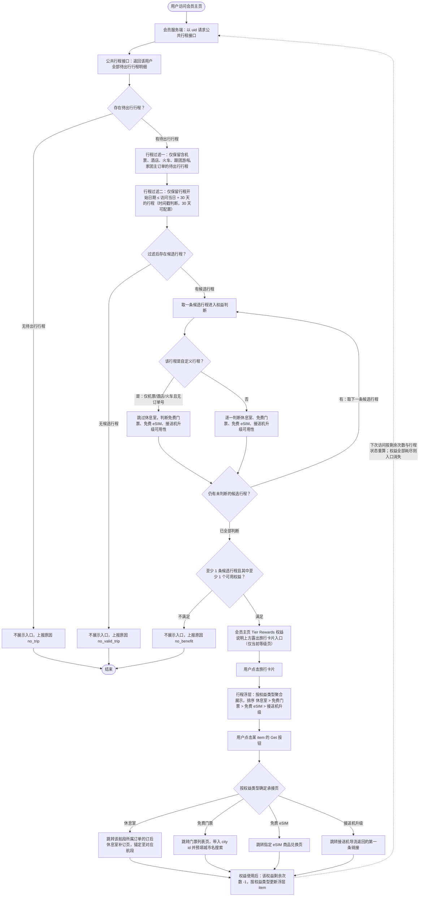

# 同案例聚焦端到端回归：会员页权益推荐模块

> 来源：飞书文档《【PRD】会员页增加权益推荐模块》（documentId `Wi9Gd1R72oaD8mx9NdqcQj2dnpd`，revision 6418），本地分块 `feishu-part-01.md` ~ `feishu-part-09.md`。
> 本产物按当前 `plugin/skills/requirement-writing` 规则**只投影「文档信息」+「业务流程」两章**，不重写完整 PRD。章节序号按本片段实际保留顺序赋号（chapter-tree「章节标题序号」）。

## 1. 文档信息

| 项 | 值 |
|----|----|
| 标题 | 【PRD】会员页增加权益推荐模块 |
| 版本 | v0.1 |
| 状态 | 草稿 |
| 需求规模 | Normal |
| 业务域 | 主：会员权益；关联：行程、机票、酒店、火车 |
| 研发交付类型 | 主：客户端；次：服务端 |
| 更新日期 | 2026-08-12 |
| UI 链接 | https://www.figma.com/design/ADdYufM8o45CmrjqZBCUGA/2026-H1-2025-H2_APP_Trip.com-Rewards-Page?node-id=19269-115107&p=f&t=PAPdclqyBZxtWiru-0 |
| UX 链接 | 原文未提供（待确认） |
| 关联 PRD | 【PRD Demo】丰富会员页核心触点--增加多模块 https://trip.larkenterprise.com/docx/Id0qdKqDZojSVSx5ANGcdUmsnQb 【PRD】休息室详情页增加可用航段（下迭代承接）https://trip.larkenterprise.com/docx/OE5Yd2kPEogmNuxJ0YNcliJQnGh |
| 依赖文档 | 行程接口字段说明（公共行程接口数据来源）https://trip.larkenterprise.com/wiki/Mj8Hw09jWitXbhkYMOgcm9sAnBd 会员页数据摸排 https://trip.larkenterprise.com/wiki/WFxRwlenPicO9EkDhOhcoHIBnOe 002-对外投放链接（门票列表页跳转参数）https://trip.larkenterprise.com/wiki/LlG0w00bbi6XNjkRoffcw8Rzn1g 通用标签契约文档（用户常驻地标签来源）https://trip.larkenterprise.com/wiki/NfUtwHb5Ui3CFlkvTu5cPXtnn0b 目的地图片能力契约 http://contract.mobile.flight.ctripcorp.com/#/operation-detail/1285/89/districtGlobalizationDetail?lang=zh-CN 免费门票景点查询契约 https://contract.mobile.flight.ctripcorp.com/#/operation-detail/3670/63/marketingActivitySearch?lang=zh-CN 接送机导流契约 https://contract.mobile.flight.ctripcorp.com/#/operation-detail/5747/78/recommend?lang=zh-CN |

## 2. 业务流程

**口径说明**：本章「30 天窗口」是**入口露出过滤口径**（行程开始日期 ≤ 访问当日 + 30 天，做成配置项）；背景测算引用的「未来 60 天有待出行订单」是**覆盖面测算口径**。两者不是同一口径，不可互相替代。

**主流程图**

### 2.1 主流程步骤

1. 用户访问会员主页 → 会员服务端以 uid 请求公共行程接口。本次不使用旅行打包聚合能力，只取底层待出行行程数据。
2. 公共行程接口返回该用户全部待出行行程明细（机票颗粒度落到航段，含酒店、火车、跟团游/私家团），城市 id 统一使用酒店系 → 进入行程过滤。
3. 会员服务端执行行程过滤 → 得到候选行程集：
   - **过滤一（订单类型）**：仅保留含机票、酒店、火车、跟团游/私家团**主订单**的待出行行程。仅由租车、接送机、玩乐、餐厅等**附属订单**构成的行程不进入判断池——附属订单单独存在时目的地与出行意图不够明确。
   - **过滤二（30 天窗口）**：仅保留行程开始日期 ≤ 访问当日 + 30 天的行程，按时间戳判断；「30 天」做成配置项，不写死。
4. 逐行程判断四类权益可用性（条件见 2.2）→ 标记每条行程可用的权益类型。自定义行程（仅支持自定义机票、酒店、火车；无订单号，但有产线与特殊标识）不推休息室，其余三类权益照常判断。
5. 判断露出条件：过滤后至少有 1 条候选行程，**且**该行程中至少有 1 个可用的会员权益 → 满足则在会员主页 Tier Rewards 区域的权益说明上方露出旅行卡片入口，且仅展示在当前等级页；不满足则不展示入口并按原因上报（见 2.4）。
6. 用户点击旅行卡片 → 弹出行程浮层。
7. 行程浮层**按权益类型聚合**展示（不按行程聚合），权益露出排序为 休息室 > 免费门票 > 免费 eSIM > 接送机升级；每个权益下列出该权益可用的具体航段或目的地 item，并展示该权益剩余使用次数。
8. 用户点击某 item 的 Get 按钮 → 按权益类型跳转对应承接页：
   - 休息室 → 该航段所属订单的订后休息室补订页，锚定至对应航段（机票侧支持航段锚定前，先跳该订单下）；承接页同时露出高端休息室与普通休息室。
   - 免费门票 → 门票列表页，带入 city id 并预填完成城市名称的搜索。
   - 免费 eSIM → 指定 eSIM 商品兑换页。
   - 接送机升级 → 接送机导流返回的链接；会员侧不区分接机与送机，取返回的第一条链接。
9. 权益使用后，剩余次数 -1，浮层 item 按权益类型更新；用户再次访问会员页时按剩余次数与行程状态重算露出（见 2.5）。

### 2.2 四类权益的可用性判定条件

步骤 4 的判定依据，每类权益的条件需**全部满足**才算该行程可用该权益。

| 权益 | 判定条件 | 判定粒度 |
|------|----------|----------|
| 休息室 | ① 有待出行的机票行程，且该行程的航段有可用休息室（普通或高端）；② 用户有**可用的**休息室权益次数（可用判断中已包含前置酒店订单、实名等前置判断）；③ 航段起飞时间晚于当前时间 + 60 分钟，需按同时区判断 | 航段 |
| 免费门票 | ① 至少 1 个未结束的待出行行程，其目的地城市在 free ticket 可用城市范围内，且该城市下可兑换免费门票的景点数 ≥ 1；② 用户账户内有权益剩余次数；③ 行程未到退场时间；④ 去除中转航段所在的目的地城市 | 目的地城市 |
| 免费 eSIM | ① 至少 1 个待出行行程的目的地城市所属国家在 free eSIM 覆盖国家范围内；② 用户账户内有剩余 eSIM 次数；③ 行程未到退场时间；④ 去除中转航段的目的地国家；⑤ 该国家非用户常驻国家（目的地国家为中国时须再下探 province，并同时判断用户常驻省，见 2.3）。明确**不校验**用户是否已有该国 eSIM 订单——eSIM 订单不实名可代订、多国通用产品的目的地字段只记录随机单值不准确，且不论是否已购买用户都拥有免费兑换权益 | 目的地国家（中国下探至省） |
| 接送机升级 | ① 必须有待出行的机票行程；② 以航班信息向接送机侧查询导流，返回跳转链接即代表该航班有接送机业务覆盖与推荐，取第一条返回链接；③ 用户账户内有权益剩余次数；④ 行程未到退场时间；⑤ 去除中转航段的目的地城市 | 航段的出发城市与到达城市 |

### 2.3 免费 eSIM 的常驻地判定

2.2 中 eSIM 条件⑤的展开。

| 行程目的地 | 用户常驻地 | 是否推 eSIM | 露出的地名口径 |
|------------|------------|-------------|----------------|
| 中国大陆（country = 中国且 province 不属港澳台） | 中国大陆 | 不推 | 不适用（不露出） |
| 中国大陆 | 不在中国大陆（country 非中国，或 country = 中国但 province 属港澳台） | 推 | 统一露出「中国内地」多语言 |
| 港澳台（country = 中国，按 province 判断） | 港澳台 | 不推 | 不适用（不露出） |
| 港澳台 | 不在港澳台（country 非中国，或 country = 中国但 province 不属港澳台） | 推 | 露出省一级名称多语言（如「台湾」） |
| 其他国家 | 不在该国家 | 推 | 露出国家名多语言（如「英国」） |

> 常驻地数据来源：CDP 标签能力（见文档信息「通用标签契约文档」）。

### 2.4 异常与分支

| 分支 / 异常 | 触发条件 | 处理 | 流转到 |
|-------------|----------|------|--------|
| 无待出行行程 | 公共行程接口未返回待出行行程 | 不展示入口，上报原因 no_trip | 结束 |
| 无符合标准的行程 | 行程过滤一或过滤二后候选行程为空 | 不展示入口，上报原因 no_valid_trip | 结束 |
| 行程无可用权益 | 候选行程存在，但没有任何行程含可用权益 | 不展示入口，上报原因 no_benefit | 结束 |
| 自定义行程 | 行程为用户自定义（仅机票、酒店、火车，无订单号但有特殊标识） | 跳过休息室判断，仍判断其余三类权益 | 步骤 4 |
| 休息室航段临近起飞 | 航段起飞时间 ≤ 当前时间 + 60 分钟（同时区判断） | 该航段不作为可用休息室 item 露出 | 步骤 4 |
| 中转航段目的地 | 目的地为中转航段所在城市 / 国家 | 从免费门票、免费 eSIM、接送机升级的目的地集合中去除该城市 / 国家 | 步骤 4 |
| eSIM 目的地为常驻地 | 目的地国家（中国时下探至省）与用户常驻地一致 | 该目的地不推免费 eSIM | 步骤 4 |
| 接送机无覆盖 | 以航班信息查询接送机导流未返回跳转链接 | 该行程不推接送机升级 | 步骤 4 |
| 景点数查询失败 | 免费门票的城市景点数查询报错、无法返回信息 | 露出通用兜底文案，不露出景点个数相关内容 | 步骤 7 |
| 目的地图片缺失 | 开始时间最近的「有可用权益行程」的目的地无图片返回 | 顺位取第二个目的地的图片；仍取不到则使用设计提供的兜底图 | 步骤 5 |
| 休息室补订页未支持航段锚定 | 机票侧航段锚定能力未上线 | 先跳转至该航段所属订单下 | 步骤 8 |
| 权益次数耗尽 | 某权益剩余次数 = 0 | 浮层不展示该权益模块；四类权益全部耗尽时入口卡片消失 | 步骤 5 / 步骤 7 |

### 2.5 权益使用后的状态流转

步骤 9 的重算依据。

| 权益 | 浮层行为 | 入口卡片行为 |
|------|----------|--------------|
| 休息室 | 该航段从列表中移除，剩余次数 -1；航段结束后该 item 消失；剩余次数 = 0 时不展示休息室模块 | 单次权益使用后入口无变化；入口的露出与文案只在**权益种类变化或旅行变化**时才变化；四类权益全部耗尽时入口消失 |
| 免费门票 | 该城市信息保留（用户可为他人预订，或订该城市下其他景点），剩余次数 -1；该目的地行程结束后目的地城市消失 | 同上 |
| 免费 eSIM | 该国家行保留，剩余次数 -1；该目的地行程结束后目的地消失 | 同上 |
| 接送机升级 | 该出发、到达城市信息保留（接送机可能需要多次），剩余次数 -1；该目的地行程结束后目的地消失 | 同上 |
