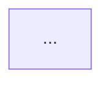

# 轻量功能方案模板

适用于：单功能模块、小型变更、API 新增等不需要完整系统设计的场景。

---

## 模板结构

```markdown
# [功能名称] 技术方案

## 1. 概述

### 背景
[为什么要做？1-2 句]

### 目标
[做什么？解决什么问题？]

### 范围
- 做：...
- 不做：...

---

## 2. 方案设计

### 2.1 整体思路
[1-2 段文字 + 一张架构/流程图]



### 2.2 核心流程

```mermaid
sequenceDiagram
    ...
```

步骤：
1. ...
2. ...

### 2.3 数据模型变更

| 字段 | 类型 | 说明 | 索引 |
|------|------|------|------|
| ... | ... | ... | ... |

### 2.4 接口设计

**新增/变更接口**：

| 方法 | 路径 | 入参 | 出参 | 说明 |
|------|------|------|------|------|
| ... | ... | ... | ... | ... |

---

## 3. 关键决策

| 决策点 | 选择 | 原因 | 代价 |
|--------|------|------|------|
| ... | ... | ... | ... |

---

## 4. 影响分析

### 兼容性
- 是否需要数据迁移？
- 是否影响现有接口？
- 灰度/回滚策略？

### 性能影响
- 新增的 DB 查询/写入
- 缓存影响
- 预期 QPS

---

## 5. 风险与 TODO

| 风险 | 缓解 |
|------|------|
| ... | ... |

---

## 6. 排期估算

| 阶段 | 人天 |
|------|------|
| 开发 | |
| 联调 | |
| 测试 | |
```

---

## 何时用轻量模板 vs 完整模板

| 判据 | 轻量 | 完整 |
|------|------|------|
| 影响范围 | 单模块/单服务 | 跨服务/全系统 |
| 数据模型变更 | 增加字段/表 | 重新建模 |
| 新增外部依赖 | 无或少量 | 新增中间件/服务 |
| 需要容量规划 | 不需要 | 需要 |
| 团队规模 | 1-2 人 | 多人/多团队 |
| 方案存活期 | < 1 年 | 多年 |
