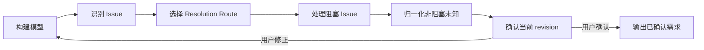

# V2 需求理解流程

本文件定义如何构建 RequirementModel、识别和路由 RequirementIssue，并收敛到可确认状态。字段和枚举以 `state-model.md` 为唯一准则。

---

## 1. 总流程



流程不保存阶段状态。通过当前 RequirementModel 和 RequirementIssue 集合判断下一步。

---

## 2. 构建 RequirementModel

### 2.1 读取输入

输入可能是从零口头想法、已有 PRD/规则/来源文档、讨论过一部分的半成品或多来源混合。输入成熟度只影响处理方式，不写入新的领域模型。

### 2.2 建模顺序

1. **Problem**：现在有什么问题，为什么要处理；
2. **Desired outcome**：希望产生什么结果；
3. **Target users**：谁使用、受影响、负责或调用；
4. **Success signals**：如何判断结果达成；
5. **Scope**：明确 in-scope 和关键 out-of-scope；
6. **Vocabulary**：只澄清影响语义的术语；
7. **Requirements**：功能、业务规则、数据、集成、质量属性和约束；每个条目通过 `scope_item_ids` 关联 disposition 一致的 ScopeItem。

不要先下沉到技术实现。用户给出的方案应先判断它是硬约束、偏好，还是解决问题的一种候选方式。

### 2.3 来源处理

- 用户陈述：`origin=user_statement`；
- 来源文档：`origin=source_document`；
- AI 低风险默认：`origin=ai_default`；
- 已验证外部事实：`origin=verified_evidence`。

Authority 针对具体信息判断。来源是文档不代表它对所有字段都 authoritative。

只有原文保真、规则措辞有约束力、多来源冲突或后续需引用证据时，才保存 quoted text。

### 2.4 何时不创建 Issue

以下内容直接进入 RequirementModel：

- 表意明确、无冲突的用户目标；
- authority 已知的业务规则；
- 已验证且与需求相关的事实；
- 不影响语义的普通措辞差异；
- 可以无损规范化的名称和格式。

禁止为每条输入事实创建 Issue。Issue 只承载真实问题和决策历史。

---

## 3. 识别 RequirementIssue

每发现一个候选问题，依次判断：

1. 是否影响理解、范围、规则、验收或最终输出；
2. 是否可通过现有来源直接消除；
3. 是否与已有 Issue 重复或依赖已有 Issue；
4. 如果不处理，是否阻塞模型确认。

只有确实影响需求且无法直接建模时才创建 Issue。

**确认失效不变量**：如果当前 `confirmed_revision === revision`，任何确实需要创建 RequirementIssue 的产品语义缺口，都必须在创建 Issue 前或同一原子更新中执行 `revision += 1`，先使旧确认失效；不因“非阻塞”“暂不影响风险”或尚未确定模型修改而例外。只有不创建 Issue、也不改变需求事实的纯表达或组织问题可以保留当前 revision。

### 3.1 类型选择

| 信号 | issue_type |
|---|---|
| 必要信息完全缺失 | `missing_information` |
| 同一句话有多种合理解释 | `ambiguity` |
| 两个来源或规则不能同时成立 | `conflict` |
| 多个可行方案需要取舍 | `decision` |
| 当前没人知道，需真实证据 | `validation` |
| 是否纳入本次交付未确定 | `scope` |
| 术语定义或口径不一致 | `terminology` |

不要使用 `direct_decision` 类型。用户主动拍板仍是 `decision`，通过 `record_user_decision` route 表达。

### 3.2 Target reference

Issue 尽量指向具体模型对象和字段。尚无目标对象时，可先指向拟新增对象的稳定 ID；解决后通过 ModelChange 记录实际变化。

### 3.3 依赖关系

使用 `depends_on_issue_ids` 表示依赖，不建立 frontier 模型。

处理顺序：

1. 无未解决依赖的 blocker；
2. 会影响多个下游问题的 Issue；
3. 高影响、难逆转问题；
4. 其他非阻塞项。

前置答案使后续 Issue 失效时，以 `no_model_change` 解决或标记 superseded，不继续提问。

---

## 4. 判断问题价值

### 4.1 错误返工成本

综合 error impact、reversibility、影响对象数量、是否改变目标/范围/核心规则，以及是否导致 PRD 或实现方向完全不同。

### 4.2 可推断性

综合 evidence confidence、来源 authority、是否可通过材料/代码/数据/外部证据查明，以及是否属于用户偏好或业务取舍。

### 4.3 决策矩阵

| 返工成本 | 可推断性 | 动作 |
|---|---|---|
| 高 | 低 | `ask_user`，或保持 blocker |
| 高 | 高 | `investigate_evidence`，必要时再确认 |
| 低 | 低 | `apply_ai_default`，门禁统一批准 |
| 低 | 高 | 直接建模，不制造交互 |

惊讶测试只能作为风险信号：用户可能惊讶且错误后返工高，才升级为提问。

---

## 5. 选择 Resolution Route

### 5.1 `investigate_evidence`

适用：存在可访问的来源、代码、数据、协议或权威材料。

1. 先调查，不把可查事实转嫁给用户；
2. 将证据记录为 SourceReference；
3. authority 足够且无冲突时，以 `verified_fact` Resolution 解决；
4. 证据仍不足时转 `ask_user` 或 `define_validation_plan`。

不得因为 AI 自信就伪造 `evidence_verification`。

### 5.2 `ask_user`

适用：用户拥有信息或决策权，不同答案会显著改变需求，且无法从来源可靠推断。

- 无法合理枚举 → `open_ended`；
- 可枚举取舍 → `option_selection`。

提问前加载 `interaction-contract.md`。

### 5.3 `apply_ai_default`

仅适用：整体返工成本明确为低、`error_impact=low`、`reversibility=easy`、默认符合上下文，并会在门禁中显式展示。核心目标、核心范围、关键业务规则或关键数据语义即使看似可控，也不得走 AI default。

处理：

1. 将默认语义写入 RequirementModel；
2. `origin=ai_default`；
3. `understanding_status=proposed`；
4. 创建 `open + apply_ai_default` Issue；
5. `blocks_confirmation=false`；
6. 门禁批准后转 `confirmed + accepted_default`。

每个可独立批准或反转的默认使用独立 Issue。只有必须一起批准和反转的紧密相关默认才可合并。

### 5.4 `define_validation_plan`

适用：答案必须通过试验、数据、真实环境或外部权威获得。

计划至少说明验证对象、验证方法、责任人、时机/触发条件和失败影响。

计划完整后：

- `issue_status=resolved`；
- `resolution_type=validation_plan`；
- 模型条目 `understanding_status=unverified`。

验证计划本身不完整且影响交付时，Issue 保持 open blocker。

### 5.5 `record_user_decision`

适用：用户未被提问就主动给出明确选择、边界或拍板。

1. 创建 decision Issue；
2. 创建 `unsolicited_decision` Interaction；
3. 记录用户原话和来源；
4. 形成 `user_decision` Resolution；
5. 更新 RequirementModel；
6. 不重复问“是否确认刚才的决定”。

整体模型仍需最终 revision 门禁。

---

## 6. 冲突处理

1. 分别记录每个 SourceReference；
2. 判断来源对当前信息的 authority；
3. authority 已明确时按权威来源建模并记录 Resolution；
4. authority 不明或同级冲突时交给正确 decision owner；
5. 冲突未解决前目标条目为 `conflicted`；
6. conflicted 条目阻止 ready。

不得仅按“更新、更具体、措辞更强”擅自判断权威。

---

## 7. 用户无法回答或要求停止

### 7.1 用户无法抽象回答

加载 `prototyping.md`，改用示例表、决策表、状态图、流程图、GWT 或低保真线框，不要重复改写同一个问题。

### 7.2 用户说“都可以”“你定”

- 低风险、易逆转 → `apply_ai_default`；
- 高风险、难逆转 → 给出取舍并要求明确决策；
- 当前没人知道 → `define_validation_plan`；
- 用户明确愿意承担已说明风险 → `accepted_risk`。

### 7.3 用户说“别问了”“先这样”

这不是将 blocker 变成默认的授权。对每个 blocker 判断能否调查、建立验证计划、缩小范围或由用户明确接受具体风险。无法满足任一路径时，不得宣告 ready。

---

## 8. Parking 与 Accepted Risk

### Parking

- `issue_status=parked`；
- `blocks_confirmation=false`；
- 记录 reason、risk、owner、revisit trigger；
- 模型条目保持 `unresolved`。

### Accepted Risk

- `issue_status=resolved`；
- `resolution_type=accepted_risk`；
- `resolved_by=user`；
- 模型条目保持 `unresolved`。

Parking 表示延期处理；Accepted Risk 表示治理决策。两者互斥。

---

## 9. 收敛到 ready

进入门禁前必须满足：

- problem、desired outcome、target users 已建立；
- 无 open blocker；
- 无 conflicted 条目；
- 除等待本次门禁批准的 `apply_ai_default` Issue 外，无其他 open Issue；
- 非阻塞未知已成为 parking、`validation_plan` 或 `accepted_risk`；
- AI 默认、unresolved、unverified 和 parked 项已准备展示；
- 所有拟确认语义都已写入当前 revision。

满足后加载 `alignment-output.md`，不要自行发明另一套确认或输出规则。

---

## 10. 行为伪代码

```text
build_or_update_requirement_model()

for each candidate understanding problem:
    assessment = assess_impact_reversibility_evidence_and_blocking(candidate)

    if current_revision_is_confirmed:
        atomically:
            increment_revision()
            issue = create_issue(candidate, assessment)
    else:
        issue = create_issue(candidate, assessment)

    link_dependencies(issue)
    select_resolution_route(issue)

while open_blockers_exist:
    process_highest_value_unblocked_issue()
    apply_resolution_to_model_and_increment_revision_if_semantic()

normalize_non_blocking_unknowns()
assert only_gate_defaults_may_remain_open()
run_revision_alignment_gate()

if user_confirms_current_revision:
    resolve_gate_defaults_atomically()
    assert_no_open_issues()
    return_confirmed_requirement_output()
else:
    update_model()
    increment_revision()
    repeat()
```

---

## 11. 禁止行为

- 不建立 AskList、AssumptionList、ValidateList、Frontier 或 DecisionRecords；
- 不为所有输入事实创建 Issue；
- 不把 evidence confidence 当成用户批准；
- 不把 user statement 自动视为所有事实的 authoritative source；
- 不让用户回答本可调查的事实；
- 不强制所有问题选项化；
- 不给 `open_ended` 问题伪造推荐；
- 不以“用户累了”为由关闭高风险 blocker；
- 不确认聊天摘要而绕过 RequirementModel revision；
- 不在输出已确认需求时保留 open Issue；
- 不选择、调用或编排其他 Skill。
