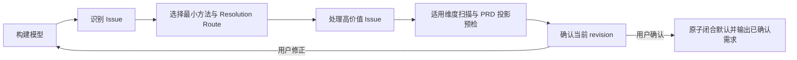

# V2 需求理解流程

本文件定义如何构建 RequirementModel、识别和路由 RequirementIssue，并收敛到可确认状态。字段和枚举以 `state-model.md` 为唯一准则。

---

## 1. 总流程



流程不保存阶段状态。通过当前 RequirementModel 和 RequirementIssue 集合判断下一步；方法和预检清单都不是第三个领域模型。

---

## 2. 构建 RequirementModel

### 2.1 读取输入

输入可能是从零口头想法、已有 PRD/规则/来源文档、讨论过一部分的半成品或多来源混合。输入成熟度只影响处理方式，不写入新的领域模型。

### 2.2 建模顺序

1. **Problem**：现在有什么问题，为什么要处理；
2. **Desired outcome**：希望产生什么结果；
3. **Target users**：谁使用、受影响、负责或调用；
4. **Success signals**：输入明确提供了哪些定性或定量达成信号；
5. **Scope**：明确 in-scope 和关键 out-of-scope；
6. **Vocabulary**：只澄清影响语义的术语；
7. **Requirements**：功能、业务规则、数据、集成、质量属性和约束；每个条目通过 `scope_item_ids` 关联 disposition 一致的 ScopeItem。

不要先下沉到技术实现。用户给出的方案应先判断它是硬约束、偏好，还是解决问题的一种候选方式。

每个派生 scope 为 `in_scope` 的 RequirementItem 都必须包含足够的当前 confirmed 业务语义，使其至少能形成一个可判定真假的完成条件；不要求固定为 GWT，也不建立 Example 模型。不足时创建并处理 RequirementIssue，不能等到写作阶段猜测。

success signals 不强制量化。定性和部分量化信号都按已确认内容原样保留；只有基线、目标、测量口径和时间窗全部明确时，才形成结构化量化指标。缺少四要素本身不创建 Issue；仅当模型把指标定义为验收或发布门槛，且缺失口径导致业务上无法判定是否通过时，才创建 Issue。

### 2.3 来源处理

- 用户陈述：`origin=user_statement`；
- 来源文档：`origin=source_document`；
- AI 低风险默认：`origin=ai_default`；
- 已验证外部事实：`origin=verified_evidence`。

Authority 针对具体信息判断。来源是文档不代表它对所有字段都 authoritative。

只有原文保真、规则措辞有约束力、多来源冲突或后续需引用证据时，才保存 quoted text。

### 2.4 何时不创建 Issue

以下内容直接进入 RequirementModel：

- 表意明确、无冲突的用户目标；
- authority 已知的业务规则；
- 已验证且与需求相关的事实；
- 不影响语义的普通措辞差异；
- 可以无损规范化的名称和格式；
- 仅仅没有量化 success signal。

禁止为每条输入事实创建 Issue。Issue 只承载真实问题和决策历史。

---

## 3. 最小信号驱动方法路由

先根据当前信号选择最小够用的方法；方法只帮助理解和暴露 Issue，不新增方法记录模型。

| 信号 | 最小方法 | 产出如何回到两个核心模型 |
|---|---|---|
| 方案伪装成需求，problem/outcome 不清 | 5 Whys 或 JTBD | 改写 IntentStatement；有高价值缺口才建 Issue |
| 目标到角色、行为、交付物的价值链断裂 | Impact Mapping | 补齐 target user、scope 或 RequirementItem；断点建 Issue |
| 结论依赖强假设 | 苏格拉底追问或反证 | 可证事实走 evidence；业务取舍走 decision Issue |
| 多条件组合影响结果 | 决策表 | 确认后的规则写回 RequirementItem；空白/冲突格建 Issue |
| 生命周期或转换规则不清 | 状态图 | 确认后的状态/转换写回 RequirementItem |
| 边界、重复、幂等或例外不清 | 少量 GWT 或反例 | 只回写确认后的规则和边界，不建立示例模型 |
| 抽象沟通连续失败 | 最小低保真制品 | 通过 artifact review 更新模型或创建 Issue |

选择规则：

1. 能用一句澄清解决就不用制品；
2. 只覆盖当前高价值分歧，不穷举低价值场景；
3. 方法得出的候选结论仍须满足来源、认知状态和确认规则；
4. 抽象沟通失败时加载 `prototyping.md`。

---

## 4. 识别 RequirementIssue

每发现一个候选问题，依次判断：

1. 是否影响理解、范围、规则、验收或 PRD 投影；
2. 是否可通过现有来源直接消除；
3. 是否与已有 Issue 重复或依赖已有 Issue；
4. 如果答案错误，是否会造成明显返工；
5. 是否必须在模型确认前闭合。

只有确实影响需求且无法直接建模时才创建 Issue。

**确认失效不变量**：如果当前 `confirmed_revision === revision`，任何确实需要创建 RequirementIssue 的产品语义缺口，都必须在创建 Issue 前或同一原子更新中执行 `revision += 1`，先使旧确认失效。只有不创建 Issue、也不改变需求事实的纯表达或组织问题可以保留当前 revision。

### 4.1 类型选择

| 信号 | issue_type |
|---|---|
| 必要信息完全缺失，正确 owner 可直接回答 | `missing_information` |
| 同一句话有多种合理解释 | `ambiguity` |
| 两个来源或规则不能同时成立 | `conflict` |
| 多个可行方案需要取舍 | `decision` |
| 确认 PRD 前必须由真实证据查明事实 | `validation` |
| 是否纳入本次交付未确定 | `scope` |
| 术语定义或口径不一致 | `terminology` |

`issue_type=validation` 不是后续事项：它必须使用 `investigate_evidence`，未取得足够证据时保持 open blocker，只能以 `verified_fact` 解决。产品不知道业务事实时，应让其咨询有权人员后带回证据，期间不得确认。

不要使用 `direct_decision` 类型。用户主动拍板仍是 `decision`，通过 `record_user_decision` route 表达。

### 4.2 Target reference

Issue 尽量指向具体模型对象和字段。尚无目标对象时，可先指向拟新增对象的稳定 ID；解决后通过 ModelChange 记录实际变化。

### 4.3 依赖关系

使用 `depends_on_issue_ids` 表示依赖，不建立 frontier 模型。

处理顺序：

1. 无未解决依赖的 blocker；
2. 会影响多个下游问题的 Issue；
3. 高影响、难逆转问题；
4. 其他高价值项。

前置答案使后续 Issue 失效时，以 `no_model_change` 解决或标记 superseded，不继续提问。validation Issue 只有事实已查明才能 resolved；若它因前置结论不再适用，应 supersede，而不是假装事实已核验。

---

## 5. 判断问题价值

### 5.1 错误返工成本

综合 error impact、reversibility、影响对象数量、是否改变目标/范围/核心规则，以及是否导致 PRD 或实现方向完全不同。

### 5.2 可推断性

综合 evidence confidence、来源 authority、是否可通过材料/代码/数据/有权人员证据查明，以及是否属于用户偏好或业务取舍。

### 5.3 决策矩阵

| 返工成本 | 可推断性 | 动作 |
|---|---|---|
| 高 | 低 | `ask_user`，或保持 blocker |
| 高 | 高 | `investigate_evidence`，必要时再确认 |
| 低 | 低 | `apply_ai_default`，门禁统一批准 |
| 低 | 高 | 直接建模，不制造交互 |

只有同时满足以下条件才提问：答案会改变 PRD；无法可靠推断；错误会造成明显返工。惊讶测试只能作为风险信号，不能单独制造问题。

---

## 6. 选择 Resolution Route

### 6.1 `investigate_evidence`

适用：存在可访问的来源、代码、数据、协议、真实环境或有权人员可提供的证据。

1. 先调查，不把可查事实转嫁给用户猜测；
2. 将证据记录为 SourceReference；
3. authority 足够且无冲突时，以 `verified_fact` Resolution 解决；
4. 证据仍不足时，Issue 保持 open；若它是 validation Issue，必须继续阻塞确认；
5. 如果需要产品联系有权人员，只记录等待证据，不改变 route 和状态。

不得因为 AI 自信就伪造 `evidence_verification`。

### 6.2 `ask_user`

适用：用户拥有信息或决策权，不同答案会显著改变需求，且无法从来源可靠推断。

- 无法合理枚举 → `open_ended`；
- 可枚举取舍 → `option_selection`。

提问前加载 `interaction-contract.md`。如果用户明确不知道外部业务事实，不要求其猜测；将问题按事实核验规则处理并等待权威证据。

### 6.3 `apply_ai_default`

仅适用：整体返工成本明确为低、`error_impact=low`、`reversibility=easy`、默认符合上下文，并会在门禁中显式展示。核心目标、核心范围、关键业务规则或关键数据语义即使看似可控，也不得走 AI default。

处理：

1. 将默认语义写入 RequirementModel；
2. `origin=ai_default`；
3. `understanding_status=proposed`；
4. 创建 `open + apply_ai_default` Issue；
5. `blocks_confirmation=false`；
6. 门禁批准时原子转为 `confirmed + accepted_default + resolved`。

每个可独立批准或反转的默认使用独立 Issue。只有必须一起批准和反转的紧密相关默认才可合并。

待批准默认使模型保持 draft，但可在满足 `state-model.md` 门禁候选例外时展示确认。未完成原子更新前不得输出。

### 6.4 `record_user_decision`

适用：用户未被提问就主动给出明确选择、边界或拍板。

1. 创建 decision Issue；
2. 创建 `unsolicited_decision` Interaction；
3. 记录用户原话和来源；
4. 形成 `user_decision` Resolution；
5. 把采用结论、适用边界和理由写入 confirmed ScopeItem、RequirementItem 或 rationale；
6. 更新 RequirementModel；
7. 不重复问“是否确认刚才的决定”。

整体模型仍需最终 revision 门禁。用户决策只能决定取舍，不能替代必须由事实证据回答的 validation Issue。

---

## 7. 冲突处理

1. 分别记录每个 SourceReference；
2. 判断来源对当前信息的 authority；
3. authority 已明确时按权威来源建模并记录 Resolution；
4. authority 不明或同级冲突时交给正确 decision owner；
5. 冲突未解决前目标条目为 `conflicted`；
6. conflicted 条目阻止 ready 和 confirmed。

不得仅按“更新、更具体、措辞更强”擅自判断权威。

---

## 8. 用户无法回答、延后或要求停止

### 8.1 用户无法抽象回答

加载 `prototyping.md`，按信号改用决策表、状态图、流程图、少量 GWT/反例或低保真线框，不要重复改写同一个问题。

### 8.2 用户不知道业务事实

- 不要求用户猜测；
- 创建或保持 validation Issue；
- 使用 `investigate_evidence`；
- 明确需要咨询的有权人员或证据来源；
- 等待用户咨询后返回可追溯结论；
- 期间 Issue 保持 open blocker，不得确认。

### 8.3 用户说“都可以”“你定”

- 低风险、易逆转且非核心语义 → `apply_ai_default`；
- 高风险、难逆转 → 给出取舍并要求明确 `user_decision`；
- 事实性问题 → 按事实核验规则处理，不能改写为偏好。

### 8.4 用户延后或说“别问了”“先这样”

`UserResponse.deferred` 只记录延后，Issue 保持 open。若答案影响 PRD，`blocks_confirmation=true`；不得变成默认、后续事项或已解决结论。

可通过以下方式继续：

- 调查并取得证据；
- 由正确 decision owner 明确取舍；
- 明确缩小当前 scope，并把边界写入 confirmed ScopeItem/RequirementItem；
- 暂停本 Skill，之后继续。

无法闭合时不得宣告 ready、confirmed 或已对齐。

---

## 9. 适用维度扫描与 PRD 投影预检

在门禁前按需扫描以下维度：

1. 角色；
2. 主流程；
3. 规则；
4. 异常/失败；
5. 边界/重复；
6. 状态；
7. 权限；
8. 数据口径；
9. 集成/依赖；
10. 质量要求；
11. 成功信号；
12. 范围。

每个维度只能得到三种结果：

- **已明确**：已有 confirmed 模型条目足以投影；
- **不适用且有理由**：说明为什么不影响本需求；若理由本身是重要边界，写入 ScopeItem、RequirementItem 或 rationale；
- **创建 Issue**：维度存在会改变 PRD 且无法可靠推断的高价值缺口。

扫描是轻量运行时检查，不建立第三模型，不要求把每个维度写成条目，也不为明显不适用的维度机械提问。定性和部分量化 success signal 按已确认内容原样保留；只有四要素完整时才形成结构化量化指标。缺少四要素本身不创建 Issue，除非该指标是验收或发布门槛且因此无法判定是否通过。

预检目标：确认当前 RequirementModel 能在不新增业务语义的前提下投影为 PRD。预检必须逐一检查每个 in-scope RequirementItem 是否仅凭当前 confirmed 语义足以形成至少一个可判定真假的完成条件，不强制 GWT，也不增加 Example 模型。若不满足，或投影时仍需猜测角色、流程、规则、失败行为、边界、状态、权限、数据口径、依赖、质量要求或范围，则创建并处理 Issue。

---

## 10. 收敛条件

### 10.1 PRD-ready

必须满足：

- problem、desired outcome 和至少一个 target user 均存在且 confirmed；
- 至少一个 confirmed `in_scope` ScopeItem；
- 至少一个派生 scope 为 `in_scope` 的 confirmed RequirementItem；
- 每个 in-scope RequirementItem 仅凭当前 confirmed 模型语义足以形成至少一个可判定真假的完成条件；
- 无任何 open Issue；
- RequirementModel 中所有模型条目均为 confirmed；
- 适用维度扫描通过；
- 所有拟确认语义都已写入当前 revision。

success signals 不强制非空。定性和部分量化信号按已确认内容原样保留；缺少完整四要素本身不阻止 PRD-ready，除非模型把指标定义为验收或发布门槛且无法据此判定是否通过。

### 10.2 门禁候选例外

唯一例外是低风险 AI 默认可在门禁前保持 `proposed + open apply_ai_default`。除这些逐一双向关联的默认外，10.1 的条件必须满足；门禁必须展示全部默认。用户确认时原子转为 `confirmed + resolved`，随后才能设置 confirmed revision 和输出。

满足 PRD-ready 或门禁候选例外后加载 `alignment-output.md`，不要自行发明另一套确认或输出规则。

---

## 11. 行为伪代码

```text
build_or_update_requirement_model()
route_minimum_method_by_signal()

for each candidate understanding problem:
    if not changes_prd_or_causes_material_rework(candidate):
        continue_or_model_directly()

    assessment = assess_impact_reversibility_evidence_and_blocking(candidate)

    if current_revision_is_confirmed:
        atomically:
            increment_revision()
            issue = create_issue(candidate, assessment)
    else:
        issue = create_issue(candidate, assessment)

    link_dependencies(issue)
    select_resolution_route(issue)

while substantive_open_issues_exist:
    process_highest_value_unblocked_issue()
    if user_deferred:
        keep_issue_open_and_block_if_prd_relevant()
    apply_resolution_to_model_and_increment_revision_if_semantic()

run_applicability_scan_and_prd_projection_preflight()
for each in_scope RequirementItem:
    assert current_confirmed_semantics_can_form_truth_evaluable_completion_condition()
assert prd_ready_or_only_gate_defaults_remain()
run_revision_alignment_gate()

if user_confirms_current_revision:
    atomically:
        confirm_all_gate_defaults()
        resolve_all_gate_default_issues()
        assert_no_open_issues()
        assert_all_model_items_confirmed()
        set_confirmed_revision()
    return_confirmed_requirement_output()
else:
    update_model_or_pause()
    if semantic_change:
        increment_revision()
    repeat_when_resumed()
```

---

## 12. 禁止行为

- 不建立 AskList、AssumptionList、ValidateList、Frontier、DecisionRecords 或方法模型；
- 不为所有输入事实创建 Issue；
- 不把 evidence confidence 当成用户批准；
- 不把 user statement 自动视为所有事实的 authoritative source；
- 不让用户猜测本可调查的事实；
- 不把事实核验延到 PRD 确认之后；
- 不强制所有问题选项化；
- 不给 `open_ended` 问题伪造推荐；
- 不以“用户累了”或“用户延后”为由关闭 blocker；
- 不确认聊天摘要而绕过 RequirementModel revision；
- 不在输出已确认需求时保留 open Issue 或非 confirmed 模型条目；
- 不选择、调用或编排其他 Skill。
