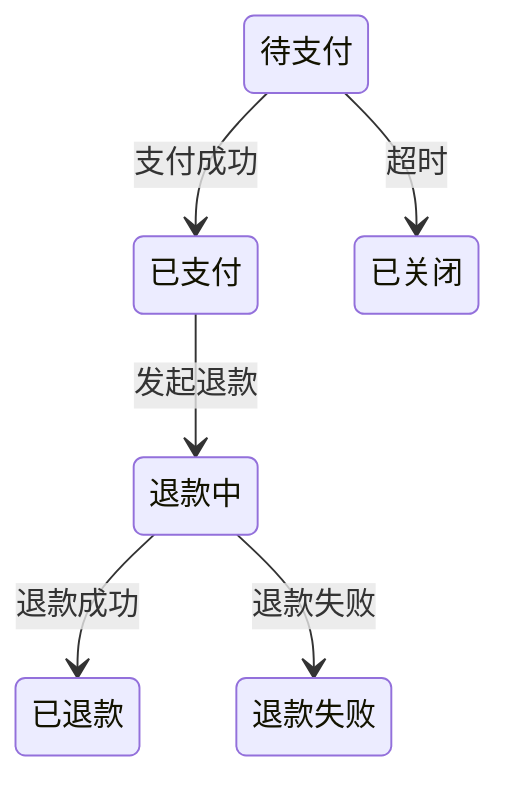
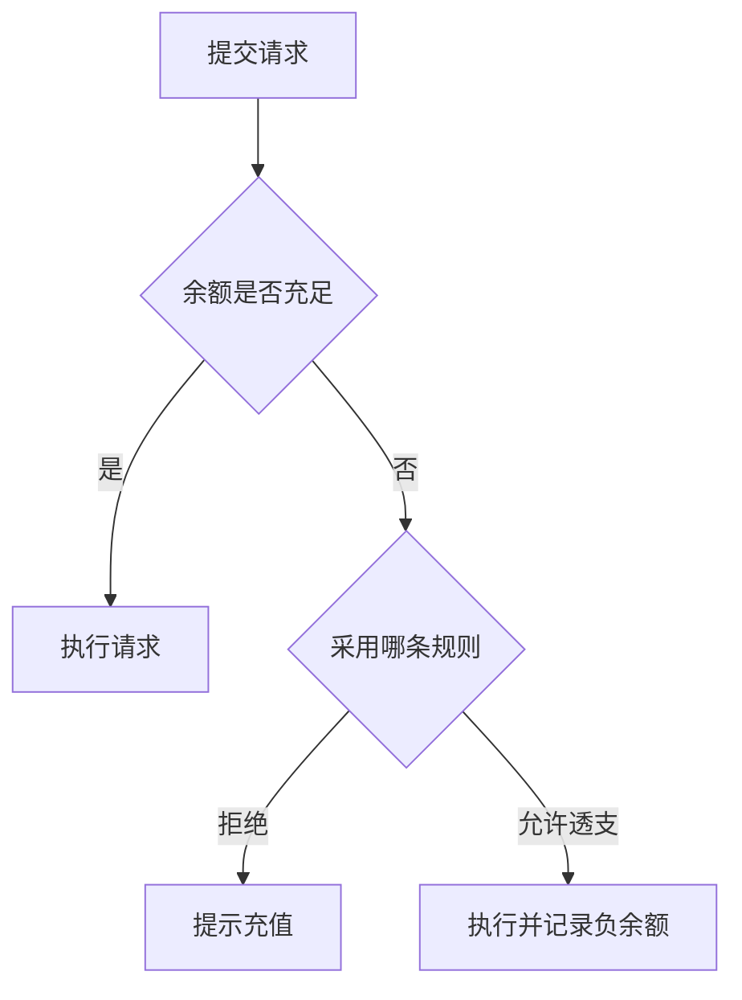

# V2 原型与认知制品

当抽象语言不足以帮助用户判断时，用低保真制品把隐含分支、状态、条件和界面结构外显。制品服务于需求理解，不是提前进入设计或实现。

字段和状态以 `state-model.md` 为准，交互记录遵守 `interaction-contract.md`。进入任何 `artifact_review` 前，必须确保已经加载 `interaction-contract.md`；不能因为用户直接要求画图而跳过交互契约。

GWT 与 Example 只作为按需诊断制品。简单、清晰、无高价值歧义的需求不生成 GWT；本 Skill 不建立 Example 模型，只把用户确认后的规则、边界与例外写回 RequirementItem。

---

## 1. 触发条件

出现以下信号时切换到制品，而不是继续重复追问：

- 用户说“都可以”“你看着办”“没概念”，且问题不能安全使用低风险默认；
- 用户无法通过抽象语言描述流程或边界；
- 分支、状态、角色或条件组合容易遗漏；
- 两个方案的差异只有看到结构后才明显；
- 界面信息层级会改变需求理解；
- 用户看到整体后才可能发现高价值遗漏；
- 连续两次文字澄清仍未减少歧义。

如果问题只是缺少一个简单事实，或者需求已经简单清晰，不制作制品。事实性问题优先调查证据，不能用示例替代核验。

---

## 2. 制品选择

| 认知信号 | 首选制品 |
|---|---|
| 多条件组合、规则冲突 | Markdown 决策表 |
| 生命周期、状态转换 | Mermaid stateDiagram |
| 用户或系统流程分支 | Mermaid flowchart |
| 多角色交互时序 | Mermaid sequenceDiagram |
| 高价值边界、重复、幂等或反例 | 少量 Given/When/Then 或反例表 |
| 页面区域和信息层级 | ASCII / Markdown 低保真线框 |
| 角色、状态、动作权限 | 角色 × 状态 × 动作矩阵 |
| 多方案对比 | 选项对比表 |

优先选择能用最少内容暴露最大分歧的制品。制品选择遵循 `flow.md` 的最小信号驱动方法路由，不建立方法模型。

---

## 3. 决策表示例

```md
| 余额 | 用户类型 | 是否允许请求 | 是否扣次数 | 提示 |
|---|---|---|---|---|
| > 0 | 任意 | 是 | 是 | 无 |
| = 0 | 普通用户 | 待确认 | 待确认 | 待确认 |
| = 0 | 测试账号 | 是 | 否 | 测试标识 |
```

让用户只确认会改变 PRD 且答错会造成明显返工的空白或冲突格，不逐格采访。确认后的组合规则写回 RequirementItem；仍待确认的格创建 Issue。

---

## 4. 状态图示例



审阅时聚焦：

- 是否缺少会改变需求的状态；
- 哪些转换允许重试或重复触发；
- 失败后由谁处理；
- 哪些状态对用户可见；
- 是否存在无法离开的状态。

用户确认后的状态和转换规则写回 RequirementItem；候选转换不能直接成为 confirmed 事实。

---

## 5. 流程图示例



图中的未决分支应转为 RequirementIssue，不要把“待确认”伪装成已定流程。确认后的主流程和失败分支写回相应 RequirementItem。

---

## 6. Given/When/Then 与反例

只在边界、重复、条件组合或例外难以用一句规则澄清时，使用少量 GWT 或反例：

```md
| Given | When | Then | 状态 |
|---|---|---|---|
| 用户余额为 0 | 发起请求 | 拒绝并提示充值 | 候选规则 |
| 用户余额为 0 | 重复发起同一请求 | 只处理一次 | 待确认边界 |
| 测试账号余额为 0 | 发起请求 | 允许执行 | 已确认例外 |
```

约束：

- 简单清晰需求不生成 GWT；
- 不追求场景穷举或测试覆盖；
- 只选能暴露高价值规则、边界、重复行为或反例的少量行；
- GWT/Example 不成为核心或附加领域模型；
- 用户确认后，只把规则、边界和例外写回 RequirementItem；
- 候选行保持 draft，或为高价值缺口创建 RequirementIssue；
- 不把制品本身当作验收规格交付。

---

## 7. 低保真线框

```text
┌────────────────────────────┐
│ 余额：¥0          [充值]   │
├────────────────────────────┤
│ 请求内容                   │
│ [________________________] │
│                            │
│ [提交请求]                 │
└────────────────────────────┘
```

审阅目标是确认：

- 必须展示什么信息；
- 用户何时作出什么动作；
- 错误和空状态如何理解；
- 信息优先级是否符合任务。

不要讨论字体、颜色、像素或视觉品牌，除非它们本身是明确需求。确认后的信息、动作和错误规则写回 RequirementItem；线框不是第三模型。

---

## 8. Artifact Review 流程

### Step 1：说明制品目的

```text
这张图只用于确认流程、规则和边界，不代表最终 UI、验收规格或技术实现。
```

### Step 2：提出聚焦审阅问题

不要只问“这样可以吗”。应问：

- 哪个分支不符合真实业务？
- 缺少哪个会改变 PRD 的角色或状态？
- 哪个候选规则应采用？
- 哪个例外不属于本期范围？

只问无法可靠推断、错误会造成明显返工的高价值问题。

### Step 3：记录 Interaction

```yaml
interaction_type: artifact_review
```

记录用户反馈和 `created_issue_ids`。

### Step 4：更新模型

- 先区分反馈只是制品表达/组织问题，还是需要创建 RequirementIssue 的产品语义缺口；
- 纯表达/组织问题不得创建 Issue，也不得改变需求事实，可直接修正制品；
- 如果当前 revision 已确认，任何产品语义缺口都必须将 `revision += 1` 与 RequirementIssue 创建放在同一原子更新中，先使旧确认失效；
- 用户确认的规则、边界和例外 → 写回 RequirementItem，并标记为 confirmed；
- 新歧义/冲突/缺失/决策/事实核验/范围/术语问题 → 创建 RequirementIssue；
- 用户拍板取舍 → `user_decision` Resolution，并把明确边界写回模型；
- 仍需真实证据 → validation Issue 保持 open blocker，直到以 `verified_fact` 解决；
- 将 Issue 处理结果应用到模型时，按 state-model revision 规则递增 revision。

### Step 5：废弃过时制品

如果模型改变使制品不再准确，不要继续引用旧图作为当前事实。保留其历史 SourceReference，但生成新的当前制品。

---

## 9. 与适用维度扫描的关系

制品只用于扫描中确实需要外显的维度：

- 角色不清 → 时序图或角色矩阵；
- 主流程/失败不清 → 流程图；
- 规则/边界/重复不清 → 决策表或少量 GWT/反例；
- 状态不清 → 状态图；
- 权限不清 → 角色 × 状态 × 动作矩阵；
- 抽象沟通失败 → 最小低保真线框。

若某维度已明确或明显不适用，不生成制品。制品揭示的新缺口必须创建 Issue；不能把图中的猜测带入最终确认。

---

## 10. 平台边界

基础能力只假设：

- Markdown；
- Markdown 表格；
- Mermaid；
- 等宽文本。

不假设：

- 可交互 HTML；
- 高保真设计工具；
- 图片热点；
- 原型状态持久化。

运行环境明确支持 HTML 时可以临时使用，但不能让需求理解依赖 HTML 才能完成。

---

## 11. 停止条件

满足以下条件后停止扩展制品：

- 制品已暴露关键分歧；
- 用户能够作出所需决定，或已明确需要调查的证据；
- 确认后的结论已回写 RequirementModel，剩余缺口已创建 RequirementIssue；
- 继续细化只会进入 UI、测试或技术设计；
- 当前问题已足以继续适用维度扫描或进入 revision 门禁。

制品是按需诊断工具，不是交付物数量目标。

---

## 12. 禁止行为

- 不为简单清晰需求生成 GWT 或 Example；
- 不在一个制品中穷举所有低价值组合；
- 不用漂亮图掩盖 open、draft 或 conflicted 内容；
- 不把候选分支画成已确认事实；
- 不因画了原型就跳过用户审阅；
- 不把 GWT、Example、制品或方法当作第三个核心模型；
- 不把候选示例直接写入 confirmed RequirementItem；
- 不在需求理解阶段追求高保真视觉设计；
- 不保留与当前 revision 冲突的制品作为权威来源。
