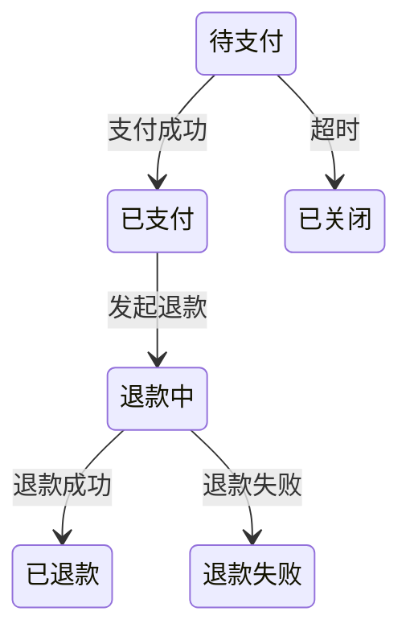
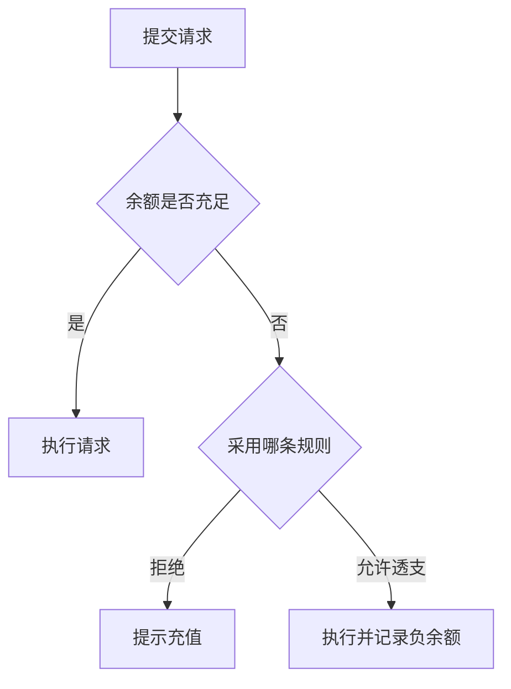

# V2 原型与认知制品

当抽象语言不足以帮助用户判断时，用低保真制品把隐含分支、状态、条件和界面结构外显。制品服务于需求理解，不是提前进入设计或实现。

字段和状态以 `state-model.md` 为准，交互记录遵守 `interaction-contract.md`。进入任何 `artifact_review` 前，必须确保已经加载 `interaction-contract.md`；不能因为用户直接要求画图而跳过交互契约。

---

## 1. 触发条件

出现以下信号时切换到制品，而不是继续重复追问：

- 用户说“都可以”“你看着办”“没概念”；
- 用户无法通过抽象语言描述流程或边界；
- 分支、状态、角色或条件组合容易遗漏；
- 两个方案的差异只有看到结构后才明显；
- 界面信息层级会改变需求理解；
- 用户看到整体后才可能发现遗漏；
- 连续两次文字澄清仍未减少歧义。

如果问题只是缺少一个简单事实，不需要制作制品。

---

## 2. 制品选择

| 认知问题 | 首选制品 |
|---|---|
| 多条件组合、规则冲突 | Markdown 决策表 |
| 生命周期、状态转换 | Mermaid stateDiagram |
| 用户或系统流程分支 | Mermaid flowchart |
| 多角色交互时序 | Mermaid sequenceDiagram |
| 典型场景与边界行为 | Given/When/Then 表 |
| 页面区域和信息层级 | ASCII / Markdown 低保真线框 |
| 角色、状态、动作权限 | 角色 × 状态 × 动作矩阵 |
| 多方案对比 | 选项对比表 |

优先选择能用最少内容暴露最大分歧的制品。

---

## 3. 决策表示例

```md
| 余额 | 用户类型 | 是否允许请求 | 是否扣次数 | 提示 |
|---|---|---|---|---|
| > 0 | 任意 | 是 | 是 | 无 |
| = 0 | 普通用户 | 待确认 | 待确认 | 待确认 |
| = 0 | 测试账号 | 是 | 否 | 测试标识 |
```

让用户只确认高价值的空白或冲突格，不逐格采访。

---

## 4. 状态图示例



审阅时聚焦：

- 是否缺少状态；
- 哪些转换允许重试；
- 失败后由谁处理；
- 哪些状态对用户可见；
- 是否存在无法离开的状态。

---

## 5. 流程图示例



图中的未决分支应转为 RequirementIssue，不要把“待确认”伪装成已定流程。

---

## 6. Given/When/Then 示例

```md
| Given | When | Then | 状态 |
|---|---|---|---|
| 用户余额为 0 | 发起请求 | 拒绝并提示充值 | 候选规则 |
| 用户余额为 0 | 发起请求 | 不扣调用次数 | 候选规则 |
| 测试账号余额为 0 | 发起请求 | 允许执行 | 已确认例外 |
```

GWT 用于显化规则、边界和例外，不建立独立 Examples 模型。被确认的语义应回写 RequirementItem。

---

## 7. 低保真线框

```text
┌────────────────────────────┐
│ 余额：¥0          [充值]   │
├────────────────────────────┤
│ 请求内容                   │
│ [________________________] │
│                            │
│ [提交请求]                 │
└────────────────────────────┘
```

审阅目标是确认：

- 必须展示什么信息；
- 用户何时作出什么动作；
- 错误和空状态如何理解；
- 信息优先级是否符合任务。

不要讨论字体、颜色、像素或视觉品牌，除非它们本身是明确需求。

---

## 8. Artifact Review 流程

### Step 1：说明制品目的

```text
这张图只用于确认流程和边界，不代表最终 UI 或技术实现。
```

### Step 2：提出聚焦审阅问题

不要只问“这样可以吗”。应问：

- 哪个分支不符合真实业务？
- 缺少哪个角色或状态？
- 哪个候选规则应采用？
- 哪个例外不属于本期范围？

### Step 3：记录 Interaction

```yaml
interaction_type: artifact_review
```

记录用户反馈和 `created_issue_ids`。

### Step 4：更新模型

- 先评估制品反馈暴露的候选问题是否属于 blocker、conflicted 理解，或会改变模型完整性/风险暴露；
- 如果当前 revision 已确认且候选问题会使确认失效，必须将 `revision += 1` 与 RequirementIssue 创建放在同一原子更新中，不能先创建 Issue 后继续保留旧 confirmed 状态；
- 确认内容 → 更新 RequirementModel；
- 新歧义/冲突 → 按上述失效规则创建 RequirementIssue；
- 用户拍板 → `user_decision` Resolution；
- 仍需真实验证 → validation Issue；
- 其他模型语义变化 → revision += 1。

### Step 5：废弃过时制品

如果模型改变使制品不再准确，不要继续引用旧图作为当前事实。保留其历史 SourceReference，但生成新的当前制品。

---

## 9. 平台边界

基础能力只假设：

- Markdown；
- Markdown 表格；
- Mermaid；
- 等宽文本。

不假设：

- 可交互 HTML；
- 高保真设计工具；
- 图片热点；
- 原型状态持久化。

运行环境明确支持 HTML 时可以临时使用，但不能让需求理解依赖 HTML 才能完成。

---

## 10. 停止条件

满足以下条件后停止扩展制品：

- 制品已暴露关键分歧；
- 用户能够作出所需决定；
- 结论已回写 RequirementModel 或 RequirementIssue；
- 继续细化只会进入 UI/技术设计；
- 当前问题已足以进入 revision 门禁。

制品是认知工具，不是交付物数量目标。

---

## 11. 禁止行为

- 不在一个制品中穷举所有低价值组合；
- 不用漂亮图掩盖 unresolved 或 conflicted 内容；
- 不把候选分支画成已确认事实；
- 不因画了原型就跳过用户审阅；
- 不把制品当作第三个核心模型；
- 不在需求理解阶段追求高保真视觉设计；
- 不保留与当前 revision 冲突的制品作为权威来源。
