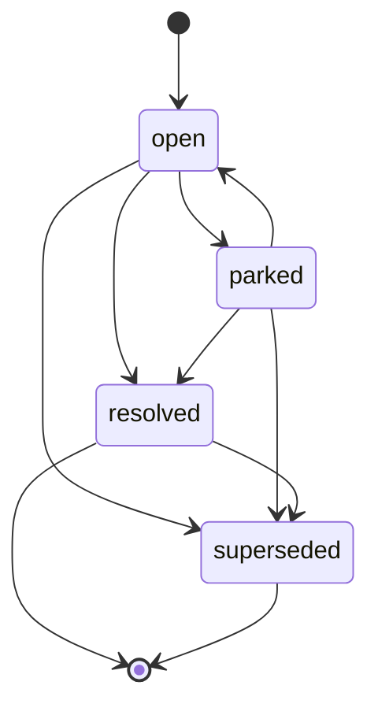

# V2 状态与模型契约

本文是 Requirement Understanding V2 的 canonical 数据契约。其他 reference 不得定义冲突字段或枚举。

这些结构是同一 Session 内的概念模型，不要求原样输出 JSON，也不要求落盘。

---

## 1. 根状态

```ts
interface RequirementUnderstandingState {
  schema_version: "2.0";
  requirement_model: RequirementModel;
  requirement_issues: RequirementIssue[];
}
```

只存在两个核心领域模型：RequirementModel 与 RequirementIssue 集合。根状态不保存 workflow phase。

---

## 2. RequirementModel

```ts
interface RequirementModel {
  requirement_model_id: string;
  revision: number;
  confirmed_revision: number | null;
  intent: RequirementIntent;
  scope_items: ScopeItem[];
  vocabulary_terms: VocabularyTerm[];
  requirements: RequirementItem[];
}
```

### 2.1 RequirementIntent

```ts
interface RequirementIntent {
  problem: IntentStatement | null;
  desired_outcome: IntentStatement | null;
  target_users: IntentStatement[];
  success_signals: IntentStatement[];
}

interface IntentStatement extends UnderstandingFields {
  intent_item_id: string;
  statement: string;
}
```

- `problem`：为什么做，当前存在什么问题；
- `desired_outcome`：希望产生什么结果，不是预设实现方案；
- `target_users`：用户、受影响者、责任人或下游系统；
- `success_signals`：判断结果是否达成的信号，不强制完整 KPI。

进入门禁前必须有 problem、desired outcome 和至少一个 target user。

### 2.2 ScopeItem

```ts
interface ScopeItem extends UnderstandingFields {
  scope_item_id: string;
  scope_disposition: "in_scope" | "out_of_scope";
  statement: string;
  rationale: string | null;
}
```

范围未决定时创建 `issue_type=scope` 的 RequirementIssue，不增加 undecided scope 状态。

### 2.3 VocabularyTerm

```ts
interface VocabularyTerm extends UnderstandingFields {
  vocabulary_term_id: string;
  term: string;
  definition: string;
  aliases: string[];
}
```

只记录会影响范围、规则、决策或验收的术语。

### 2.4 RequirementItem

```ts
interface RequirementItem extends UnderstandingFields {
  requirement_id: string;

  requirement_type:
    | "functional"
    | "business_rule"
    | "data"
    | "integration"
    | "quality_attribute"
    | "constraint";

  statement: string;
  rationale: string | null;

  delivery_priority:
    | "must"
    | "should"
    | "could"
    | "unspecified";
}
```

优先级未提供时使用 `unspecified`。不得因为优先级未知就自动向用户提问，也不得把所有条目标成 `must`。

### 2.5 UnderstandingFields

```ts
interface UnderstandingFields {
  origin:
    | "user_statement"
    | "source_document"
    | "ai_default"
    | "verified_evidence";

  understanding_status:
    | "proposed"
    | "confirmed"
    | "unresolved"
    | "unverified"
    | "conflicted";

  confirmation_mode:
    | "none"
    | "direct_statement"
    | "selected_option"
    | "batch_confirmation"
    | "source_authority"
    | "evidence_verification";

  confidence: "high" | "medium" | "low";
  source_refs: SourceReference[];
  related_issue_ids: string[];
}
```

四个维度相互独立：

| 字段 | 问题 |
|---|---|
| `origin` | 内容最初来自哪里 |
| `understanding_status` | 当前认知处于什么状态 |
| `confirmation_mode` | 为什么可视为已确认 |
| `confidence` | AI 对当前解释准确性的判断 |

| understanding_status | 含义 |
|---|---|
| `proposed` | 已形成候选理解，但尚未批准 |
| `confirmed` | 已由用户、权威来源或证据确认 |
| `unresolved` | 当前没有确定答案或决定 |
| `unverified` | 已有候选答案，但仍需证据验证 |
| `conflicted` | 同时存在无法兼容的理解 |

确认后的 RequirementModel：

- 允许 `confirmed`；
- 允许 `unresolved`，但必须关联 `parked` 或 `accepted_risk` Issue；
- 允许 `unverified`，但必须关联 `validation_plan` Issue；
- 不允许 `proposed`；
- 不允许 `conflicted`。

AI 默认经批量确认后的正确组合：

```yaml
origin: ai_default
understanding_status: confirmed
confirmation_mode: batch_confirmation
```

### 2.6 SourceReference

```ts
interface SourceReference {
  source_ref_id: string;

  source_type:
    | "user_message"
    | "source_document"
    | "external_evidence"
    | "prototype";

  source_name: string | null;
  locator: string;
  quoted_text: string | null;

  authority_level:
    | "authoritative"
    | "supporting"
    | "unknown";
}
```

Authority 针对当前被引用信息判断，不是来源的全局等级。只有原文保真、冲突处理或关键证据需要时才记录 quoted text。

---

## 3. RequirementIssue

```ts
interface RequirementIssue {
  issue_id: string;

  issue_type:
    | "missing_information"
    | "ambiguity"
    | "conflict"
    | "decision"
    | "validation"
    | "scope"
    | "terminology";

  title: string;
  description: string;
  target_refs: TargetReference[];

  resolution_route:
    | "investigate_evidence"
    | "ask_user"
    | "apply_ai_default"
    | "define_validation_plan"
    | "record_user_decision";

  question_mode:
    | "none"
    | "open_ended"
    | "option_selection";

  decision_owner:
    | "user"
    | "ai"
    | "external_authority"
    | "unknown";

  error_impact: "high" | "medium" | "low";
  reversibility: "easy" | "moderate" | "hard";

  evidence_confidence:
    | "high"
    | "medium"
    | "low"
    | "not_applicable";

  blocks_confirmation: boolean;

  issue_status:
    | "open"
    | "resolved"
    | "parked"
    | "superseded";

  depends_on_issue_ids: string[];
  supersedes_issue_id: string | null;
  source_refs: SourceReference[];
  interactions: Interaction[];
  parking: Parking | null;
  resolution: Resolution | null;
}
```

### 3.1 Issue type

| issue_type | 使用条件 |
|---|---|
| `missing_information` | 必要信息缺失 |
| `ambiguity` | 表达存在多种合理解释 |
| `conflict` | 多个认知无法同时成立 |
| `decision` | 存在多个可行方案，需要确定采用哪一个 |
| `validation` | 当前没人能确认，需要后续验证 |
| `scope` | 是否纳入本次需求尚未确定 |
| `terminology` | 术语含义或口径不一致 |

用户主动拍板仍是 `decision`，不增加独立的 `direct_decision` 类型：

```yaml
issue_type: decision
resolution_route: record_user_decision
interaction_type: unsolicited_decision
resolution_type: user_decision
```

### 3.2 Resolution route

| resolution_route | 行为 |
|---|---|
| `investigate_evidence` | 从材料、系统或外部证据查明 |
| `ask_user` | 向用户获取信息或决策 |
| `apply_ai_default` | 使用低风险 AI 默认，等待门禁确认 |
| `define_validation_plan` | 制定后续验证对象、方法、责任人或时机 |
| `record_user_decision` | 用户已主动决定，直接记录 |

### 3.3 TargetReference

```ts
interface TargetReference {
  target_type:
    | "intent_item"
    | "scope_item"
    | "vocabulary_term"
    | "requirement";

  target_id: string;
  target_field: string | null;
}
```

---

## 4. Interaction

```ts
interface Interaction {
  interaction_id: string;
  interaction_sequence: number;

  interaction_type:
    | "open_question"
    | "choice_question"
    | "unsolicited_decision"
    | "artifact_review";

  question_text: string | null;
  options: InteractionOption[];
  ai_recommendation: AIRecommendation | null;
  user_response: UserResponse | null;
  created_issue_ids: string[];
}

interface InteractionOption {
  option_key: string;
  label: string;
  description: string;
}

interface AIRecommendation {
  option_key: string;
  rationale: string;
  confidence: "high" | "medium" | "low";
}

interface UserResponse {
  response_type:
    | "selected_option"
    | "custom_answer"
    | "deferred";

  selected_option_key: string | null;
  free_text: string | null;
}
```

约束：

- interaction sequence 在当前 Issue 内从 1 递增；
- `open_question` 的 options 为空、AI recommendation 为 null；
- `choice_question` 使用 1–3 个选项；
- selected option key 必须出现在 options 中；
- 用户可选择选项并通过 free text 补充限制；
- `unsolicited_decision` 的 question text 可以为 null；
- `artifact_review` 可通过 created issue ids 产生新问题。

---

## 5. Parking

```ts
interface Parking {
  reason: string;
  risk_if_unresolved: string;

  follow_up_owner:
    | "user"
    | "delivery_team"
    | "external_authority"
    | "unknown";

  revisit_trigger: string;
}
```

Parking 表示问题仍未解决，但已明确延期、不阻塞当前确认，并记录风险、责任人和重访条件。Parking 不等于 `accepted_risk`。

---

## 6. Resolution

```ts
interface Resolution {
  resolution_type:
    | "verified_fact"
    | "user_decision"
    | "accepted_default"
    | "validation_plan"
    | "accepted_risk"
    | "no_model_change";

  answer: string;
  rationale: string;

  resolved_by:
    | "user"
    | "ai"
    | "external_authority";

  confirmation_mode:
    | "direct_statement"
    | "selected_option"
    | "batch_confirmation"
    | "source_authority"
    | "evidence_verification";

  selected_option_key: string | null;
  rejected_option_keys: string[];
  model_changes: ModelChange[];
  resolved_model_revision: number;
  confirmation_interaction_id: string | null;
  confirmation_source_ref_ids: string[];
  confirmation_model_revision: number | null;
}

interface ModelChange {
  operation: "add" | "replace" | "remove";

  target_type:
    | "intent_item"
    | "scope_item"
    | "vocabulary_term"
    | "requirement";

  target_id: string;
  target_field: string;
  previous_value: unknown | null;
  new_value: unknown | null;
}
```

| resolution_type | 含义 |
|---|---|
| `verified_fact` | 已通过证据查明事实 |
| `user_decision` | 用户选择、补充或主动拍板 |
| `accepted_default` | AI 默认被用户直接或批量批准 |
| `validation_plan` | 事实仍未知，但验证方案已明确 |
| `accepted_risk` | 风险仍存在，但用户明确同意继续 |
| `no_model_change` | Issue 已处理，但无需修改 RequirementModel |

`validation_plan` 对应模型条目保持 `unverified`；`accepted_risk` 对应模型条目保持 `unresolved`。两者都不能伪装成 confirmed fact。

---

## 7. 唯一显式状态机



| issue_status | 精确含义 |
|---|---|
| `open` | 尚未解决，可能正在调查、等待用户、等待证据或等待门禁 |
| `resolved` | 已形成 Resolution |
| `parked` | 明确延期，不阻塞本轮确认 |
| `superseded` | 已被后续 Issue 替代，仅保留历史 |

不保存 `in_progress` 或 `waiting_*` 过程状态。推断方式：

| 情况 | 表达 |
|---|---|
| 等待用户 | `open + ask_user`，最新 question 无 user response |
| 等待证据 | `open + investigate_evidence` |
| 默认等待批准 | `open + apply_ai_default` |
| 已建立验证计划 | `resolved + validation_plan` |
| 已接受风险 | `resolved + accepted_risk` |

状态不变量：

- `resolved`：resolution 非 null，parking 为 null；
- `parked`：parking 非 null，resolution 为 null，blocks confirmation 必须为 false；
- `superseded`：存在后续 Issue 的 `supersedes_issue_id` 指向它；
- `open + blocks_confirmation=true` 阻止门禁；
- 已解决结论变化时新建 Issue，不重新打开旧 Issue。

---

## 8. RequirementModel 派生状态

```ts
type DerivedModelState = "draft" | "ready" | "confirmed";
```

### confirmed

```text
confirmed_revision === revision
```

该公式依赖第 9 节的确认失效不变量：新发现 blocker、conflicted 理解或其他改变模型完整性/风险暴露的 Issue 时，必须先或原子地增加 revision，不能让旧版本继续派生为 confirmed。

### ready

同时满足：

1. `confirmed_revision !== revision`；
2. problem、desired outcome 和至少一个 target user 已建立；
3. 不存在 open blocker；
4. 除等待本次门禁批准的 `open + apply_ai_default` 外，不存在其他 open Issue；
5. 不存在 conflicted 模型条目；
6. 高风险未知已转化为 `validation_plan`、parking 或 `accepted_risk`；
7. AI 默认和未闭合项已准备在门禁展示；
8. 所有拟确认语义已写入当前 revision。

### draft

既不是 confirmed，也不满足 ready。

---

## 9. Revision 规则

必须增加 revision：

- 改变需求语义；
- 新增或删除模型条目；
- 修改目标、范围、用户、规则、术语或优先级；
- 将 Issue 结果应用到模型；
- 用户在门禁提出语义修正；
- 已确认版本中新发现 blocker 或 conflicted 理解，即使具体模型修正尚未确定，也必须在创建 Issue 前或同一原子更新中使 revision 递增，先让旧确认失效；
- 已确认版本中新发现会改变模型完整性、风险暴露或置信判断的其他 Issue。

不增加 revision：

- 追加 Interaction 或审计引用；
- 将门禁覆盖的 proposed 改为 confirmed；
- 写入 `batch_confirmation`；
- 更新 confirmed revision；
- 将门禁批准的 AI default Issue 从 open 更新为 resolved。

Revision 表示需求语义版本，不是对象修改次数。

---

## 10. Handoff 不变量

交接 requirement-writing 前必须同时满足：

```text
confirmed_revision === revision
```

```text
不存在 issue_status == open
```

并且：

- 模型中不存在 proposed 或 conflicted；
- unresolved 必须关联 parked 或 `accepted_risk` Issue；
- unverified 必须关联 `validation_plan` Issue；
- superseded Issue 只保留历史，不影响当前模型。
