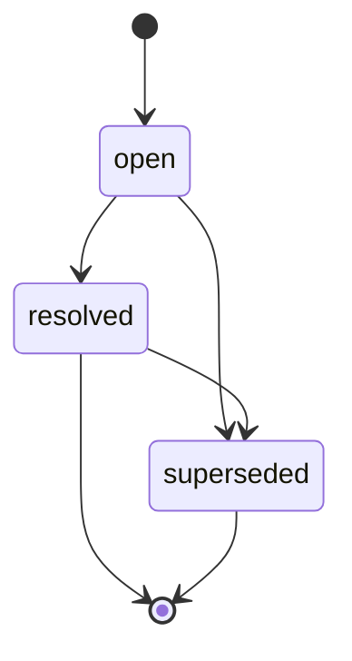

# V2 状态与模型契约

本文是 Requirement Understanding V2 的 canonical 数据契约。其他 reference 不得定义冲突字段或枚举。

这些结构是同一 Session 内的概念模型，不要求原样输出 JSON，也不要求落盘。

---

## 1. 根状态

```ts
interface RequirementUnderstandingState {
  schema_version: "2.0";
  requirement_model: RequirementModel;
  requirement_issues: RequirementIssue[];
}
```

只存在两个核心领域模型：RequirementModel 与 RequirementIssue 集合。根状态不保存 workflow phase；方法、诊断制品和适用维度扫描都不是第三个领域模型。

---

## 2. RequirementModel

```ts
interface RequirementModel {
  requirement_model_id: string;
  revision: number;
  confirmed_revision: number | null;
  intent: RequirementIntent;
  scope_items: ScopeItem[];
  vocabulary_terms: VocabularyTerm[];
  requirements: RequirementItem[];
}
```

### 2.1 RequirementIntent

```ts
interface RequirementIntent {
  problem: IntentStatement | null;
  desired_outcome: IntentStatement | null;
  target_users: IntentStatement[];
  success_signals: IntentStatement[];
}

interface IntentStatement extends UnderstandingFields {
  intent_item_id: string;
  statement: string;
}
```

- `problem`：为什么做，当前存在什么问题；
- `desired_outcome`：希望产生什么结果，不是预设实现方案；
- `target_users`：用户、受影响者、责任人或下游系统；
- `success_signals`：判断结果是否达成的定性或定量信号。

进入 ready 至少必须有 problem、desired outcome 和一个 target user。success signals 不强制量化；没有量化指标本身不创建 Issue。输入明确提供的定性信号和部分量化信号都按已确认内容原样记录，不擅自补齐或改写成 KPI。只有模型同时明确提供完整基线、目标、测量口径和时间窗时，才具备结构化量化指标语义。缺少四要素本身不产生 Issue；仅当模型把该指标定义为验收或发布门槛，且缺失口径导致业务上无法判定是否通过时，才创建并闭合相应 Issue。

### 2.2 ScopeItem

```ts
interface ScopeItem extends UnderstandingFields {
  scope_item_id: string;
  scope_disposition: "in_scope" | "out_of_scope";
  statement: string;
  rationale: string | null;
}
```

范围未决定时创建 `issue_type=scope` 的 RequirementIssue，不增加 undecided scope 状态。进入 ready 至少存在一个 `in_scope` ScopeItem。

### 2.3 VocabularyTerm

```ts
interface VocabularyTerm extends UnderstandingFields {
  vocabulary_term_id: string;
  term: string;
  definition: string;
  aliases: string[];
}
```

只记录会影响范围、规则、决策或验收的术语。

### 2.4 RequirementItem

```ts
interface RequirementItem extends UnderstandingFields {
  requirement_id: string;
  scope_item_ids: string[];

  requirement_type:
    | "functional"
    | "business_rule"
    | "data"
    | "integration"
    | "quality_attribute"
    | "constraint";

  statement: string;
  rationale: string | null;

  delivery_priority:
    | "must"
    | "should"
    | "could"
    | "unspecified";
}
```

`scope_item_ids` 必须非空且全部指向当前 RequirementModel 中的 ScopeItem。同一 RequirementItem 关联的 ScopeItem 必须具有相同 `scope_disposition`；若语义同时跨越 `in_scope` 与 `out_of_scope`，必须拆分为不同 RequirementItem。RequirementItem 的派生 scope 等于全部关联 ScopeItem 的共同 disposition。

进入 ready 至少存在一个派生 scope 为 `in_scope` 的 RequirementItem。每个派生 scope 为 `in_scope` 的 RequirementItem 还必须仅凭当前 confirmed 模型语义，足以形成至少一个可判定真假的完成条件；不强制 Given/When/Then，也不增加 Example 模型。若做不到，必须创建并闭合相应 Issue，模型不得进入 ready 或 confirmed。

优先级未提供时使用 `unspecified`。不得因为优先级未知就自动向用户提问，也不得把所有条目标成 `must`。

用户确认的取舍必须以 `user_decision` 解决，并将适用边界写入 confirmed ScopeItem、RequirementItem 或 rationale；不能只在 Issue 历史中留下结论。

### 2.5 UnderstandingFields

```ts
interface UnderstandingFields {
  origin:
    | "user_statement"
    | "source_document"
    | "ai_default"
    | "verified_evidence";

  understanding_status:
    | "proposed"
    | "confirmed"
    | "unresolved"
    | "unverified"
    | "conflicted";

  confirmation_mode:
    | "none"
    | "direct_statement"
    | "selected_option"
    | "batch_confirmation"
    | "source_authority"
    | "evidence_verification";

  confidence: "high" | "medium" | "low";
  source_refs: SourceReference[];
  related_issue_ids: string[];
}
```

四个维度相互独立：

| 字段 | 问题 |
|---|---|
| `origin` | 内容最初来自哪里 |
| `understanding_status` | 当前认知处于什么状态 |
| `confirmation_mode` | 为什么可视为已确认 |
| `confidence` | AI 对当前解释准确性的判断 |

| understanding_status | 草稿阶段含义 |
|---|---|
| `proposed` | 已形成候选理解，但尚未批准 |
| `confirmed` | 已由用户、权威来源或证据确认 |
| `unresolved` | 草稿中当前没有确定答案或决定 |
| `unverified` | 草稿中已有候选答案，但事实核验尚未完成 |
| `conflicted` | 草稿中同时存在无法兼容的理解 |

`unresolved` 与 `unverified` 只用于表达 draft 认知，不提供 ready 或 confirmed 支撑。ConfirmedRequirementOutput 中 problem、desired outcome、target users、success_signals、ScopeItem、VocabularyTerm 和 RequirementItem 等所有模型条目都必须是 `confirmed`；`proposed`、`unresolved`、`unverified`、`conflicted` 均非法。

#### 当前有效 Resolution 支撑谓词

Resolution 只有同时满足以下条件，才能为当前模型条目提供支撑：

1. Issue 为 `issue_status=resolved` 且不是 `superseded`；
2. 模型条目的 `related_issue_ids` 包含该 `issue_id`，Issue 的 `target_refs` 也包含该条目的精确 `target_type + target_id`；
3. Resolution 的 `answer`、`model_changes` 与当前条目语义一致，不存在被当前模型反转或冲突的结论；
4. `resolved_model_revision <= requirement_model.revision`；
5. `confirmation_model_revision` 非空且 `confirmation_model_revision <= requirement_model.revision`；
6. `confirmation_interaction_id` 非空或 `confirmation_source_ref_ids` 非空，且对应原始确认证据存在、可追溯并支持该 Resolution。

Resolution 的确认 revision 不要求等于当前 revision。无关语义导致 revision 增加时，历史 Resolution 仍可保持当前有效；若条目语义改变，必须创建新 Issue supersede 旧 Issue，旧 Resolution 只保留历史。

#### AI default 最终有效支撑谓词

确认后的 AI default 只有同时满足以下条件才有效：

1. 条目为 `origin=ai_default + understanding_status=confirmed + confirmation_mode=batch_confirmation`；
2. 存在满足“当前有效 Resolution 支撑谓词”的双向精确关联 Issue；
3. Issue 为 `resolution_route=apply_ai_default`、`error_impact=low`、`reversibility=easy`、`blocks_confirmation=false`；
4. 默认目标不是 problem、desired outcome、核心范围、关键业务规则或关键数据语义；
5. Resolution 为 `resolution_type=accepted_default + resolved_by=user`；
6. Resolution 的原始确认 revision 与证据非空、可追溯，且确认 revision 不晚于当前模型 revision。

顶层 `confirmation_evidence` 另行精确绑定当前整个模型 revision。历史 `accepted_default` 不因无关语义增加 revision 而失效；只有语义改变时才通过新 Issue supersede 旧 Issue。

等待门禁批准时，AI default 的临时组合是：

```yaml
origin: ai_default
understanding_status: proposed
confirmation_mode: none
```

并由独立的 `open + apply_ai_default` Issue 双向关联。Issue 同样必须满足低影响、易反转、不阻塞且目标非核心的约束。该组合只满足门禁候选谓词，不满足 ready 或 confirmed。

用户在 revision 门禁批准后，原子更新为：

```yaml
origin: ai_default
understanding_status: confirmed
confirmation_mode: batch_confirmation
```

### 2.6 SourceReference

```ts
interface SourceReference {
  source_ref_id: string;

  source_type:
    | "user_message"
    | "source_document"
    | "external_evidence"
    | "prototype";

  source_name: string | null;
  locator: string;
  quoted_text: string | null;

  authority_level:
    | "authoritative"
    | "supporting"
    | "unknown";
}
```

Authority 针对当前被引用信息判断，不是来源的全局等级。只有原文保真、冲突处理或关键证据需要时才记录 quoted text。

---

## 3. RequirementIssue

```ts
interface RequirementIssue {
  issue_id: string;

  issue_type:
    | "missing_information"
    | "ambiguity"
    | "conflict"
    | "decision"
    | "validation"
    | "scope"
    | "terminology";

  title: string;
  description: string;
  target_refs: TargetReference[];

  resolution_route:
    | "investigate_evidence"
    | "ask_user"
    | "apply_ai_default"
    | "record_user_decision";

  question_mode:
    | "none"
    | "open_ended"
    | "option_selection";

  decision_owner:
    | "user"
    | "ai"
    | "external_authority"
    | "unknown";

  error_impact: "high" | "medium" | "low";
  reversibility: "easy" | "moderate" | "hard";

  evidence_confidence:
    | "high"
    | "medium"
    | "low"
    | "not_applicable";

  blocks_confirmation: boolean;

  issue_status:
    | "open"
    | "resolved"
    | "superseded";

  depends_on_issue_ids: string[];
  supersedes_issue_id: string | null;
  source_refs: SourceReference[];
  interactions: Interaction[];
  resolution: Resolution | null;
}
```

### 3.1 Issue type

| issue_type | 使用条件 |
|---|---|
| `missing_information` | 必要信息缺失，且正确 owner 能直接补充或决定 |
| `ambiguity` | 表达存在多种合理解释 |
| `conflict` | 多个认知无法同时成立 |
| `decision` | 存在多个可行方案，需要确定采用哪一个 |
| `validation` | 某项事实必须在确认 PRD 前由证据查明 |
| `scope` | 是否纳入本次需求尚未确定 |
| `terminology` | 术语含义或口径不一致 |

`issue_type=validation` 的语义严格限定为“确认 PRD 前必须完成的事实核验”：

- `resolution_route` 必须是 `investigate_evidence`；
- 未取得足够证据时必须保持 `open + blocks_confirmation=true`；
- 只能以 `resolution_type=verified_fact` 解决；
- 解决时必须保留 authoritative 或足以支撑结论的 SourceReference；
- 产品本人不知道事实时，等待其咨询有权人员并带回证据，期间不得确认。

不新增其他事实核验类型。

用户主动拍板仍是 `decision`：

```yaml
issue_type: decision
resolution_route: record_user_decision
interaction_type: unsolicited_decision
resolution_type: user_decision
```

### 3.2 Resolution route

| resolution_route | 行为 |
|---|---|
| `investigate_evidence` | 从材料、系统、数据或有权人员提供的证据查明事实 |
| `ask_user` | 向拥有信息或决策权的用户获取答案或取舍 |
| `apply_ai_default` | 使用低风险 AI 默认，等待门禁确认 |
| `record_user_decision` | 用户已主动决定，直接记录并写回模型 |

Route 约束：

- validation Issue 只能使用 `investigate_evidence`；
- `apply_ai_default` 只能产生 `accepted_default`；
- `record_user_decision` 只能产生 `user_decision`；
- 任何 route 都不能用计划、延后或风险声明替代事实核验。

### 3.3 TargetReference

```ts
interface TargetReference {
  target_type:
    | "intent_item"
    | "scope_item"
    | "vocabulary_term"
    | "requirement";

  target_id: string;
  target_field: string | null;
}
```

---

## 4. Interaction

```ts
interface Interaction {
  interaction_id: string;
  interaction_sequence: number;

  interaction_type:
    | "open_question"
    | "choice_question"
    | "unsolicited_decision"
    | "artifact_review";

  question_text: string | null;
  options: InteractionOption[];
  ai_recommendation: AIRecommendation | null;
  user_response: UserResponse | null;
  created_issue_ids: string[];
}

interface InteractionOption {
  option_key: string;
  label: string;
  description: string;
}

interface AIRecommendation {
  option_key: string;
  rationale: string;
  confidence: "high" | "medium" | "low";
}

interface UserResponse {
  response_type:
    | "selected_option"
    | "custom_answer"
    | "deferred";

  selected_option_key: string | null;
  free_text: string | null;
}
```

约束：

- interaction sequence 在当前 Issue 内从 1 递增；
- `open_question` 的 options 为空、AI recommendation 为 null；
- `choice_question` 使用 1–3 个选项；
- selected option key 必须出现在 options 中；
- 用户可选择选项并通过 free text 补充限制；
- `unsolicited_decision` 的 question text 可以为 null；
- `artifact_review` 可通过 created issue ids 产生新问题；
- `deferred` 只记录延后，不形成 Resolution，不改变 Issue 状态；Issue 保持 open，若答案影响 PRD 则 `blocks_confirmation=true`。

---

## 5. Resolution

```ts
interface Resolution {
  resolution_type:
    | "verified_fact"
    | "user_decision"
    | "accepted_default"
    | "no_model_change";

  answer: string;
  rationale: string;

  resolved_by:
    | "user"
    | "ai"
    | "external_authority";

  confirmation_mode:
    | "direct_statement"
    | "selected_option"
    | "batch_confirmation"
    | "source_authority"
    | "evidence_verification";

  selected_option_key: string | null;
  rejected_option_keys: string[];
  model_changes: ModelChange[];
  resolved_model_revision: number;
  confirmation_interaction_id: string | null;
  confirmation_source_ref_ids: string[];
  confirmation_model_revision: number | null;
}

interface ModelChange {
  operation: "add" | "replace" | "remove";

  target_type:
    | "intent_item"
    | "scope_item"
    | "vocabulary_term"
    | "requirement";

  target_id: string;
  target_field: string;
  previous_value: unknown | null;
  new_value: unknown | null;
}
```

| resolution_type | 含义 |
|---|---|
| `verified_fact` | 已通过可追溯证据查明事实 |
| `user_decision` | 用户选择、补充或主动拍板；明确边界已写回模型 |
| `accepted_default` | AI 默认被用户直接或批量批准 |
| `no_model_change` | Issue 已处理，但无需修改 RequirementModel |

`verified_fact` 必须使用 `evidence_verification` 或 `source_authority`，并引用实际证据。`user_decision` 不得把尚未查明的外部事实伪装为用户选择。

---

## 6. 唯一显式状态机



| issue_status | 精确含义 |
|---|---|
| `open` | 尚未解决，可能正在调查、等待用户、等待证据或等待门禁 |
| `resolved` | 已形成合法 Resolution |
| `superseded` | 已被后续 Issue 替代，仅保留历史 |

不保存 `in_progress` 或 `waiting_*` 过程状态。推断方式：

| 情况 | 表达 |
|---|---|
| 等待用户 | `open + ask_user`，最新 question 无 user response |
| 等待事实证据 | `open + investigate_evidence` |
| 默认等待批准 | `open + apply_ai_default` |
| 用户延后回复 | 原 route 不变，Interaction 的 UserResponse 为 `deferred`，Issue 仍 open |

状态不变量：

- `resolved`：resolution 非 null；
- `open`：resolution 为 null；
- `superseded`：存在后续 Issue 的 `supersedes_issue_id` 指向它；
- `open + blocks_confirmation=true` 阻止确认；
- ready 与 confirmed 不允许任何 open Issue；
- 已解决结论变化时新建 Issue，不重新打开旧 Issue。

---

## 7. RequirementModel 派生状态

```ts
type DerivedModelState = "draft" | "ready" | "confirmed";
```

### confirmed

```text
confirmed_revision === revision
```

且必须同时满足第 9 节 Confirmed Output 不变量。该公式依赖第 8 节确认失效规则：已确认版本中新发现任何产品语义缺口时，必须先增加 revision。

### ready

同时满足：

1. `confirmed_revision !== revision`；
2. problem、desired outcome 和至少一个 target user 均存在且 confirmed；
3. 至少一个 confirmed `in_scope` ScopeItem；
4. 至少一个派生 scope 为 `in_scope` 的 confirmed RequirementItem；
5. 不存在任何 open Issue；
6. RequirementModel 中所有模型条目都是 `understanding_status=confirmed`；
7. 每个派生 scope 为 `in_scope` 的 RequirementItem 仅凭当前 confirmed 模型语义足以形成至少一个可判定真假的完成条件；
8. 适用维度扫描已经完成，每个维度均为已明确或不适用且有理由；
9. 所有拟确认语义已写入当前 revision。

success signals 可以是空数组。定性和部分量化信号按已确认内容原样保留；缺少完整基线、目标、测量口径或时间窗本身不影响 ready，除非该指标被定义为验收或发布门槛且因此无法判定是否通过。

### 门禁候选例外

为允许用户一次性批准低风险 AI 默认，以下状态可以展示 revision 门禁，但它仍派生为 draft：

- ready 的第 2、3、4、7、8、9 条均满足；
- 除 AI default 外的所有模型条目均为 confirmed；
- 唯一的 proposed 条目是 `origin=ai_default`；
- 唯一的 open Issue 是与这些条目逐一双向关联的 `apply_ai_default` Issue；
- 每个此类 Issue 都是 `error_impact=low`、`reversibility=easy`、`blocks_confirmation=false`，且目标不是 problem、desired outcome、核心范围、关键业务规则或关键数据语义；
- 门禁完整展示全部待批准默认。

用户确认时必须在一个原子更新中：把这些条目转为 confirmed；形成 `accepted_default` Resolution；把对应 Issue 转为 resolved；确认不存在 open Issue；再设置 `confirmed_revision=revision`。原子更新失败时不得输出。

### draft

既不是 confirmed，也不满足 ready 的状态；门禁候选例外在用户确认前仍属于 draft。

---

## 8. Revision 规则

必须增加 revision：

- 改变需求语义；
- 新增或删除模型条目；
- 修改目标、范围、用户、规则、术语或优先级；
- 将 Issue 结果应用到模型；
- 用户在门禁提出语义修正；
- 已确认版本中新发现任何产品语义缺口，无论它是否阻塞、是否立即改变模型字段，都必须在创建 Issue 前或同一原子更新中使 revision 递增，先让旧确认失效。

不增加 revision：

- 追加 Interaction 或审计引用；
- 将门禁覆盖的 proposed AI default 改为 confirmed；
- 写入 `batch_confirmation`；
- 更新 confirmed revision；
- 将门禁批准的 AI default Issue 从 open 更新为 resolved。

Revision 表示需求语义版本，不是对象修改次数。

---

## 9. Confirmed Output 不变量

输出 `ConfirmedRequirementOutput` 前必须同时满足：

```text
confirmed_revision === revision
不存在 issue_status == open
至少存在一个 scope_disposition == in_scope 的 ScopeItem
至少存在一个派生 scope == in_scope 的 RequirementItem
```

并且：

- problem、desired outcome 和至少一个 target user 存在且 confirmed；
- RequirementModel 中每个模型条目的 `understanding_status` 都严格等于 `confirmed`；草稿的 `proposed`、`unresolved`、`unverified`、`conflicted` 均不能进入输出；
- 每个 `origin=ai_default` 条目满足第 2.5 节 AI default 最终有效支撑谓词；
- 每个 RequirementItem 的 `scope_item_ids` 非空、引用有效且 disposition 一致；
- 每个派生 scope 为 `in_scope` 的 RequirementItem 仅凭当前 confirmed 模型语义足以形成至少一个可判定真假的完成条件；不强制 GWT，也不增加 Example 模型；
- 每个模型条目有稳定 ID、合法 origin，以及有效 SourceReference 或满足第 2.5 节谓词的当前有效 Resolution；
- 适用维度扫描通过，不存在需要新增业务语义才能完成 PRD 投影的缺口；
- 定性和部分量化 success signal 可按已确认内容原样投影；只有四要素完整时才视为结构化量化指标，除验收或发布门槛无法判定外，缺少四要素不构成缺口；
- 顶层 confirmation evidence 精确指向当前 revision，且 `interaction_id != null` 或 `source_ref_ids` 非空；对应记录可追溯到用户对该 revision 的显式确认，空 interaction/source 组合非法；
- superseded Issue 只保留历史，永远不能提供当前支撑。

以上条目共同构成本 Skill 的完整 Confirmed Output 不变量，其他 reference 不得弱化或另建外部依赖。
