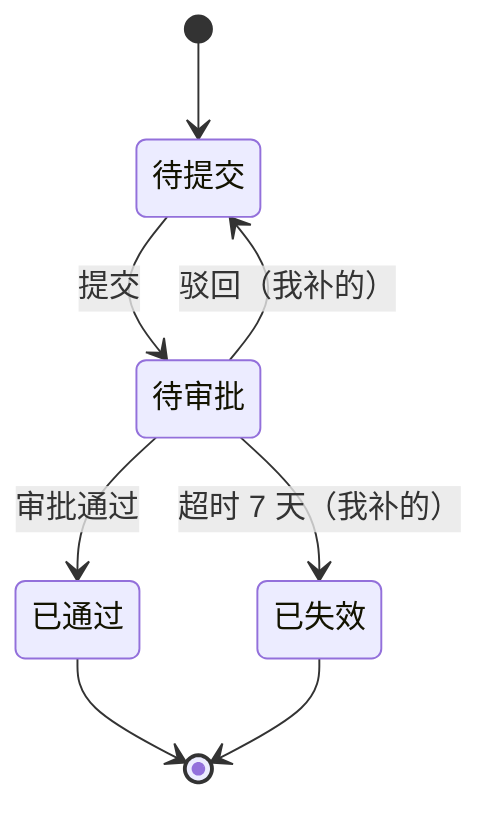

# 低保真具象化 —— 用户说不清时，给他看东西

> 何时用：追问已经失效——用户连续两轮低信息量回答（"你定就行""差不多吧""都行"），或问题本身涉及数据形态 / 流程分支 / 页面结构 / 规则组合。
> 核心机制：需求澄清最强的杠杆是**"说不清但见到能判断"**。把抽象讨论变成对具体制品的批注，用户从"作文"降为"指错"。

---

## 为什么这比继续追问有效

用户答不出来，通常不是不愿意说，是**抽象问题本身难回答**。"导出的数据要包含哪些字段" 是一道开放作文题；给他一张五行的样例表，他会立刻说"这里还要加个部门""金额要保留两位小数""这一列不用"。

一张样例数据表能顶三轮抽象追问。而且它同时产出了下游要的东西——具体的字段、边界值、规则例子。

**这也是控制提问量的手段**，不是额外负担：与其把一个说不清的点拆成五个小问题轮番问，不如给一份制品让他一次批完。

---

## 需求类型 → 形态映射

**首选是样例数据表，不是流程图。** 大多数需求的隐藏信息藏在数据里，不在流程里。

| 需求类型 | 首选形态 | 能逼出什么 |
|---|---|---|
| 数据 / 列表 / 报表 / 导出 | **markdown 样例数据表**（3-5 行有真实感的假数据） | 隐藏字段、空值口径、精度与单位、默认排序、脱敏要求 |
| 流程 / 审批 / 状态流转 | **mermaid `flowchart`** 或 **`stateDiagram`** | 缺失分支、回退路径、遗漏的终态、并发情况 |
| 规则密集（定价 / 权限 / 风控 / 折扣） | **markdown 条件组合表**（穷举组合） | 未定义的组合、规则优先级冲突、兜底缺失 |
| 页面 / 交互 | **ASCII 粗线框**（只画区块和层级） | 信息层级、缺失入口、空态与异常态 |
| 接口 / 消息 / 通知 / 文案 | **伪造的响应体或文案原文** | 字段口径、措辞、错误提示的具体说法 |

---

## 各形态示例

### 样例数据表（最高性价比）

```markdown
我按理解造了 3 行，你看看字段和格式对不对，缺什么直接说：

| 订单号 | 下单时间 | 客户 | 商品 | 数量 | 金额 | 状态 |
|---|---|---|---|---|---|---|
| SO20260801001 | 2026-08-01 09:12 | 张三（VIP） | 蓝牙耳机 | 2 | ¥398.00 | 已发货 |
| SO20260801002 | 2026-08-01 10:33 | 李四 | 数据线 | 1 | ¥0.00 | 已完成 |
| SO20260801003 | 2026-08-02 14:05 | （已注销） | 充电宝 | 3 | ¥267.50 | 退款中 |
```

**故意在数据里埋边界**：金额为 0（全额优惠券）、客户已注销、退款中状态。这些是钩子——用户看到会立刻反应"注销用户不该出现""0 元订单要单独标记"，而这些规则你直接问是问不出来的。

### mermaid 流程图 / 状态机

```markdown
我理解的审批流是这样，回退和超时这两条是我补的，你确认下：


```

**明确标出哪些分支是你补的**——用户的注意力会直接落在那里，这是最可能出错的地方。

### 条件组合表（规则密集需求）

```markdown
把组合穷举了一下，标 ? 的是我不确定的：

| 会员等级 | 券类型 | 是否叠加 | 最终折扣 |
|---|---|---|---|
| 普通 | 满减券 | 是 | 券面额 |
| VIP | 满减券 | 是 | 券面额 + 会员 9 折 |
| VIP | 折扣券 | **?** | **? 两个折扣叠乘还是取高** |
| 黑钻 | 折扣券 + 满减券 | **?** | **?** |
```

穷举组合是发现"没定义的情况"最可靠的办法——规则密集的需求里，漏掉的永远是组合，不是单条规则。

### ASCII 粗线框

```
只画区块和层级，不涉及视觉设计：

┌─────────────────────────────────────┐
│  [搜索框]              [导出] [筛选] │
├─────────────────────────────────────┤
│  订单列表                            │
│  ┌───────────────────────────────┐  │
│  │ SO2026...  张三  ¥398  已发货 │  │
│  │ SO2026...  李四  ¥0    已完成 │  │
│  └───────────────────────────────┘  │
│  ← 1 2 3 ... →                      │
├─────────────────────────────────────┤
│  ? 空态显示什么                      │
│  ? 是否需要批量操作入口              │
└─────────────────────────────────────┘
```

把不确定的地方直接用 `?` 画进去，比在图外另起一段提问更容易被看见。

### 伪造响应体 / 文案原文

```markdown
错误提示我先写了三条，措辞你改：

- 余额不足：「当前权益余额不足，无法兑换。剩余 0 次」
- 超出上限：「本月兑换已达上限（3 次），下月 1 日重置」
- 商品下架：「该权益已下架，看看其他的？」
```

文案类需求不要问"提示语要怎么说"，直接写出来让他改。

---

## 三条纪律

### 1. 低保真，且明说是抛弃型

开场就声明：**"我先粗糙造一份，纯粹为了让你好指错，不是最终形态。"**

高保真会产生两个副作用（这是原型法的经典局限，不是危言）：
- **锚定效应**——用户被早期形态框住，想不到更好的方案。
- **完成度错觉**——看起来很像做完了，导致后续讨论草率。

所以：数据表就 3-5 行、线框只画区块、流程图只画主干加疑问分支。**别做精。**

### 2. 不做 HTML 页面原型

这属于 UI 设计，越过了本 skill 的边界（本 skill 只做需求理解与对齐）。而且高保真页面原型正是上面两个副作用最严重的形态。

需要页面级原型 → 明确告知用户这属于 UI 设计阶段，需求对齐完成后另行处理。

### 3. 把疑问点画进制品里

不要"制品 + 另起一段列问题"。直接在制品内部用 `?`、`（我补的）`、加粗标注你不确定的地方——用户的视线本来就在制品上，标在里面才会被看到。

---

## 拿到批注之后

用户的批注要立刻回写，不能只停在对话里：

1. **确认的部分** → 记入「已定决策」，归属 `用户定`，状态 `confirmed`。
2. **他改的部分** → 覆盖你原来的假设；若原来在假设清单里，从清单移除（已升级为 confirmed）。
3. **他没提的部分** → 视为默认认可，但仍留在假设清单里，门禁时一并兜底。**"他没说反对"不等于确认过**，别偷偷升级成 confirmed。
4. **批注暴露的新决策点** → 加回 frontier，按 `flow.md` Step 2 的分流表重新分流（很可能有新的高返工成本点）。

回到 `flow.md` Step 3 继续。
