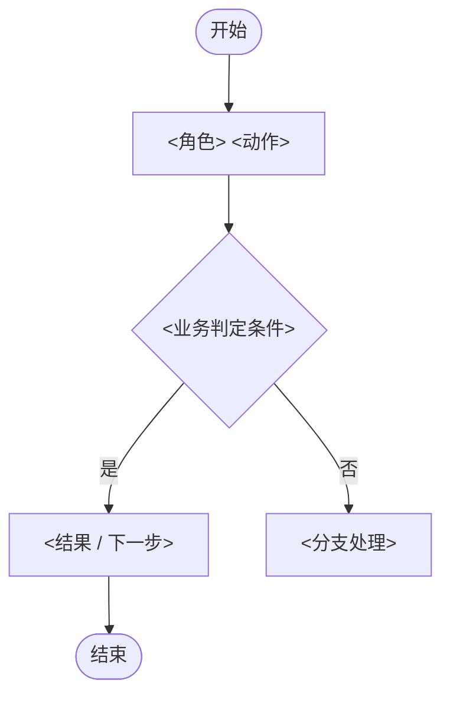

# Templates · Core

> 纯 Output Skeleton。照填，不从零手搓格式。规则见 `projection-rules.md`，名词见 `prd-language.md`。骨架按实际需求裁剪，不为填满臆造内容。
>
> **字段准入判据（防膨胀）**：每个字段过一问——去掉它会不会漏一类 in-scope 信息，或违反某条 Rule？会 → 留；不会 → 删。字段只服务 Language 节点与 Rules，不服务"看着更完整"。正文精简遵循 R-T13 的保护集，不以短为由删条件、例外、来源或验收。

## 文档信息 Doc Meta

```markdown
## 文档信息
| 项 | 值 |
|----|----|
| 标题 | <PRD 标题> |
| 版本 | v0.1 |
| 状态 | 草稿 / 评审中 / 已定稿 |
| 需求规模 | Micro / Normal / Large |
| 业务域 | <会员 / 活动 / CRM / 交易 / 增长 / 内容 / 权限 / 数据…> |
| 产品类型 | <C端 / B端 / Backend / Data / AI，可多值并标主值> |
| 更新日期 | <YYYY-MM-DD> |
| UI 链接 | <真实 URL / 空值三态> |
| UX 链接 | <真实 URL / 空值三态> |
| 关联 PRD | <标题 + 真实 URL；可多条 / 空值三态> |
| 依赖文档 | <标题 + 真实 URL；可多条 / 空值三态> |
```

## TL;DR

> **写法（R-T4 / R-T12 / R-T13）**：TL;DR 是压缩摘要，不受“权威细节只在一处”限制，但不得复制规则全文或引入新事实。首句一句话给主结论（为谁做什么），其余要素分点跟随。禁止把用户定义 / 做什么 / 问题 / 价值 / 时机 / 佐证数据塞进一个长句。每点只承担一个判断，佐证数据附在对应点后。

```markdown
## TL;DR
**<一句话主结论：为<目标用户>做<做什么>>。**
- 解决：<核心问题>
- 价值：<目标结果 / 衡量方向>
- 时机：<为何现在做，佐证数据附此>
```

## 背景与目标 Background & Goals

```markdown
## 背景与目标

**背景与问题**（R-T12 / R-T13：每点结论粗体打头，数据附结论后；一点一事）
- **<现状痛点结论>**：<数据佐证>
- **<机会结论>**：<数据佐证>

**目标**（可衡量）
- G1：<目标>

**北极星指标**：<最高层衡量指标；详细四要素见"成功指标">

**非目标**（非空）
- N1：<当前明确 `out_of_scope` 且用于划定本次边界的事项；未来承诺只按 rationale 投影到“后续规划”>
```

## 成功指标 Success Metrics

```markdown
## 成功指标
| 指标 | 基线 | 目标 | 测量口径 | 时间窗 |
|------|------|------|----------|--------|
| <指标名> | <当前值> | <目标值> | <统计对象 / 分母 / 去重口径> | <观察周期> |

<!-- 确无量化指标时，删表并写：本需求无量化指标：<原因> -->
```

## 用户与场景 Users & Scenarios

```markdown
## 用户与场景
- 目标用户：<角色；B 端需写明权限差异>
- 核心场景：<角色 + 情境 + 诉求>

**用户故事**
| 角色 | 诉求 | 价值 |
|------|------|------|
| <角色> | <想完成什么> | <获得什么价值> |
```

## 业务流程 Business Flow

````markdown
## 业务流程

**主流程图**（简单线性可豁免；有分支 / 回流 / 循环时必填）


**主流程步骤**
1. <角色> <动作> → <结果 / 下一步>（遵循 BR-00X；对应 REQ-00X）

**异常与分支**
| 分支 / 异常 | 触发条件 | 处理 | 流转到 |
|-------------|----------|------|--------|
| <名称> | <条件> | <需求侧处理> | <步骤号 / 结束> |
````

## 功能需求 Features

```markdown
## 功能需求

**功能列表总览**（REQ ≥3 时必填，见 R-T8）
| 编号 | 标题 | 优先级 | 关联公共业务规则 | 说明 |
|------|------|--------|------------------|------|
| REQ-001 | <功能标题> | P0 | <BR-00X / 空值三态> | <一句话职责> |

### REQ-001 <功能标题>
- 功能描述：<先一句话讲清这个 REQ 提供什么能力，再展开位置 / 交互（R-T12）>
- 关联：<BR-00X / 业务流程步骤号 / 空值三态>
- 规则：<主行为与条件在前，字段 / 依据 / 例外在后；同时承载多类规则时按主题拆子列表或表格（R-T12）；接口入出参、类名、方法名按 R-T1 剥离 / 空值三态>
- 异常处理：<边界 / 失败 / 兜底行为>
- 验收标准（每个 REQ 至少一组；一行一个场景）：

| 编号 | 场景 | Given（前置条件） | When（动作 / 事件） | Then（可验证结果） |
|------|------|-------------------|---------------------|--------------------|
| AC-001 | <场景名> | <前置条件> | <用户动作 / 系统事件> | <可验证结果> |
```

## 公共业务规则 Shared Business Rules

```markdown
## 公共业务规则
> 仅收录跨 ≥2 个 REQ 复用的规则（R-T3）；单功能规则留在对应 REQ 内。

| 编号 | 规则类型 | 规则内容 | 适用范围 | 备注 / 边界 |
|------|----------|----------|----------|-------------|
| BR-001 | <计算 / 限制 / 校验 / 时效 / 权限 / 风控合规> | <规则内容> | <REQ-001, REQ-002> | <备注 / 边界> |
```

## 页面交互 Page Interaction

```markdown
## 页面交互
| 页面 / 区域 | 页面职责 | 关键交互 / 跳转 | 状态与反馈 | 异常兜底 |
|-------------|----------|-----------------|------------|----------|
| <页面名> | <解决什么问题> | <操作与去向> | 加载 / 空 / 错误 / 成功 | <失败时如何处理> |

> 仅写交互需求；真实 UI/UX 链接收录在"文档信息"。
```

## 埋点 Tracking

```markdown
## 埋点
| 事件 | 触发时机 | 类型（曝光 / 点击 / 结果） | 关键属性 | 观测目的 / 关联指标 |
|------|----------|---------------------------|----------|---------------------|
| <事件名> | <明确时点> | <类型> | <业务语义参数> | <成功指标 / 分析目的> |

- 上报口径：<统计对象 / 时区 / 成功失败定义>
- 去重口径：<去重键 / 时间窗口 / 重复事件处理>
```

## 待决与验证事项 Open Items

```markdown
## 待决与验证事项
| 类型 | 事项 | 影响范围 | 责任人 | 后续动作 / 触发条件 | 状态 | 来源 |
|---|---|---|---|---|---|---|
| 暂缓 | <unresolved + parked 事项> | <章节 / REQ / 发布范围> | <follow_up_owner> | <revisit_trigger> | 暂缓 | <Issue ID> |
| 待验证 | <unverified 事项> | <章节 / REQ / 发布范围> | <decision_owner / 计划责任人> | <validation_plan 摘要> | 待验证 | <Issue ID> |
```

> 只收输入模型中明确保留的 `parked` 和 `validation_plan`。`accepted_risk` 进入“风险与依赖”，不放本表；`superseded` 不进入正文。现场发现的未知不得直接新增为 Open Item；按 R-S7 返回 ProjectionGap 并停止受影响部分。
