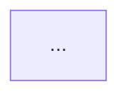

# 完整技术方案模板

---

## 模板结构

```markdown
# [系统/功能名称] 技术方案

## 1. 概述

### 1.1 一句话定位
> [用一句话说清这个系统是什么、为谁解决什么问题]

### 1.2 背景与动机
- 为什么要做这个？
- 当前痛点是什么？
- 期望达到什么效果？

### 1.3 范围
| 做 | 不做 |
|----|------|
| ... | ... |

---

## 2. 需求与约束

### 2.1 功能需求
- FR-1: ...
- FR-2: ...

### 2.2 非功能需求
| 属性 | 目标 | 优先级 | 备注 |
|------|------|--------|------|
| 性能 | P99 < Xms | 高 | |
| 可用性 | 99.X% | 高 | |
| ... | | | |

### 2.3 约束条件
- 团队：...
- 时间线：...
- 技术栈：...
- 预算：...
- 合规：...

---

## 3. 架构设计

### 3.1 架构全景图

（Mermaid Context/Container 图）



### 3.2 组件职责

| 组件 | 职责 | 技术选型 | 理由 |
|------|------|----------|------|
| ... | ... | ... | ... |

### 3.3 关键数据流

#### 场景 1：[主航道场景]

```mermaid
sequenceDiagram
    participant ...
    ...
```

步骤说明：
1. ...
2. ...

#### 场景 2：[次关键场景]
...

---

## 4. 数据设计

### 4.1 数据模型

（核心实体及其关系）

### 4.2 存储选型

| 数据 | 访问形态 | 存储方案 | 一致性 | 理由 |
|------|----------|----------|--------|------|
| ... | ... | ... | ... | ... |

### 4.3 缓存策略

| 缓存对象 | 策略 | TTL | 失效方式 |
|----------|------|-----|----------|
| ... | ... | ... | ... |

---

## 5. 接口设计

### 5.1 外部接口

| 接口 | 方法 | 路径 | 说明 |
|------|------|------|------|
| ... | ... | ... | ... |

### 5.2 内部接口/消息

| 消息/事件 | 生产者 | 消费者 | 说明 |
|-----------|--------|--------|------|
| ... | ... | ... | ... |

---

## 6. 架构决策记录 (ADR)

### ADR-1: [决策标题]

- **状态**: Adopted
- **背景**: [面临的问题]
- **候选项**:
  - A: [方案] — 优点... 代价...
  - B: [方案] — 优点... 代价...
- **决定**: [选择]
- **理由**: [为什么]
- **代价**: [放弃了什么]
- **触发信号**: [何时重新评估]

### ADR-2: ...

---

## 7. 规模化分析

### 7.1 容量估算

| 指标 | 当前 | 峰值 | 年增长 |
|------|------|------|--------|
| QPS | | | |
| 存储 | | | |
| 带宽 | | | |

### 7.2 瓶颈分析

> 涨 10x：第一个瓶颈 → [组件] → [解决方案]
> 涨 100x：第二个瓶颈 → [组件] → [解决方案]

### 7.3 扩展策略
...

---

## 8. 可靠性设计

### 8.1 故障模式分析

| 故障场景 | 影响 | 检测方式 | 应对策略 |
|----------|------|----------|----------|
| ... | ... | ... | ... |

### 8.2 韧性措施
- 超时：...
- 重试：...
- 熔断：...
- 降级：...

---

## 9. 安全设计

### 9.1 认证与授权
### 9.2 数据安全
### 9.3 审计

---

## 10. 演进路线

### Stage 1: MVP（X 周）
- 目标：...
- 范围：...
- 架构选择：...

### Stage 2: 成长期
- 触发信号：...
- 升级方向：...

### Stage 3: 成熟期
- 触发信号：...
- 升级方向：...

---

## 11. 风险与未决问题

| # | 风险/问题 | 影响 | 概率 | 缓解措施 | 负责人 |
|---|-----------|------|------|----------|--------|
| 1 | ... | ... | ... | ... | ... |

---

## 12. 里程碑与排期（可选）

| 里程碑 | 内容 | 预计时间 |
|--------|------|----------|
| M1 | ... | ... |
```

---

## 使用说明

- 根据系统复杂度裁剪：简单功能可省略 7-9 节
- 图表优先用 Mermaid，确保可版本管理
- ADR 是最核心的部分——决策推理比方案本身更有长期价值
- 演进路线必须有"触发信号"——不是时间驱动，是信号驱动
