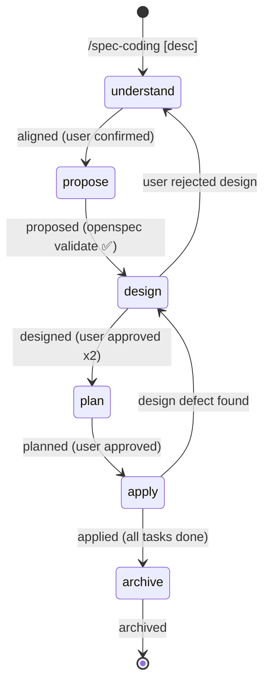

# Spec-Coding Skill Suite — 技术设计方案 v3

> **单命令启动**：需求深度理解+对齐 → 创建提案 → 技术设计 → 实现规划 → 代码实施 → spec 归档
>
> **设计原则**：自包含、可组合、文件持久化、流程自治、中断可恢复

---

## 1. 总体架构：4 个独立可组合 Skill

```
┌───────────────────────────────────────────────────────────────────┐
│  /spec-coding（编排器 + Spec 生命周期）                              │
│  全流程 spec-driven 开发                                           │
│  Phase 1-4 + 6 内聚，Phase 5 调用 /subagent-execute                │
└──────────────────────────────┬────────────────────────────────────┘
                               │ Phase 5 调用
                               ▼
┌───────────────────────────────────────────────────────────────────┐
│  /subagent-execute（通用子代理执行引擎）                              │
│  输入任务列表，输出执行结果                                          │
│  独立可用：任何有 tasks 的场景                                       │
└───────────────────────────────────────────────────────────────────┘

┌───────────────────────────────────────────────────────────────────┐
│  /parallel-dispatch（通用并行代理调度）                               │
│  输入独立任务集，并行执行，冲突检测                                    │
│  独立可用：探索、独立修复等并行场景                                    │
└───────────────────────────────────────────────────────────────────┘

┌───────────────────────────────────────────────────────────────────┐
│  /verify（横切验证门控）                                             │
│  证据先于断言。声称完成前必须独立验证。                                  │
│  横切：被所有其他 skill 在完成声明时调用                                │
│  独立可用：用户随时 /verify 验证当前工作状态                            │
└───────────────────────────────────────────────────────────────────┘
```

### 核心设计哲学

- **编排与执行分离** — spec-coding 管理 WHAT（做什么、为什么），subagent-execute 管理 HOW（怎么做）
- **验证横切** — /verify 是所有 skill 的质量约束，不属于任何一个阶段
- **Spec 生命周期委托 OpenSpec CLI** — 格式验证、归档合并、可累积性由 OpenSpec 程序化保证，spec-coding 只做编排
- **调用关系 ≠ 依赖关系** — 四者互相增强但互不强制依赖
- **每个 Skill 都有独立入口** — 可单独使用，也可组合使用
- **上下文精简** — 任何一次执行最多加载 ~800 行（编排器 + 当前阶段 + 被调用 skill）

### 前置依赖

| 依赖 | 必需？ | 用途 |
|------|--------|------|
| OpenSpec CLI (`@fission-ai/openspec`) | ✅ 必需 | spec 生命周期管理（创建、验证、归档） |
| `/subagent-execute` skill | ⚪ 可选 | 子代理驱动执行（无则 direct 模式） |
| `/parallel-dispatch` skill | ⚪ 可选 | 并行调度（无则串行） |
| `/verify` skill | ✅ 必需 | 横切验证门控（所有完成声明的质量保证） |

### OpenSpec CLI 集成点

| 阶段 | CLI 命令 | 用途 |
|------|---------|------|
| 启动/恢复 | `openspec list --json` | 检测活跃变更，自动恢复 |
| Phase 2 Propose | `openspec new change {name}` | 创建 change 目录结构（含 .openspec.yaml） |
| Phase 2 Propose | `openspec instructions proposal --change {name} --json` | 获取 proposal 四层写作指令 |
| Phase 2 Propose | `openspec instructions specs --change {name} --json` | 获取 delta spec 四层写作指令 |
| Phase 2 Propose | `openspec status --change {name} --json` | 查看工件图状态 |
| Phase 2/3/4 写入后 | `openspec validate --json` | 验证 artifact 格式 |
| Phase 3 Design | `openspec instructions design --change {name} --json` | 获取 design 四层写作指令 |
| Phase 4 Plan | `openspec instructions tasks --change {name} --json` | 获取 tasks 四层写作指令 |
| Phase 6 Archive | `openspec archive {name} --yes` | 归档：delta spec 合并入 specs/、目录移动 |

### OpenSpec Schema 选择

默认使用 OpenSpec 内置的 `spec-driven` schema（DAG：proposal → specs/design → tasks）。

如果项目需要调整 artifact 依赖关系（如强制 design 依赖 specs），可在项目中创建自定义 schema：

```
$PROJECT_ROOT/openspec/schemas/spec-coding/
├── schema.yaml          # 自定义 artifact DAG
└── templates/           # 自定义模板
    ├── proposal.md
    ├── spec.md
    ├── design.md
    └── tasks.md
```

然后在 `openspec/config.yaml` 中指定：
```yaml
schema: spec-coding
context: |
  # 项目上下文（注入所有 artifact 生成）
  ...
rules:
  specs:
    - ...
  design:
    - ...
```

**何时需要自定义 Schema**：
- 项目要求 design 必须在 specs 之后（默认 schema 中两者并行）
- 需要额外的 artifact 类型
- 需要项目级的格式规则注入

**默认 Schema 已够用的情况**（大多数）：
- spec-coding 的阶段编排已保证执行顺序（Phase 2 propose → Phase 3 design）
- 即使 Schema DAG 允许并行，spec-coding 仍会串行执行

### 独立使用入口

| Skill | 命令 | 独立使用场景 |
|-------|------|------------|
| `/spec-coding` | `/spec-coding [description]` | 完整 spec-driven 开发流程 |
| `/subagent-execute` | `/subagent-execute [tasks-path]` | 执行任何 tasks.md / 计划文件 |
| `/parallel-dispatch` | `/parallel-dispatch [description]` | 并行修复多文件 bug、并行探索等 |
| `/verify` | `/verify [claim]` | 验证当前工作状态是否与声明一致 |

### 调用链（非强制依赖）

```
/spec-coding
  ├── Phase 1/3 探索 → 可选调用 /parallel-dispatch（≥3 独立探索维度时）
  ├── Phase 2/3/4/6 完成声明 → 调用 /verify 逻辑
  └── Phase 5 执行 → 调用 /subagent-execute（串行逐任务执行）

/subagent-execute（独立使用）
  └── 每个任务完成 → 调用 /verify 逻辑（Controller 独立验证）

/parallel-dispatch（独立使用）
  └── 并行探索/调研 OR 并行修复独立 bug

/verify（横切，被动+主动）
  ├── 被动：被其他 skill 在完成声明时调用
  └── 主动：用户直接 /verify 验证当前状态
```

降级策略：
- 无 `/subagent-execute` → spec-coding 使用 direct 模式（主代理直接执行）
- 无 `/parallel-dispatch` → subagent-execute 串行执行所有任务

---

## 2. 灵感来源映射

| 能力 | 灵感来源 | 取什么 | 不取什么 |
|------|---------|--------|---------|
| Spec 生命周期 | OpenSpec | **直接调用 CLI**：创建 change、验证格式、归档合并。格式一致性和可累积性由 OpenSpec 保证 | 自己实现解析/验证/合并（委托给 CLI） |
| 技术设计 | Superpowers/brainstorming | 一次一问、多选优先、分段设计、范围检测、设计隔离性、YAGNI、spec 自审查 | Visual Companion、Git commit 设计文档 |
| 执行引擎 | Superpowers/subagent-driven | 隔离子代理、两阶段审查、4种状态处理、模型选择策略、持续执行不打断 | Git worktree 强制 |
| 并行调度 | Superpowers/dispatching-parallel | 独立性判断、prompt 构造规范、结果整合验证 | 纯调试场景的特殊处理 |
| 验证门控 | Superpowers/verification-before-completion | Gate Function 5步、反合理化表、Red-Green 回归验证、"不信任 agent 报告" | 24条失败记忆（内化为原则） |
| 复杂度分级 | ECC Size Classifier | 四级自动裁剪流程深度、根据信号自动分级 | 完整的软件工程流程标准化（过重） |
| Pattern Grounding | ECC GateGuard + 方案 B | 强制搜索代码库 6 维度约定、禁止发明模式、产出 Pattern Report | GateGuard 的 PreToolUse 钩子（实现过重） |
| TDD 铁律 | Superpowers/test-driven-development + 方案 B | RED→GREEN→REFACTOR 强制序列 + 反合理化表 | "违反 = 删除代码"（过于极端） |
| 流程编排 | Comet | 5 阶段状态机、.yaml 持久化、自动恢复检测 | Shell 脚本基础设施、CLI 命令 |
| 认知增强 | aspec | 对齐门禁、维度深度提问、经验闭环 | config.yaml 注入、外部协议引用 |

---

## 3. 文件安装结构

```
~/.claude/plugins/marketplaces/ace-local/skills/
│
├── spec-coding/                          # Skill 1: 编排器
│   ├── SKILL.md                          # 入口 + 状态机 + 阶段路由（~600 行）
│   ├── phases/
│   │   ├── understand.md                 # Phase 1: 需求理解 + 对齐（~200 行）
│   │   ├── propose.md                    # Phase 2: 创建提案（~120 行）
│   │   ├── design.md                     # Phase 3: 技术设计（~250 行）
│   │   ├── plan.md                       # Phase 4: 实现规划（~150 行）
│   │   └── archive.md                    # Phase 6: 归档收尾（~120 行）
│   ├── knowledge/
│   │   └── dimensions.md                 # 需求分析维度库 + 盲区表（~150 行）
│   └── references/
│       └── recovery.md                   # 恢复协议（~80 行）
│
├── subagent-execute/                     # Skill 2: 执行引擎
│   ├── SKILL.md                          # 执行逻辑 + 调度策略（~400 行）
│   └── prompts/
│       ├── implementer.md                # 实现者子代理 prompt（~100 行）
│       ├── spec-reviewer.md              # 规范审查子代理 prompt（~80 行）
│       └── code-reviewer.md              # 代码质量审查子代理 prompt（~60 行）
│
├── parallel-dispatch/                    # Skill 3: 并行调度
│   └── SKILL.md                          # 并行逻辑 + 冲突检测（~200 行）
│
└── verify/                               # Skill 4: 横切验证门控
    └── SKILL.md                          # Gate Function + 反合理化 + 触发时机（~150 行）
```

**总计 ~2550 行**，单次执行上下文负担：~800 行（verify ~150 行常驻作为认知锚点）

---

## 4. Skill 1: `/spec-coding`（编排器 + Spec 生命周期）

### 4.1 Front Matter

```yaml
---
name: spec-coding
description: "Full-lifecycle spec-driven coding. Single command starts: deep understanding → clarification → alignment → proposal → technical design → implementation planning → code execution → spec archive. Self-contained, file-persistent, resumable."
---
```

### 4.2 状态机设计

#### 六阶段生命周期

```
  [understand] → [propose] → [design] → [plan] → [apply] → [archive]
       │             │           │          │         │          │
  需求理解+对齐   创建提案    技术设计   实现规划  代码实施   归档收尾
  (探索+交互)    (输出)     (探索+交互+输出) (输出) (执行)   (收尾)
```

#### 状态转换

| 当前阶段 | 事件 | 目标阶段 | 守护条件 |
|---------|------|---------|---------|
| - | `init` | understand | 用户触发 /spec-coding |
| understand | `aligned` | propose | AskUserQuestion 确认对齐 |
| propose | `proposed` | design | proposal.md + delta-spec + openspec validate 通过 |
| design | `designed` | plan | design.md 生成 + 用户审批 |
| plan | `planned` | apply | tasks.md 生成 + 用户批准 |
| apply | `applied` | archive | 所有任务完成 |
| archive | `archived` | (终态) | 归档完成 |

#### 回退路径

| 阶段 | 回退条件 | 目标 |
|------|---------|------|
| design | 用户否决设计 | → understand（重新对齐） |
| apply | 发现设计缺陷 | → design |

#### 状态文件：`.ace-state.json`

```json
{
  "change_name": "add-user-auth",
  "created_at": "2026-06-08",
  "workflow": "standard",

  "phase": "apply",
  "phase_started_at": "2026-06-08T14:30:00",

  "understanding": {
    "insights_count": 3,
    "assumptions_count": 4,
    "scope_assessment": "appropriate",
    "subsystems": [],
    "issues_file": "issues/requirement-issues.md",
    "aligned": true
  },

  "proposal": "proposal.md",
  "delta_specs": ["specs/auth/spec.md"],

  "design_doc": "design.md",
  "design_approved": true,

  "tasks_file": "tasks.md",
  "total_tasks": 8,
  "completed_tasks": 5,

  "apply_mode": "subagent",
  "isolation": "branch",
  "branch_name": "feat/spec-add-user-auth",
  "current_task": 6,

  "archived": false,
  "experience_extracted": false
}
```

### 4.3 决策核心（SKILL.md 主体）

```markdown
# Spec Coding — Full-Lifecycle Spec-Driven Development

## Hard Gate

<HARD-GATE>
未通过 AskUserQuestion 获得用户确认，不得进入 propose 阶段。
未通过 AskUserQuestion 获得用户设计批准，不得进入 plan 阶段。
未通过 AskUserQuestion 获得用户计划批准，不得进入 apply 阶段。
</HARD-GATE>

## 自动恢复检测

1. 运行 `openspec list --json`（获取活跃变更列表）
2. 对每个变更检查 .ace-state.json 是否存在
3. 有 spec-coding 管理的活跃变更 → 读 phase → 路由
4. 多个活跃变更 → AskUserQuestion 选择
4. 无活跃变更 → Phase 1 (understand)

## 阶段路由

进入每阶段时 Read `phases/{phase}.md`。
Phase 5 Apply 时 invoke `/subagent-execute`。

| phase | 行为 |
|-------|------|
| understand | 内部分析 + 交互对齐 → aligned 后 → propose |
| propose | 创建提案（OpenSpec CLI）→ proposed → design |
| design | 深入代码探索 + 技术设计 → designed → plan |
| plan | 任务编排 → planned → apply |
| apply | 子代理执行 → applied → archive |
| archive | 归档收尾 → 终态 |

## 复杂度分级器（Size Classifier）

Phase 1 对齐完成后，根据需求特征自动确定流程深度：

```
分级信号：
  file_count:       预估受影响文件数
  design_ambiguity: 设计方案是否不明确
  new_dependency:   是否引入新外部依赖
  cross_module:     是否跨模块边界

分级结果：
  trivial  — 1 文件 + 设计清晰 → 跳过 Spec/Design，直接 TDD 实现
  small    — ≤3 文件 + 无新依赖 → 简化 Spec（只写 tasks），跳过完整 Design
  standard — ≤10 文件 → 完整 6 阶段流程
  large    — >10 文件或 needs_decomposition → 完整流程 + 子项目分解
```

**分级与阶段映射：**

| 分级 | Phase 1 | Phase 2 | Phase 3 | Phase 4 | Phase 5 | Phase 6 |
|------|---------|---------|---------|---------|---------|---------|
| trivial | 简化对齐 | 跳过 | 跳过 | 跳过（直接生成内联 tasks） | TDD 实现 | 简化 |
| small | ✅ | tasks only | 跳过 | ✅ | TDD 实现 | ✅ |
| standard | ✅ | ✅ | ✅ | ✅ | ✅ | ✅ |
| large | ✅ + 分解 | ✅ | ✅ | ✅ | ✅ | ✅ |

**分级时机**：Phase 1 结束后、进入 Phase 2 前。
**存储**：写入 `.ace-state.json` 的 `workflow` 字段（trivial/small/standard/large）。
**降级路径**：执行中发现比预估复杂 → 升级 workflow 等级（不回退已完成阶段）。

## 范围检测（Superpowers brainstorming 借鉴）

一个主检测点 + 一个兜底安全网：

**主检测（Phase 1 Understand 末尾）**：
- 探索完上下文、做完四追问后，在与用户交互前评估范围
- 信号：≥2 独立子系统 / "平台"等宏大词汇 / ≥3 无关技术层
- 触发后：Phase 1 的首要议题变为分解策略确认
- 分解后：只对第一个子项目继续，其余记为 Future Changes

**兜底（Phase 4 Plan 开头）**：
- 设计展开后发现无法收敛为单个 plan → 拆为多个 plan
- 不回退 design，只拆 plan（每个 plan 独立产出可工作的软件）

## 交互规则

- 每条消息只问一个问题
- 优先多选题（AskUserQuestion with options）
- 开放式仅在无法给选项时使用
- 需深入的话题 → 拆为多消息逐步追问
```

### 4.4 各阶段设计

---

#### Phase 1: Understand（需求理解 + 对齐）

**目的**：深度理解需求并与用户形成共识。内部严格执行"先想后问"。

**详细探索策略**：参见 `exploration-strategy.md` 第 3 章

**执行逻辑**：

```
Step A: 内部深度分析（先想，无用户交互）
─────────────────────────────────────────
1. 解析用户输入
2. 鸟瞰式探索项目上下文（≥3 源时并行）：
   ├── .ace/experience.md（历史经验）
   ├── 项目结构 Glob（技术栈识别）
   ├── openspec/specs/ 相关领域（已有规范）
   └── Git log --oneline -20（近期方向）
   注意：不深入代码实现，只看结构和高层信息
3. 苏格拉底四追问（内部思考）：
   - 追问目的：为什么做？根本问题？
   - 追问完整性：全貌还是冰山一角？
   - 追问前提：假设成立吗？
   - 追问约束：什么不能动？
4. 维度分析（Read knowledge/dimensions.md）：
   - 对照 8 个需求维度识别缺失
   - 生成 unknowns 列表
5. 范围评估（主检测点）：
   信号检测：
   - 描述了 ≥2 个独立子系统？
   - 涉及 ≥3 个无关技术层变更？
   - "平台"、"系统"等宏大词汇 + 无明确边界？
   IF 触发 → scope_assessment = "needs_decomposition"
6. Defeater 搜索：
   - 对用户核心断言 Steel-man → Attack

Step B: 交互对齐（后问，基于 Step A 的分析）
─────────────────────────────────────────
7. 范围分解路由（如 needs_decomposition）：
   IF scope_assessment == "needs_decomposition":
     第一个 AskUserQuestion = 分解策略确认：
     "我识别到这包含 N 个独立部分：[列表]。
      建议按 A → B → C 顺序。同意先做 A 吗？"
     → 确认后只对选中的子项目继续澄清
     → 其余记为 Future Changes
8. 基于 unknowns 设计问题：
   - 暴露取舍（方案 A vs B）
   - 关联问题（"X 还涉及 Y？"）
   - 优先级（时间/质量/范围）
9. AskUserQuestion（引导性澄清）
10. 展示四要素对齐：
    我的理解 / 计划方向 / 关键假设 / 完成标准
11. AskUserQuestion（确认对齐）
12. 写入 issues/requirement-issues.md
13. 事件 `aligned` → Phase 2
```

**门禁**：
```
<HARD-GATE>
未调用 AskUserQuestion 获得确认 = Phase 1 未完成。
文本提示不能替代工具调用。
</HARD-GATE>
```

**跳过条件**（Step B 可跳过，全部满足）：
- 同会话已完整表达意图
- 无 unknowns
- 无惊讶假设
- 延续性修复

**Red Flags**：
| 想法 | 真相 |
|------|------|
| "任务很简单" | 简单 = 隐含决策被忽略 |
| "用户说清楚了" | 说清楚 ≠ 理解正确 |
| "先探索代码再对齐" | 对齐在深入代码之前（代码探索留给 Design） |

---

#### Phase 2: Propose（创建提案）

**目的**：通过 OpenSpec CLI 创建变更，按 CLI 提供的写作指令生成提案和 delta spec

**执行逻辑**：

```
1. 创建 change（OpenSpec CLI）：
   运行 `openspec new change {change-name}`
   → 自动创建 openspec/changes/{name}/ 目录结构
   → 自动创建 .openspec.yaml（工件图状态）
   可用选项：--description, --schema, --goal

2. 获取 proposal 写作指令（OpenSpec CLI）：
   运行 `openspec instructions proposal --change {name} --json`
   → 返回四层分离的富化指令：
     - template: 文件结构模板（AI 要产出的格式）
     - instruction: 写作指导（如何写，不出现在输出中）
     - context: 项目上下文（来自 config.yaml 的 context 字段）
     - rules: 约束规则（来自 config.yaml 的 rules.proposal）
   
   AI 基于指令编写 proposal.md → 写入 change 目录

3. 获取 delta spec 写作指令（OpenSpec CLI）：
   运行 `openspec instructions specs --change {name} --json`
   → 返回同样四层分离的富化指令
   
   AI 基于指令编写 delta spec → 写入 openspec/changes/{name}/specs/{domain}/spec.md
   格式要求（OpenSpec 解析器强制，validate 验证）：
   - 操作分区 header：## ADDED / MODIFIED / REMOVED / RENAMED Requirements
   - Requirement 标题：### Requirement: {Name}
   - 正文必须含 SHALL 或 MUST（RFC 2119 关键词）
   - Scenario 标题：#### Scenario: {Name}（必须 4 个 #）
   - Scenario 内容必须含 WHEN 和 THEN
   
   示例：
   ```markdown
   ## ADDED Requirements
   
   ### Requirement: Avatar Upload
   The system SHALL accept image uploads in JPEG, PNG, and WebP formats.
   The system SHALL reject files exceeding 5MB.
   
   #### Scenario: Successful upload
   - **GIVEN** a user with a valid session
   - **WHEN** the user uploads a 2MB JPEG file
   - **THEN** the system stores the image
   - **AND** returns a public URL
   
   #### Scenario: File too large
   - **GIVEN** a user with a valid session
   - **WHEN** the user uploads a 6MB file
   - **THEN** the system rejects with HTTP 413
   - **AND** returns an error message
   ```

4. 格式验证（OpenSpec CLI）：
   运行 `openspec validate --json`
   → JSON 返回 {items: [{id, type, valid, issues}], summary: {totals}}
   → valid=true → 继续
   → valid=false → 读取 issues → 自动修复 → 重新验证
   → 3 次仍失败 → AskUserQuestion 报告问题

5. 初始化 .ace-state.json（spec-coding 自有状态文件）

6. 事件 `proposed` → Phase 3
```

**OpenSpec CLI 在 Phase 2 的完整调用序列**：
```
openspec new change {name}             # 1. 创建目录结构
openspec instructions proposal --change {name} --json   # 2. 获取 proposal 写作指令
  → AI 写 proposal.md
openspec instructions specs --change {name} --json      # 3. 获取 delta spec 写作指令
  → AI 写 specs/{domain}/spec.md
openspec validate --json               # 4. 验证所有 artifact 格式
```

**关键区分**：
- `.openspec.yaml` — OpenSpec 管理（工件图状态、spec 版本）
- `.ace-state.json` — spec-coding 管理（工作流阶段、执行模式、恢复点）
- 两文件共存于同一 change 目录，各自独立演进

---

#### Phase 3: Design（技术设计）

**目的**：深度技术设计，产出 design.md。这是代码库深入探索的阶段。

**详细探索策略**：参见 `exploration-strategy.md` 第 4 章

**执行逻辑**（融合 Superpowers brainstorming 方法论）：

```
1. 代码库分层探索（由外而内）：
   L1 全局鸟瞰：Glob 结构 + Read 入口文件
   L2 领域定位：Grep 关键词 → 受影响文件
   L3 模式学习：Read 一个类似功能的完整实现
   L4 接口分析：Grep 调用方/被调用方 → 约束清单
   （≥3 独立维度时并行 Agent）

2. Pattern Grounding（模式锚定 — 设计前强制搜索）：
   目的：禁止发明模式。先搜索代码库约定，无约定时明确声明"无现有约定"。
   
   搜索 6 维度：
   | 维度 | 搜索目标 | 方法 |
   |------|---------|------|
   | Naming | 文件/函数/类/变量命名约定 | Glob + Grep 现有代码 |
   | Error Handling | 异常抛出/返回/日志模式 | Grep throw/catch/Result |
   | Logging | 级别/格式/记录内容 | Grep log 调用 |
   | Data Access | Repository/Service/Query 模式 | 搜索 DAO/Repository 层 |
   | Test | 测试框架/fixture/断言风格/文件位置 | Glob test 文件 |
   | API | 路由/参数验证/响应格式 | 搜索 Controller 层 |
   
   产出：Pattern Grounding Report（写入 technical-design.md 的 Patterns 节）
   传递：Report 传入 implementer prompt → Worker 遵循约定编码
   
   关键规则：
   - 搜索不到 ≠ 自由发挥。搜索不到 = 声明"无约定" + 设计时定义新约定
   - Pattern Report 只搜索当前代码库，不引入外部"最佳实践"除非项目无先例

3. 读取前置 artifact 内容（instructions 只给路径，需主动读取）：
   - Read proposal.md → 获取动机和范围
   - Read specs/{domain}/spec.md → 获取行为契约
   - 这些内容作为设计的输入上下文

4. 现有代码库原则：
   - 先探索再提议
   - 遵循现有模式（不引入不一致的新风格）
   - 仅改进影响当前工作的问题（不做无关重构）

5. 设计维度分析：
   - 可行性 + 替代方案
   - 影响面 + 模块边界
   - 风险点 + 缓解措施

6. 识别设计决策 + 分级（基于 ADR 社区三维评估）：
   按可逆性 × 影响范围 × 决策成本三维矩阵评估：
   - 可逆性：不可逆/回滚成本高 vs 易回滚/可替换
   - 影响范围：跨模块/跨系统/影响 API 契约 vs 单文件内部
   - 决策成本：选错需大量重构 vs 选错改几行代码
   分级结果：
   - 需澄清：任一维度为"高" + 有 ≥2 种可行方案 → 必须向用户确认
   - 自主决定：三维度均为"低"或只有唯一可行方案 → AI 决定，记录理由

7. 设计决策澄清（需澄清级 — 确认门禁）：
   收集所有"需澄清"级决策，使用 AskUserQuestion 多 tab 交互：
   - 每个 question = 一个设计决策（独立 tab）
   - options = 2-3 个可行选项（推荐项加"(推荐)"后缀 + description 说明理由）
   - 用户可选预设选项或选"Other"自由输入
   - 单次最多 4 个 question；>4 个则分多轮提问
   → 用户确认/调整后再进入设计展开
   → 未确认的决策 = 不可写入设计文档

8. 分段呈现设计（每段后确认）：
   - 架构概览（2-3 句）
   - 组件设计（每个 100-200 字）
   - 数据流/接口
   - 错误处理
   - 测试策略

9. 设计隔离性原则（Superpowers 借鉴）：
   - 每个单元有单一明确目的
   - 通过定义良好的接口通信
   - 可独立理解和测试
   - 文件不宜过大 — 过大 = 职责不清

10. 写入两份设计文档：

    === 文档 A: OpenSpec design.md（精简，由 CLI 驱动） ===
    运行 `openspec instructions design --change {name} --json`
    → 获取 template + instruction + context + rules
    → AI 严格按 template 结构编写 design.md（精简的架构决策记录）
    → 运行 `openspec validate --json` 验证格式
    
    === 文档 B: technical-design.md（完整，spec-coding 自有） ===
    这是 spec-coding 的增强产物（类似 Superpowers brainstorming 的设计文档），
    写入 change 目录但不由 OpenSpec 管理。包含：
    # {Change} Technical Design
    ## Context（背景 + 约束 + 关联系统）
    ## Patterns（Pattern Grounding Report 完整内容）
    ## Architecture（架构图 + 数据流）
    ## Component Design（每组件：职责/接口/依赖/测试策略）
    ## Interface Contracts（API 签名/数据结构/错误码）
    ## Implementation Order（任务依赖图 — 为 Phase 4 铺垫）
    ## Risks & Mitigations
    ## Open Questions

    关系：
    - OpenSpec design.md = 轻量决策记录（满足 DAG 依赖，让 tasks 可解锁）
    - technical-design.md = 完整设计参考（传入 implementer 作为 context）

11. Spec 自审查（对 technical-design.md 执行 5 项检查）：
    □ Placeholder 扫描：TBD/TODO/待定？→ 修复
    □ 内部一致性：架构 vs 组件 是否矛盾？
    □ 范围检查：聚焦到单个实现计划可覆盖？
    □ 歧义检查：需求可被两种方式理解？→ 选一种显式化
    □ YAGNI 检查：未请求的功能？→ 删除

12. 派遣 design-reviewer 子代理（独立审查）：
    - 审查 technical-design.md
    - 检查：完整性、一致性、清晰性、范围、YAGNI
    - 通过 → 用户审查
    - 问题 → 修复后重新审查

13. AskUserQuestion（用户审查文档）— 确认门禁
    "技术设计已完成（technical-design.md + design.md），请 review。可以开始规划了吗？"
    
    IF 用户有调整意见：
      → 修改 technical-design.md（必须 — 完整设计是 implementer 的输入）
      → 评估是否影响 design.md：
        - 涉及架构决策/Goals/Risks 变更 → 同步更新 design.md + `openspec validate`
        - 仅组件细节/接口/实现顺序调整 → 只改 technical-design.md
      → 重新执行步骤 11（自审查）
      → 重新 AskUserQuestion 确认
    IF 用户确认通过：
      → 继续

14. 写入 issues/design-issues.md（如有遗留）

15. 事件 `designed` → Phase 4
```

**两份设计文档的职责分离**：
| 文档 | 管理者 | 用途 | 传递给 |
|------|--------|------|--------|
| `design.md` | OpenSpec CLI | 满足 artifact DAG 依赖、架构决策存档 | tasks instructions（作为 dependency） |
| `technical-design.md` | spec-coding | 完整设计参考、Pattern Report、接口契约 | implementer prompt（作为 context） |

**确认设计**（简化自 Superpowers 两步确认）：
- 方案选择：条件性（多方案时触发，单方案跳过）
- 文档审批：必需门禁（design 文档写好后用户审阅）

---

#### Phase 4: Plan（实现规划）

**目的**：生成 bite-sized 实现任务

**执行逻辑**（融合 Superpowers writing-plans 方法论）：

```
1. 范围兜底安全网（Superpowers writing-plans 借鉴）：
   design.md 是否覆盖了无法收敛为单个 plan 的内容？
   IF yes →
     "设计展开后发现比预期复杂。建议拆为多个 plan：
      Plan A: {scope} — 独立产出可工作的软件
      Plan B: {scope} — 独立产出可工作的软件"
     → 不回退 design（design 仍有效），只拆分执行
     → AskUserQuestion 确认拆分策略
   IF no → 继续

2. File Map：
   列出所有需创建/修改/测试的文件 + 每个文件的职责

3. 设计单元边界（Superpowers 借鉴）：
   - 清晰边界 + 定义良好的接口
   - 每文件一个清晰职责
   - 变化一起的放一起（按职责分，不按技术层分）
   - 遵循现有代码库模式

4. 任务分块（每块 5-8 任务）：
   - 每步 = 1 个原子操作（2-5 分钟）
   - 包含验证方式（命令 + 预期结果）
   - **TDD 铁律（Iron Law: 无测试不编码）：**
     每个实现任务强制遵循 RED→GREEN→REFACTOR：
     ① 写失败测试（RED）
     ② 运行测试确认 FAIL（验证测试本身有效）
     ③ 写最小实现使测试通过（GREEN）
     ④ 运行测试确认 PASS
     ⑤ 重构（如需要）
     ⑥ 提交
     
     反合理化：
     ❌ "太简单不需要测试" → 简单的东西写测试也快
     ❌ "先写代码后补测试" → 后补测试只验证代码做了什么，不验证应该做什么
     ❌ "测试会在后面任务中写" → 违反 TDD 定义
     ❌ "只是改配置" → 配置错误是最常见的生产事故
     
     豁免条件（仅以下情况可跳过 TDD）：
     - 纯文档/配置文件修改（无可执行行为）
     - 项目无测试基础设施（此时第一个任务应是搭建测试框架）

5. 读取前置 artifact 内容 + 获取 tasks 写作指令：
   - Read technical-design.md → 获取完整设计方案（组件/接口/依赖图）
   - Read specs/{domain}/spec.md → 获取行为契约（每个 scenario = 一个测试用例）
   - 运行 `openspec instructions tasks --change {name} --json`
     → 获取 tasks artifact 的 template + instruction
     → 注意：instructions 的 dependencies 只给路径，内容已在上面手动读取

6. 生成 tasks.md（遵循 OpenSpec template 格式 + spec-coding TDD 增强）：
   OpenSpec 要求：checkbox 格式 `- [ ] X.Y description`，按 ## 分组
   spec-coding 增强：每个任务内嵌 TDD 步骤 + 完整代码 + 验证命令
   
   # Implementation Tasks

   ## File Map
   - Create: `src/auth/service.ts` — 认证服务核心逻辑
   - Modify: `src/api/routes.ts:45-60` — 添加认证路由
   - Test: `test/auth/service.test.ts` — 认证服务测试

   ## Group 1: {名称}
   - [ ] 1.1 写失败测试：{描述} [完整测试代码]
   - [ ] 1.2 验证测试失败：`npm test -- auth` → expect FAIL
   - [ ] 1.3 实现最小代码使测试通过 [完整实现代码]
   - [ ] 1.4 验证测试通过：`npm test -- auth` → expect PASS
   - [ ] 1.5 提交：`git commit -m "{message}"`

   ## Group N+1: 质量收尾
   - [ ] N.1 复盘 — 对照 technical-design.md 检查偏差 → notes.md
   - [ ] N.2 经验提取
   - [ ] N.3 归档确认
   
   运行 `openspec validate --json` 确认 tasks.md 格式

7. 标注任务依赖和并行性：
   - 独立任务标记 ⟂
   - 依赖任务标记 (depends: X)
   - ≥2 个 ⟂ 任务 → 执行时将使用 /parallel-dispatch

7. AskUserQuestion（确认计划）

8. 更新 .ace-state.json

9. 事件 `planned` → Phase 5
```

---

#### Phase 5: Apply（代码实施）

**目的**：按计划执行代码实现

**执行逻辑**：

```
1. 选择执行策略（首次进入时，一次性确认）：
   AskUserQuestion（合并两个选择为一次交互）：
   - 执行模式：subagent（推荐）| direct
   - 隔离方式：branch（推荐）| worktree | none

2. 创建隔离环境（在任何代码修改之前）：
   IF branch：
     git checkout -b feat/spec-{change-name}
     → 记录 branch_name 到 .ace-state.json
   IF worktree：
     EnterWorktree
     → 记录 worktree path 到 .ace-state.json
   IF none：
     → 跳过（当前分支直接工作）
   
   ⚠️ 此步骤必须在步骤 3 之前完成。任何代码修改都在隔离环境中进行。

3. 执行：
   IF subagent 模式：
     → invoke /subagent-execute，传入：
       - tasks_file: openspec/changes/{name}/tasks.md
       - design_context: openspec/changes/{name}/technical-design.md
       - pattern_report: technical-design.md 的 Patterns 节
     → /subagent-execute 返回执行结果
     → spec-coding 更新 .ace-state.json

   IF direct 模式：
     → 逐任务执行（主代理直接实现）
     → 每任务完成后更新 tasks.md checkbox
     → 更新 .ace-state.json: completed_tasks++

4. 偏差处理（分级，借鉴 OpenSpec "随时更新 artifact" 哲学）：
   
   轻微偏差（spec 不精确但方向对）：
   - implementer 报告 DONE_WITH_CONCERNS
   - Controller 评估：是 spec 描述不精确？
   - 直接更新 delta spec 中对应的 WHEN/THEN
   - 运行 `openspec validate --json` 确认格式
   - 继续执行
   
   中度偏差（设计决策需微调）：
   - 记录到 notes.md
   - 更新 design.md 相关段落
   - 继续执行
   
   重大偏差（方向性问题）：
   - AskUserQuestion 报告偏差
   - 用户决策：继续 / 回退 Phase 3 (design) / 回退 Phase 1 (understand)

5. 全部完成 → 事件 `applied` → Phase 6
```

**spec-coding 在 Phase 5 的职责边界**：
- ✅ 选择模式和隔离方式
- ✅ 调用 /subagent-execute
- ✅ 接收结果并更新状态
- ✅ 偏差决策（回退/继续/回写 spec）
- ✅ 轻微偏差时回写 delta spec
- ❌ 不做具体的子代理调度（那是 /subagent-execute 的事）

---

#### Phase 6: Archive（归档收尾）

**目的**：知识固化 + 流程收尾。Spec 合并由 OpenSpec CLI 保证。

**执行逻辑**：

```
1. 复盘：
   - 对照 design.md 检查偏差
   - 写入 notes.md

2. 格式验证（归档前确认）：
   运行 `openspec validate`
   → 确保所有 spec 文件格式正确，避免归档失败

3. 归档（OpenSpec CLI 执行）：
   运行 `openspec archive {change-name} --yes`
   → OpenSpec 自动执行：
     - Delta spec 合并入 openspec/specs/（RENAMED→REMOVED→MODIFIED→ADDED 顺序）
     - 保留原始需求排序
     - 目录移动：changes/{name}/ → changes/archive/YYYY-MM-DD-{name}/
     - 更新 .openspec.yaml: archived: true
   → 合并算法由 OpenSpec 源码保证（specs-apply.ts 450+ 行）
   → 如归档失败 → 读取错误 → 尝试修复 → 重试

4. 经验提取：
   触发条件（任一满足）：
   - 实施中遇到意外
   - 踩坑后找到更好方案
   - 反直觉行为
   - 可复用模式

   格式：
   E{N}: {描述} | 来源: {change-name} | 日期: {date}
   | 详情: {2-3 句} | 适用: {场景}

   收敛：经验 > 20 条时提议合并/淘汰

5. 分支处理：
   AskUserQuestion：合并主分支 / 创建 PR / 保持 / 丢弃

6. 更新 .ace-state.json:
   archived: true
   experience_extracted: true/false

7. AskUserQuestion（归档确认）
```

**spec-coding vs OpenSpec 职责边界（Phase 6）**：
| 职责 | 谁做 |
|------|------|
| 复盘偏差 | spec-coding |
| delta spec 合并入 specs/ | **OpenSpec CLI** |
| 目录归档移动 | **OpenSpec CLI** |
| 经验提取 | spec-coding |
| 分支处理 | spec-coding |
| 工作流状态更新 | spec-coding |

---

### 4.5 恢复协议

```
用户说"继续"或重新调用 /spec-coding：
1. 运行 `openspec list --json`（获取所有活跃变更）
2. 对活跃变更检查 .ace-state.json 是否存在
3. 找到 spec-coding 管理的变更（.ace-state.json 存在 + archived: false）
4. 读取 phase + 关键字段
5. 按 phase 决定恢复点：
   - understand → 重新进入 Phase 1
   - propose → proposal.md 存在？继续到 Phase 3 : 重新 propose
   - design → design.md
   - plan → tasks.md
   - apply → tasks.md（找下一个未勾选任务）
6. 告知用户恢复状态
7. 继续执行

多变更：AskUserQuestion 选择

降级路径（.ace-state.json 丢失但 change 存在）：
  1. 运行 `openspec status --change {name} --json`
  2. 从 artifact 完成状态推断当前 phase：
     - proposal done + specs done + design done → phase = plan
     - proposal done + specs done → phase = design
     - proposal done → phase = propose（结束）或 design（开始）
     - 无 artifact → phase = understand
  3. 重建 .ace-state.json（基于推断的 phase）
  4. AskUserQuestion 确认推断是否正确
  5. 继续执行

无 .ace-state.json 的 openspec change：
  → 这是其他工具创建的 change，不由 spec-coding 管理
  → 提示用户：是否接管？接管则创建 .ace-state.json
```

### 4.6 项目文件系统结构

```
$PROJECT_ROOT/
├── .ace/                                 # ACE 框架私有状态目录
│   ├── experience.md                     #   项目经验库（spec-coding 维护）
│   └── config.yaml                       #   ACE 框架配置（未来扩展）
│
├── openspec/                             # OpenSpec CLI 管理的 spec 仓库
│   ├── specs/                            # 源代码真理（OpenSpec CLI 维护）
│   │   └── {domain}/spec.md              #   格式由 OpenSpec 解析器保证
│   ├── changes/                          # 进行中的变更
│   │   └── {change-name}/               #   由 `openspec new change` 创建
│   │       ├── .openspec.yaml            #   OpenSpec 管理（工件图状态）
│   │       ├── .ace-state.json         #   spec-coding 管理（工作流状态）
│   │       ├── proposal.md               #   AI 编写，openspec validate 验证
│   │       ├── design.md                 #   AI 编写（精简决策），openspec validate 验证
│   │       ├── technical-design.md       #   AI 编写（完整设计），spec-coding 私有
│   │       ├── tasks.md                  #   AI 编写，openspec validate 验证
│   │       ├── specs/                    #   Delta specs（AI 编写，格式严格）
│   │       │   └── {domain}/spec.md
│   │       ├── issues/                   #   spec-coding 私有
│   │       │   ├── requirement-issues.md
│   │       │   └── design-issues.md
│   │       └── notes.md                  #   spec-coding 私有
│   ├── changes/archive/                  # 已完成（`openspec archive` 移动至此）
│   │   └── YYYY-MM-DD-{change-name}/
│   └── config.yaml                       # OpenSpec 项目配置（schema/context/rules）
└── ...
```

**目录职责边界**：
| 目录 | 管理者 | 职责 |
|------|--------|------|
| `.ace/` | ACE 框架（spec-coding 等 skill） | 框架级状态、经验、配置 |
| `openspec/` | OpenSpec CLI | Spec 生命周期、格式保证、归档 |
| `openspec/changes/{name}/` | OpenSpec CLI + spec-coding 共管 | 变更工件 + 工作流状态 |

**文件所有权**：
| 文件 | 创建者 | 维护者 | 格式保证 |
|------|--------|--------|---------|
| .ace/experience.md | spec-coding | spec-coding | spec-coding |
| .openspec.yaml | OpenSpec CLI | OpenSpec CLI | OpenSpec |
| .ace-state.json | spec-coding | spec-coding | spec-coding |
| proposal.md | AI + spec-coding | AI | OpenSpec validate |
| design.md | AI + spec-coding | AI | OpenSpec validate |
| technical-design.md | AI + spec-coding | AI | spec-coding（自审查） |
| tasks.md | AI + spec-coding | AI + subagent-execute | OpenSpec validate |
| specs/{domain}/spec.md | AI + spec-coding | AI | **OpenSpec validate + archive** |

---

## 5. Skill 2: `/subagent-execute`（通用子代理执行引擎）

### 5.1 Front Matter

```yaml
---
name: subagent-execute
description: "Universal subagent-driven execution engine. Feed it a task list, it dispatches isolated subagents per task with two-stage review (spec compliance + code quality). Works standalone or as execution backend for /spec-coding."
---
```

### 5.2 设计理念

**核心原则**（从 Superpowers subagent-driven-development 提炼）：
- 每任务一个新的隔离子代理（无上下文污染）
- 两阶段审查：先 spec compliance，后 code quality
- 持续执行不打断（除非 BLOCKED）
- 模型选择适配任务复杂度
- 子代理可以提问（开始前和执行中）

**与 Superpowers 原版差异**：
- 不强制 TDD（按任务描述决定）
- 不强制 Git worktree（由调用者决定隔离方式）
- 不强制调用 `finishing-a-development-branch`（由调用者处理分支）
- 新增：识别独立任务时调用 `/parallel-dispatch`

### 5.3 输入/输出接口

**输入**：
```
/subagent-execute [tasks_path]
  - tasks_path: 任务文件路径（markdown with checkboxes）
  - 或通过 ARGUMENTS 直接传入任务描述
```

**输出**：
- 每任务的执行状态（DONE / DONE_WITH_CONCERNS / BLOCKED）
- 变更文件列表
- 审查结论
- tasks.md 中对应 checkbox 已勾选

### 5.4 执行流程

```
1. 解析任务列表：
   - Read tasks_path
   - 提取所有 `- [ ]` 未完成任务
   - 识别任务分组和依赖标记

2. 分析并行机会：
   - 标记为 ⟂ 的任务 → 可并行
   - 修改不同文件的任务 → 可并行
   - 有依赖的任务 → 必须串行

3. 逐任务（或并行）执行循环：
   For each task (或 parallel batch):

   3a. 选择模型（复杂度信号）：
       - 1-2 文件 + 清晰规范 → 快速模型（haiku）
       - 5+ 文件 + 模式匹配 → 标准模型（sonnet）
       - 架构判断 + 权衡 → 强模型（opus）

   3b. 派遣实现者子代理（prompts/implementer.md）：
       传递：
       - 完整任务文本（不让子代理读文件）
       - 架构背景（从 design context 摘取相关段落）
       - 约束（不修改其他代码、遵循现有模式）
       - 鼓励提问

   3c. 处理实现者状态：
       - DONE → 进入 verification gate
       - DONE_WITH_CONCERNS → 读取 concerns，必要时处理后进入 verification
       - NEEDS_CONTEXT → 提供信息，重新派遣
       - BLOCKED → 升级策略：
         ├── 上下文问题 → 补充上下文重新派遣
         ├── 推理能力不足 → 更强模型重新派遣
         ├── 任务过大 → 拆分为更小任务
         └── 计划本身错误 → 报告给调用者

   3d. Verification Gate（Controller 独立验证）：
       运行任务对应的验证命令（测试/编译/lint）
       - ✅ 通过 → 进入规范审查
       - ❌ 失败 → 报告给 implementer → 修复 → 重新验证

   3e. 规范审查（spec compliance）：
       派遣 spec-reviewer 子代理（prompts/spec-reviewer.md）
       - 验证实现 vs 任务规范（逐行对比）
       - 检查：缺失需求？多余功能？误解？
       - ✅ 通过 → 进入代码审查
       - ❌ 问题 → 实现者修复 → 重新验证 → 重新审查

   3f. 代码质量审查（code quality）：
       只在 spec compliance ✅ 后执行！
       派遣 code-reviewer 子代理（prompts/code-reviewer.md）
       - 检查：DRY、错误处理、可读性、文件职责清晰
       - ✅ 批准 → 标记完成
       - ❌ 问题 → 实现者修复 → 重新验证 → 重新审查

   3g. 标记任务完成：
       - 更新 tasks.md checkbox
       - 记录变更文件

4. 全部任务完成后：
   - 派遣最终审查子代理（整体实现审查）
   - 汇报结果给调用者
```

### 5.5 子代理 Prompt 设计

#### implementer.md

```markdown
# Implementer Subagent

You are implementing Task {N}: {task_name}

## Task Description
{FULL_TASK_TEXT — 完整粘贴，不让子代理读文件}

## Context
{架构背景 — 从 design context 摘取}

## Before You Begin
如有疑问（需求、方式、依赖、不明确的点），立即提问。
开始前提问比做完后重来更好。

## Your Job
1. TDD 循环（Iron Law — 无测试不编码）：
   ① 先写失败测试（RED）
   ② 运行测试确认 FAIL
   ③ 写最小实现使测试通过（GREEN）
   ④ 运行测试确认 PASS
   ⑤ 重构（如需要）
2. 提交
3. 自审查（完整性、质量、纪律、测试）
4. 报告

## Patterns to Follow
{PATTERN_GROUNDING_REPORT — 从 design.md Patterns 节提取}
遵循这些约定。如果没有对应约定，明确报告。

## Code Organization
- 遵循计划的文件结构
- 每文件单一职责 + 定义良好的接口
- 遵循 Pattern Grounding 中的命名/错误处理/日志约定
- 文件过大 → 报告 DONE_WITH_CONCERNS（不自行拆分）

## When You're in Over Your Head
STOP and escalate. 报告 BLOCKED 或 NEEDS_CONTEXT。
描述卡点、已尝试的方法、需要什么帮助。

## Self-Review (before reporting)
□ 完整性：是否实现了所有需求？
□ TDD：测试覆盖了 spec 中的每个 scenario？
□ 约定：遵循了 Pattern Grounding 中的命名/错误处理/日志约定？
□ 质量：命名清晰？代码可维护？
□ 纪律：YAGNI？只做了被要求的？
□ 测试：验证行为（不是 mock 行为）？

## Report Format
- Status: DONE | DONE_WITH_CONCERNS | BLOCKED | NEEDS_CONTEXT
- 实现内容
- 测试结果
- 变更文件列表
- 自审查发现
- 问题/concern
```

#### spec-reviewer.md

```markdown
# Spec Compliance Reviewer

验证实现是否与规范一致（nothing more, nothing less）。

## 规范
{FULL_TASK_REQUIREMENTS}

## 实现者报告
{IMPLEMENTER_REPORT}

## CRITICAL: 不要信任报告
实现者可能遗漏、不准确或过于乐观。独立验证一切。

DO:
- 读实际代码
- 逐行对比需求
- 检查遗漏的未实现部分
- 检查多余的未请求功能

Check:
- 缺失需求？
- 多余功能？（YAGNI）
- 误解需求？

Report:
- ✅ Spec compliant
- ❌ Issues: {具体列出，含 file:line 引用}
```

#### code-reviewer.md

```markdown
# Code Quality Reviewer

验证实现质量。只在 spec compliance ✅ 后执行。

## Review Dimensions
- 每文件是否有清晰单一职责？
- 接口是否定义良好？
- 可以独立理解和测试吗？
- DRY？错误处理？类型安全？
- 遵循现有代码库模式？
- 本次变更是否引入过大文件？

## Issue Severity
- 🔴 Critical — 阻塞进度
- 🟠 Important — 修复后继续
- 🟡 Minor — 建议但不阻塞

## Report
- Strengths
- Issues (if any, with severity)
- Assessment: Approved | Needs Changes
```

### 5.6 执行策略

```
执行模式：严格串行（Superpowers 验证有效的模式）

即使任务标记为 ⟂（逻辑独立），仍然串行执行。
原因：
  - 逻辑独立 ≠ 运行时无文件冲突
  - 串行 + 双重审查 = 高质量保证
  - 并行只用于探索/调研场景（调用 /parallel-dispatch）

任务执行顺序：
  1. 按 tasks.md 中的顺序执行
  2. 同组内按编号顺序
  3. 跨组按组顺序
  4. 无需等上一组全部完成才开始下一组（除非有 depends 标记）

⚠️ Red Flag（Superpowers 铁律）：
  绝不并行派遣修改代码的实现者子代理（冲突不可控）
```

### 5.7 Verification 集成

```
/subagent-execute 在以下时机调用 /verify 逻辑：
  - 每个 implementer 报告 DONE/DONE_WITH_CONCERNS 后
  - spec-reviewer 通过后（确认无回归）
  - 所有任务完成后的最终验证

详细的验证机制定义见 §7 /verify skill。
Controller 在此处执行的是 /verify 中定义的 Gate Function。
```

### 5.8 Red Flags

| 绝不 | 原因 |
|------|------|
| 跳过审查（spec 或 quality） | 审查是质量保证 |
| 未修复 issue 就继续 | 技术债积累 |
| 并行派遣修改同文件的 agent | 冲突 |
| 让子代理读 plan 文件 | 提供完整文本才可靠 |
| 忽略子代理提问 | 猜测 < 澄清 |
| spec 审查未过就做 code 审查 | 顺序错误，浪费 |
| 子代理失败后不改变就重试 | 相同输入 = 相同失败 |

---

## 6. Skill 3: `/parallel-dispatch`（通用并行代理调度）

### 6.1 Front Matter

```yaml
---
name: parallel-dispatch
description: "Universal parallel agent dispatcher for exploration and independent fixes. Use when facing 2+ independent investigation/exploration tasks, or 2+ bug fixes in unrelated subsystems. NOT for parallel code implementation of planned tasks — those execute serially."
---
```

### 6.2 设计理念

**核心原则**（从 Superpowers dispatching-parallel-agents 提炼）：
- 每个 agent 一个独立问题域
- 精确构造上下文（不继承会话历史）
- 并行执行，结果整合时检测冲突
- 失败不扩散（一个失败不影响其他）

**使用边界**：
- ✅ 并行探索/调研（Phase 1/3 的多维度探索）
- ✅ 并行修复独立 bug（不同子系统、不同文件）
- ❌ 并行实现计划任务（Apply 阶段 — 即使标记 ⟂ 也串行执行）

**为什么 Apply 不并行**（Superpowers 铁律）：
> "Never dispatch multiple implementation subagents in parallel (conflicts)"
- 计划阶段标记的 ⟂ 是逻辑独立，不保证运行时无文件冲突
- 并行实现后的合并冲突解决成本 > 串行实现的时间成本
- 审查流程无法对并行产物做有效交叉验证

### 6.3 执行流程

```
1. 独立性判断：
   输入的任务集是否真正独立？
   - 修改相同文件？→ ❌ 不并行
   - 共享状态？→ ❌ 不并行
   - 有序依赖？→ ❌ 不并行
   - 修复一个可能修复另一个？→ ❌ 先串行调查

2. 构造 Agent Prompt（每个任务）：
   好的 prompt 是：
   ✅ 聚焦 — 一个清晰问题域
   ✅ 自包含 — 所有需要的上下文
   ✅ 明确输出 — agent 应该返回什么
   ✅ 有约束 — 不修改范围外代码

   反模式：
   ❌ 太宽泛："修复所有测试"
   ❌ 无上下文："修复竞态条件"
   ❌ 无约束：agent 可能重构整个模块
   ❌ 输出模糊："修复它"

3. 并行派遣：
   使用 Agent tool 在单条 response 中并行发出所有任务

4. 结果整合：
   - 读取每个 agent 的返回摘要
   - 检测冲突（是否修改了同一代码？）
   - 冲突 → 手动解决
   - 无冲突 → 集成

5. 验证：
   - 运行完整测试套件
   - 抽查 agent 的工作质量
   - 确认所有修复协同工作
```

### 6.4 适用场景

| 场景 | 示例 |
|------|------|
| 多文件测试失败 | 3 个测试文件不同 root cause |
| 多子系统 bug | 认证、支付、通知各自有 bug |
| 并行探索 | 同时分析性能、安全、架构三个维度 |
| 批量任务 | 多个独立 migration 脚本 |

### 6.5 使用指南

```
/parallel-dispatch 触发时：

输入：用户描述多个独立问题（独立修复场景）
  或：来自 /spec-coding Phase 1/3 的并行探索需求

过程：
1. 确认独立性
2. 分解为 agent 任务
3. 构造 prompt
4. 并行派遣
5. 收集结果
6. 冲突检测
7. 集成验证

输出：
- 每个 agent 的工作摘要
- 冲突报告（如有）
- 集成状态（成功/需手动干预）
```

---

## 7. Skill 4: `/verify`（横切验证门控）

### 7.1 Front Matter

```yaml
---
name: verify
description: "Use before ANY completion claim — task done, tests pass, build succeeds, bug fixed, requirements met. Evidence before assertions. Never skip, never trust reports without independent verification."
---
```

### 7.2 设计理念

**铁律**：NO COMPLETION CLAIMS WITHOUT FRESH VERIFICATION EVIDENCE.

**本质**：这不是一个"阶段"——它是所有阶段共享的**质量约束**。任何时刻，任何 skill，任何 agent，在声称任何事情"完成"之前，必须通过此门控。

**为什么独立为 Skill**：
- 横切约束不属于任何单一阶段
- 作为独立 skill 出现在 skill 索引中 → agent 在即将声称完成时会"想起"
- 用户可独立使用 `/verify` 主动验证当前状态
- 被动调用时无需加载完整 spec-coding 上下文

### 7.3 Gate Function（核心机制）

```
任何完成声明触发此流程：

1. IDENTIFY — 什么命令能证明这个声明？
   声明类型 → 验证方式：
   ┌────────────────────┬───────────────────────────────────┐
   │ "测试通过"          │ 运行测试命令，看 0 failures        │
   │ "编译成功"          │ 运行 build 命令，看 exit 0         │
   │ "Lint 干净"         │ 运行 linter，看 0 errors          │
   │ "Bug 已修复"        │ 重现原始症状 → 确认不再出现        │
   │ "需求已满足"        │ 逐条 checklist 验证               │
   │ "Agent 完成了"      │ 检查 VCS diff → 独立验证变更      │
   │ "格式正确"          │ 运行格式化/验证工具               │
   │ "回归测试通过"       │ Red-Green 循环验证                │
   └────────────────────┴───────────────────────────────────┘

2. RUN — 执行验证命令
   - 必须是新鲜执行（不复用之前的结果）
   - 必须是完整执行（不跑部分）
   - 由验证方独立执行（不信任被验证方的报告）

3. READ — 检查输出
   - 读完整输出（不只看最后一行）
   - 检查 exit code
   - 计数失败/错误/警告

4. VERIFY — 输出是否确认声明？
   - ✅ 是 → 声明成立，附上证据继续
   - ❌ 否 → 声明不成立，陈述实际状态 + 证据

5. ONLY THEN — 发出完成声明
   - 声明中必须引用验证证据
   - "Tests pass (8/8, 0 failures)" ✅
   - "Tests pass" ❌（无证据）
```

### 7.4 触发时机（横切所有 Skill）

```
/spec-coding 触发点：
  Phase 2: proposal 写完 → validate 命令验证格式
  Phase 3: design.md 写完 → Placeholder 扫描 + 自审查
  Phase 4: tasks.md 写完 → spec 覆盖度检查
  Phase 5: 每个 task 完成 → 运行验证命令
  Phase 6: 归档前 → validate + 分支可合并确认

/subagent-execute 触发点：
  每个 implementer 报告 DONE → Controller 独立运行验证
  spec-reviewer 通过后 → 运行完整测试确认无回归
  所有任务完成后 → 最终集成验证

/parallel-dispatch 触发点：
  所有 agent 返回后 → 冲突检测 + 集成测试

/verify 独立使用（用户主动）：
  /verify "tests pass"     → 运行测试 → 报告结果
  /verify "build succeeds" → 运行编译 → 报告结果
  /verify                  → 检测上下文，推断应验证什么
```

### 7.5 Red-Green 回归验证（特殊流程）

```
当声称"bug 已修复"或"回归测试有效"时，单次通过不够：

1. Write 回归测试
2. Run → 确认通过（测试本身正确）
3. Revert 修复代码
4. Run → 必须失败（证明测试真的能检测到 bug）
5. Restore 修复代码
6. Run → 再次通过（修复有效）

只有完成全部 6 步，"bug 已修复"声明才成立。
```

### 7.6 反合理化对照表

```
当你发现自己在想以下任何一条 → 你正在跳过验证 → 立即停止：

┌─────────────────────────────────┬─────────────────────────────────────┐
│ 你的想法                         │ 真相                                 │
├─────────────────────────────────┼─────────────────────────────────────┤
│ "Should work now"               │ "Should" ≠ evidence. Run it.        │
│ "I'm confident"                 │ Confidence ≠ proof. Run it.         │
│ "Agent said success"            │ Agent reports are claims, not proof. │
│ "Tests passed last time"        │ Code changed since. Run again.      │
│ "Linter passed so build works"  │ Linter ≠ compiler ≠ runtime.        │
│ "Just this once"                │ No exceptions. Ever.                │
│ "Partial check is enough"       │ Partial proves nothing.             │
│ "It's a trivial change"         │ Trivial changes break things too.   │
│ "I already know it works"       │ Then running it costs nothing.      │
│ "The user is in a hurry"        │ Shipping broken is slower.          │
└─────────────────────────────────┴─────────────────────────────────────┘

Iron Law: 如果验证成本低于重做成本 → 验证。（答案几乎总是 yes。）
```

### 7.7 输出格式

```
/verify 执行后返回标准化报告：

## Verification Report

**Claim:** [被验证的声明]
**Method:** [验证命令/方式]
**Evidence:**
```
[命令输出摘要]
```
**Verdict:** ✅ Confirmed | ❌ Refuted | ⚠️ Partial

[如 Refuted] **Actual State:** [实际状态描述]
[如 Partial] **Gaps:** [未验证的部分]
```

### 7.8 与其他 Skill 的集成方式

```
被动集成（其他 Skill 内部调用 verify 逻辑）：
  - 不需要字面上 "invoke /verify"
  - 而是在完成声明前执行 Gate Function 的 5 步
  - /verify SKILL.md 作为认知锚点确保 agent 不遗忘

主动集成（用户独立使用）：
  /verify [claim]
  → 解析 claim
  → 自动选择验证方式（基于项目技术栈）
  → 执行 Gate Function
  → 返回 Verification Report

自动检测（无 claim 时）：
  /verify
  → 检查 git status（有未提交变更？）
  → 检查最近 task（有标记完成但未验证的？）
  → 推断最可能需要验证的声明
  → 执行验证
```

---

## 8. 四 Skill 协作示例

### 完整流程示例

```
用户: /spec-coding 为用户 profile 添加头像上传功能

→ spec-coding Phase 1 (understand)
  并行探索 4 个源（≥3 独立维度 → 并行 Agent）
  → 识别现有上传逻辑、存储方案、auth 模型、前端组件
  苏格拉底追问 → unknowns 列表
  AskUserQuestion: "头像尺寸限制？存储方式（本地/OSS）？"
  四要素对齐确认

→ spec-coding Phase 2 (propose)
  `openspec new change add-avatar-upload`
  生成 proposal.md + delta spec
  `openspec validate --json` → ✅

→ spec-coding Phase 3 (design)
  代码库分层探索（L1→L2→L3→L4）
  2 种方案对比 → 用户选择
  分段设计展开
  design-reviewer 审查 → 通过
  用户审查文档 → 确认

→ spec-coding Phase 4 (plan)
  生成 tasks.md（8 个任务，标注依赖关系）

→ spec-coding Phase 5 (apply)
  选择 subagent 模式 + branch 隔离
  → invoke /subagent-execute tasks.md

    /subagent-execute（严格串行执行）:
    Task 1: 实现上传 API
      implementer → verification gate → spec-review → code-review → ✅
    Task 2: 实现存储 service
      implementer → verification gate → spec-review → code-review → ✅
    Task 3: 实现图片处理
      implementer → verification gate → spec-review → code-review → ✅
    ...
    Task 8: 集成测试
      implementer → verification gate → spec-review → code-review → ✅
    → 最终整体审查

  ← /subagent-execute 返回 {status: "completed", completed_count: 8}
  spec-coding 更新状态

→ spec-coding Phase 6 (archive)
  复盘 → `openspec archive add-avatar-upload --yes` → 经验提取 → 归档
```

### 独立使用示例

```
用户: /subagent-execute ./docs/refactoring-tasks.md
→ 直接执行，无需 spec-coding 流程

用户: /parallel-dispatch 修复 auth、payment、notification 三个模块的超时 bug
→ 直接并行调度，无需 subagent-execute 的审查流程
```

---

## 9. 设计决策记录

| 决策 | 选择 | 理由 | 备选 |
|------|------|------|------|
| 架构模式 | 3 独立 skill | 可组合复用、上下文精简、独立迭代 | 全内聚（膨胀）、彻底拆分（碎片化） |
| 编排器命名 | spec-coding | 直观表达"spec-driven coding" | spec-engine（太抽象）、comet-lite（混淆） |
| Spec 生命周期 | **委托 OpenSpec CLI** | 格式一致性/可合并性/可累积性由程序保证；团队已接受安装 CLI | 自己实现（450+ 行合并算法不可靠）、纯内联模板（格式漂移风险） |
| 执行引擎独立性 | 完全独立 skill | 任何有 tasks 的场景都可复用 | spec-coding 子模块（耦合） |
| 并行调度定位 | 探索并行 + 独立修复并行 | Apply 串行执行（Superpowers 铁律）；并行仅用于无代码修改的场景 | Apply 并行（冲突风险不可控） |
| 范围检测时机 | Phase 1 主检测 + Phase 4 兜底 | Superpowers 做法：问细节前先评估范围，避免对错误范围做无用功 | Phase 3 检测（太晚，proposal 已白做）、三层都检测（机械冗余） |
| 状态持久化 | YAML（三层分离：.openspec.yaml + .ace-state.json + .ace/） | 各自独立演进，不互相破坏 | 合并为一个文件（耦合） |
| ACE 状态目录 | 项目级 `.ace/` 目录 | experience.md 非 OpenSpec 概念，需独立空间；ACE 框架需要自有配置位置 | 放在 openspec/ 下（语义混淆）、自定义 schema artifact（过度耦合） |
| 阶段划分 | 6 阶段（合并 understand+clarify） | 两者是同一认知活动的两步；用户无感知分离；无中断恢复需要 | 7 阶段（人为切割增加管理成本） |
| 子代理审查 | 三阶段（verification → spec → quality） | verification gate 独立验证编译/测试；spec 验证功能正确；quality 验证代码质量 | 两阶段（缺少自动化验证）、单次审查（遗漏多） |
| 验证门控独立性 | 独立 `/verify` skill | 横切约束不属于任何阶段；作为认知锚点存在于 skill 索引；用户可独立使用 | 内嵌于 subagent-execute（只在 Apply 生效）、内嵌于 shared/（无独立入口） |
| OpenSpec Schema | 使用默认 `spec-driven`（可选自定义） | 默认 schema 满足基础需求；项目可通过自定义 schema 调整 artifact DAG | 强制自定义（增加初始化成本） |
| Spec 偏差处理 | 轻微→回写 delta spec / 重大→回退 Design | OpenSpec 哲学"随时更新 artifact"；分级处理避免过度回退 | 全部记 notes.md（偏差积累） |
| 兼容 OpenSpec 目录 | 直接使用 OpenSpec 目录（由 CLI 管理） | 与团队现有实践一致，spec 可跨项目复用 | 自定义目录（孤岛） |
| 设计阶段审查 | design-reviewer 子代理 | Superpowers 的独立审查哲学 | 仅自审查（盲点多） |
| 交互规则 | 一次一问 + 多选优先 | Superpowers 验证有效 | 批量提问（信息过载） |
| 复杂度分级 | 四级自动裁剪（trivial/small/standard/large） | 简单任务走完整流程是过度工程；ECC Size Classifier 验证有效 | 全流程不裁剪（效率低）、手动选择（增加用户负担） |
| Pattern Grounding | 设计前强制搜索 6 维度代码库约定 | 禁止发明模式；减少 Worker 基于假设编码；保持代码风格一致 | "读一个类似实现"（非结构化，遗漏多） |
| TDD 铁律 | 强制 RED→GREEN→REFACTOR | 后补测试只验证代码做了什么；TDD 保证行为正确性 | 可选 TDD（质量无保证）、全部跳过（风险高） |

---

## 10. 实施路径

### 优先级

| 阶段 | 内容 | 优先级 | 预估行数 |
|------|------|--------|---------|
| `/spec-coding` SKILL.md | 决策核心 + 状态机 + 路由 | P0 | ~600 |
| Phase 1 | understand | P0 | ~250 |
| Phase 2-3 | propose + design | P0 | ~370 |
| `/verify` | 横切验证门控 | P0 | ~150 |
| Phase 4 | plan | P1 | ~150 |
| `/subagent-execute` | 完整执行引擎 | P1 | ~400 |
| 子代理 prompts | implementer + reviewers | P1 | ~240 |
| Phase 6 | archive | P1 | ~120 |
| `/parallel-dispatch` | 并行调度 | P2 | ~200 |
| knowledge/dimensions | 维度库 | P2 | ~150 |
| references/recovery | 恢复协议 | P2 | ~80 |

### 实施顺序建议

```
Round 1（核心闭环）：
  spec-coding SKILL.md + Phase 1-4 + Phase 6 + /verify
  → 最小可用版本（direct 模式执行 + 验证门控）

Round 2（执行引擎）：
  subagent-execute + prompts
  → 启用 subagent 模式

Round 3（并行增强）：
  parallel-dispatch
  → 启用并行探索

Round 4（知识库）：
  dimensions.md + recovery.md
  → 完善深度分析和恢复能力
```

---

## 附录 A：与参考项目的映射

| 本 Suite 能力 | OpenSpec | Superpowers | Comet | aspec |
|--------------|----------|-------------|-------|-------|
| Phase 1 Understand | - | brainstorming 一次一问 | - | 苏格拉底追问 + 对齐门禁 |
| Phase 2 Propose | /opsx:propose | - | /comet-open | proposal 规则 |
| Phase 3 Design | design artifact | brainstorming 全流程 | /comet-design | 设计澄清 |
| Phase 4 Plan | tasks artifact | writing-plans | /comet-build(plan) | tasks 规则 |
| Phase 5 Apply | /opsx:apply | subagent-driven | /comet-build(exec) | - |
| Phase 6 Archive | /opsx:archive | finishing-branch | /comet-archive | 质量收尾 |
| 执行引擎 | - | subagent-driven-development | - | - |
| 并行调度 | - | dispatching-parallel-agents | - | 并行约束 |
| 横切验证 | - | verification-before-completion | - | - |
| 状态持久化 | .openspec.yaml | - | .comet.yaml | - |
| 维度分析 | - | - | - | dimensions.md |
| 经验系统 | - | - | - | experience.md |
| 两阶段审查 | - | spec + quality reviewer | verify | - |
| 设计独立审查 | - | spec-document-reviewer | - | - |
| 范围检测分解 | - | brainstorming scope check | - | - |
| 设计隔离性 | - | brainstorming design principles | - | - |

---

## 附录 B：状态机图



---

## 附录 C：Skill 间通信协议

```
/spec-coding → /subagent-execute:
  传入：
    tasks_path: string           # 任务文件路径
    design_context: string       # design.md 摘要
    dependency_marks: Map        # 任务依赖标记
    resume_from?: task_id        # 恢复点（中断后继续时传入）
  返回：
    status: "completed" | "partial" | "blocked" | "escalation"
    completed_count: number
    total_count: number
    last_completed_task: string  # 最后完成的任务 ID（用于恢复）
    files_changed: string[]
    issues: Issue[]              # 审查发现的问题
    escalation?: {              # 仅 status=escalation 时
      type: "design_defect" | "scope_expansion" | "unresolvable_conflict"
      description: string
      affected_tasks: string[]
    }

/spec-coding → /parallel-dispatch（Phase 1/3 探索）:
  传入：
    exploration_dimensions: string[]
    sources_per_dimension: Map
  返回：
    findings_per_dimension: Map
    
/spec-coding 对 subagent-execute 返回的处理：
  status=completed → 进入 Phase 6
  status=partial   → 记录断点，等待用户决策（继续/暂停/回退）
  status=blocked   → AskUserQuestion 报告阻塞，请求指导
  status=escalation:
    type=design_defect     → 回退 Phase 3 (design)
    type=scope_expansion   → AskUserQuestion 确认是否扩展范围
    type=unresolvable_conflict → 回退 Phase 4 (plan) 重新规划
```

---

*设计完成 | v3.4 2026-06-10 | 架构：4 独立可组合 Skill*
*灵感来源：OpenSpec + Superpowers + Comet + aspec + ECC*
*v3.4 变更：Phase 3/4 正确对接 OpenSpec instructions 流程；新增 technical-design.md（完整设计，spec-coding 私有）与 design.md（精简决策，OpenSpec 管理）分离；明确前置 artifact 读取逻辑*
