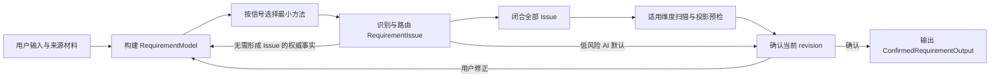
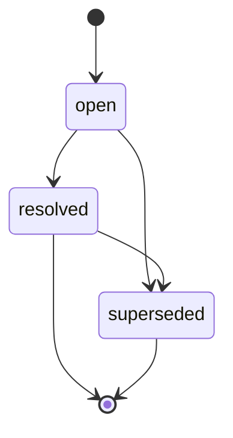
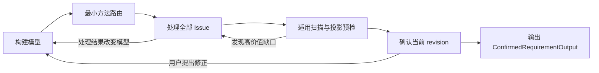

# Requirement Understanding V2 Skill 技术设计

> 状态：已同步当前实现契约
> 理解 Skill：`plugin/skills/requirement-understanding-v2/`
> 写作 Skill：`plugin/skills/requirement-writing/`
> 编排 Agent：`plugin/agents/requirement-agent.md`
> 运行边界：两个 Skill 独立，不互相命名、调用或选择回流；Agent 在同一 Session 内串联，不依赖中间状态落盘

## 1. 摘要

Requirement Understanding V2 独立完成：

1. 从用户输入、来源材料和可验证证据中建立结构化需求模型；
2. 识别缺失、歧义、冲突、决策、事实核验、范围和术语问题；
3. 只处理会改变 PRD 或造成明显返工的高价值缺口；
4. 按当前信号选择最小够用的理解方法，不机械套用模板；
5. 在确认前完成轻量适用维度扫描和 PRD 投影预检；
6. 通过显式门禁确认精确的需求模型 revision；
7. 输出 `ConfirmedRequirementOutput`，不选择任何后续流程。

需求 Agent 根据用户原始意图决定是否把合法输入交给独立写作 Skill；失败诊断的转发和重试也只由 Agent 编排。

V2 只保留两个核心领域模型：

- `RequirementModel`：当前需求语义的唯一 canonical 模型；
- `RequirementIssue[]`：理解过程中发现、处理和保留历史的问题集合。

V2 不建立独立的决策、案例、假设、提问、验证、frontier、维度扫描结果或持久化工作流模型。相关视图均从两个核心模型派生，理解方法的结果也必须回写这两个模型。

状态设计遵循最小化原则：

- 只有 `RequirementIssue` 拥有显式状态机；
- `RequirementModel` 状态由 `revision`、`confirmed_revision` 和门禁不变量派生；
- 工作流只是一组执行步骤，不存储 `workflow_phase`；
- `unresolved`、`unverified` 和 `conflicted` 只描述 draft 认知，不得进入 ready、confirmed 或成功输出。

---

## 2. 背景与问题

### 2.1 可复用能力

既有需求理解实践中以下思想继续有效：

- 区分可调查事实、用户决策和低成本默认；
- 通过错误影响与可逆性控制澄清深度；
- 按信号使用 5 Whys、JTBD、Impact Mapping、决策表、状态图、GWT、反例和低保真制品；
- 最终通过显式对齐门禁输出已确认需求；
- references 按需加载，避免入口 Skill 过长。

### 2.2 V2 要解决的问题

主要问题不是缺少澄清技巧，而是缺少统一且可执行的领域契约：

- 提问、假设、范围和决策概念分散，容易重复表达；
- 输入来源、当前认知状态和确认方式容易混用；
- 必须查证的事实容易被错误降级为询问、默认或后续事项；
- 用户看到过哪些选项、AI 推荐什么、用户如何选择以及后续是否反转，缺少统一记录；
- Issue 状态、Model 状态和 Workflow 状态可能重复表达同一事实；
- 固定方法或固定篇幅会让简单需求过度分析，也会让复杂需求被过度压缩；
- 写作若仍需新增业务语义，说明理解门禁并未真正闭合；
- Agent 若复制 Skill 的字段门禁，会形成多个漂移的契约实现。

V2 以统一模型、轻量扫描和端口内聚替代分散清单与重复门禁。

---

## 3. 设计目标与非目标

### 3.1 设计目标

1. **简单**：只有两个核心模型和一个显式状态机。
2. **精确**：字段名称见文知义，枚举维度互不混杂。
3. **不造假**：事实必须由证据确认，业务取舍必须由有权用户决定。
4. **低疲劳**：只向用户提出高价值问题，简单需求不强制形式化方法。
5. **可追溯**：记录来源、问题、交互、推荐、选择、模型修改和决策反转。
6. **版本化确认**：用户确认 `RequirementModel.revision`，而不是脱离模型的聊天摘要。
7. **可直接投影**：确认前保证无需新增业务语义即可生成 PRD。
8. **独立输出**：理解 Skill 输出 `ConfirmedRequirementOutput`，不决定后续工作。
9. **按需加载**：入口 Skill 保持精简，细节放入 references。

### 3.2 非目标

V2 不负责：

- 跨 Session 恢复、任务调度或多人协作状态；
- 将中间模型持久化到磁盘或数据库；
- 撰写最终 PRD；
- 建立完整需求管理或统计平台；
- 把每条输入事实包装成 Issue；
- 为所有低价值细节向用户提问；
- 强制所有问题选项化；
- 强制每个需求使用 GWT；
- 建立独立案例模型；
- 生成高保真 HTML 页面原型。

---

## 4. 约束与设计原则

### 4.1 已确认约束

- 两个 Skill 可由同一需求 Agent 预加载，但必须保持独立：不得互相命名、调用、回流或决定下一步；
- `plugin/agents/requirement-agent.md` 是串联、诊断转发、revision 失效和重试的唯一 orchestration owner；
- Agent 不复制、解释、弱化或预校验任一 Skill 的字段级门禁；
- 平台没有专用提问工具，因此交互契约必须是通道无关的行为规范；
- 平台支持 Markdown 表格和 Mermaid；
- references 支持按需加载；
- 澄清深度有成本，只处理高价值问题；
- 低价值 AI 默认必须显式暴露，并在最终门禁中统一确认；
- 必须核验的事实不得因用户要求停止追问而伪装成默认或业务决定；
- 写作 Skill 只接受已确认模型，并在失败时返回中立的 `InputContractFailure` 或 `ProjectionGap`；
- V1 入口只返回中立的 `LegacyRequirementInput`，不选择迁移目标或后续流程；
- 理解输出和写作输入的字段级边界分别由各自 Skill 内聚拥有。

### 4.2 核心原则

#### 原则 A：来源、认知状态、确认方式分离

一个 AI 默认被用户最终确认后表示为：

```yaml
origin: ai_default
understanding_status: confirmed
confirmation_mode: batch_confirmation
```

用户确认不会把来源改写成 `user_statement`。

#### 原则 B：Issue 是领域对象，Queue 是派生视图

“待处理问题”只是：

```text
issue_status == open
```

不建立独立 Issue Queue，也不维护重复顺序状态。

#### 原则 C：历史追加，不覆盖过去

用户改变已作出的决定时：

- 创建新 Issue；
- 新 Issue 的 `supersedes_issue_id` 指向旧 Issue；
- 旧 Issue 变为 `superseded`；
- 旧 Interaction 和 Resolution 保留。

#### 原则 D：事实与取舍分流

- 可由材料、系统、数据或有权人员查明的事实使用 `investigate_evidence`；
- `issue_type=validation` 专指确认 PRD 前必须完成的事实核验；
- 证据不足时保持 `open + blocks_confirmation=true`；
- 已知业务取舍使用 `user_decision`，并写入 confirmed 的 ScopeItem、RequirementItem 或其 rationale；
- 用户决策不能把尚未查明的外部事实变成已确认事实。

#### 原则 E：工作流状态不进入领域模型

同一 Session 内由 LLM 串行执行，不记录 `intake`、`modeling` 或 `awaiting_confirmation` 等运行时阶段。

#### 原则 F：最小方法与轻量扫描

理解方法由当前信号触发，只用于暴露问题和更新核心模型。适用维度扫描是门禁前的轻量检查，不建立第三个模型，也不机械制造问题。

---

## 5. 总体架构



### 5.1 内部状态容器

```ts
interface RequirementUnderstandingState {
  schema_version: "2.0";
  requirement_model: RequirementModel;
  requirement_issues: RequirementIssue[];
}
```

该容器是 LLM 在当前 Session 中维护的概念结构：

- 不要求以 JSON 原样输出；
- 不要求写文件；
- 不要求跨 Session 恢复；
- 字段契约用于保证各 reference 的概念一致性。

---

## 6. RequirementModel

### 6.1 根结构

```ts
interface RequirementModel {
  requirement_model_id: string;

  // 从 1 开始；仅需求语义变化时递增
  revision: number;

  // 用户最近一次确认的语义版本；未确认时为 null
  confirmed_revision: number | null;

  intent: RequirementIntent;
  scope_items: ScopeItem[];
  vocabulary_terms: VocabularyTerm[];
  requirements: RequirementItem[];
}
```

`RequirementModel` 不保存 `model_status`。`draft`、`ready`、`confirmed` 均为派生视图。

### 6.2 RequirementIntent

```ts
interface RequirementIntent {
  problem: IntentStatement | null;
  desired_outcome: IntentStatement | null;
  target_users: IntentStatement[];
  success_signals: IntentStatement[];
}

interface IntentStatement extends UnderstandingFields {
  intent_item_id: string;
  statement: string;
}
```

字段定义：

| 字段 | 含义 |
|---|---|
| `problem` | 当前存在什么问题，为什么值得处理 |
| `desired_outcome` | 希望产生什么业务或用户结果，不等于预设方案 |
| `target_users` | 使用者、受影响者、责任人或下游系统 |
| `success_signals` | 如何观察需求是否产生预期效果，可为定性或定量 |

进入 ready 前必须存在 problem、desired outcome 和至少一个 target user。纯技术需求的 target user 可以是调用系统、运维人员、管理员或下游服务。

`success_signals` 可以为空。定性和部分量化信号按已确认内容原样保留和投影；只有模型同时明确提供完整基线、目标、测量口径和时间窗时，才形成结构化量化指标。缺少四要素本身不构成 gap；仅当模型把指标定义为验收或发布门槛，且缺失口径导致业务上无法判定是否通过时，才必须闭合相应 Issue。

### 6.3 ScopeItem

```ts
interface ScopeItem extends UnderstandingFields {
  scope_item_id: string;
  scope_disposition: "in_scope" | "out_of_scope";
  statement: string;
  rationale: string | null;
}
```

不增加 `undecided`。范围尚未决定时创建 `issue_type=scope` 的 Issue，避免把问题藏在 ScopeItem 内。

ready 和 confirmed 都要求至少一个 `in_scope` ScopeItem。

### 6.4 VocabularyTerm

```ts
interface VocabularyTerm extends UnderstandingFields {
  vocabulary_term_id: string;
  term: string;
  definition: string;
  aliases: string[];
}
```

只记录影响范围、业务规则、决策、验收或数据口径的术语，不建立普通名词词典。

### 6.5 RequirementItem

```ts
interface RequirementItem extends UnderstandingFields {
  requirement_id: string;
  scope_item_ids: string[];

  requirement_type:
    | "functional"
    | "business_rule"
    | "data"
    | "integration"
    | "quality_attribute"
    | "constraint";

  statement: string;
  rationale: string | null;

  delivery_priority:
    | "must"
    | "should"
    | "could"
    | "unspecified";
}
```

`scope_item_ids` 规则：

- 非空且全部指向当前 RequirementModel 中的 ScopeItem；
- 同一 RequirementItem 关联的 ScopeItem 必须具有相同 `scope_disposition`；
- 同时跨越 in_scope/out_of_scope 时必须拆分 RequirementItem；
- RequirementItem 的派生 scope 等于关联 ScopeItem 的共同 disposition；
- ready 和 confirmed 都要求至少一个派生 scope 为 `in_scope` 的 RequirementItem。

`delivery_priority` 规则：

- 用户或权威来源明确给出时如实记录；
- 未提供时使用 `unspecified`；
- 不得擅自把所有需求标为 `must`；
- 不得仅因未指定优先级就追问用户；
- `out_of_scope` 由 ScopeItem 表达，不增加 `wont`。

每个派生 scope 为 `in_scope` 的 RequirementItem 都必须仅凭当前 confirmed 模型语义，足以形成至少一个可判定真假的完成条件；不要求在模型内固定一种验收句式，不强制 GWT，也不建立 Example 模型。不满足时模型不能进入 ready 或 confirmed。

### 6.6 通用认知字段

```ts
interface UnderstandingFields {
  origin:
    | "user_statement"
    | "source_document"
    | "ai_default"
    | "verified_evidence";

  understanding_status:
    | "proposed"
    | "confirmed"
    | "unresolved"
    | "unverified"
    | "conflicted";

  confirmation_mode:
    | "none"
    | "direct_statement"
    | "selected_option"
    | "batch_confirmation"
    | "source_authority"
    | "evidence_verification";

  confidence: "high" | "medium" | "low";
  source_refs: SourceReference[];
  related_issue_ids: string[];
}
```

四个维度不可混用：

| 字段 | 回答的问题 |
|---|---|
| `origin` | 内容最初来自哪里 |
| `understanding_status` | 当前认知处于什么状态 |
| `confirmation_mode` | 为什么可以将它视为已确认 |
| `confidence` | AI 对当前解释准确性的判断有多强 |

`understanding_status` 的精确定义：

| 状态 | 含义 | 可进入 ready/confirmed |
|---|---|---|
| `proposed` | 已形成候选理解但尚未批准 | 否；仅低风险 AI 默认可作为门禁候选 |
| `confirmed` | 已由用户、权威来源或证据确认 | 是 |
| `unresolved` | 当前没有确定答案或决定 | 否 |
| `unverified` | 已有候选答案但缺少事实证据 | 否 |
| `conflicted` | 同时存在无法兼容的理解 | 否 |

成功输出中的每一个模型条目都必须严格为 `confirmed`。Issue 历史不能把 draft 候选重新引入当前语义。

### 6.7 当前有效 Resolution 与 AI default

Resolution 只有同时满足以下条件才能支撑当前模型条目：Issue 为 `resolved` 且非 superseded；条目 `related_issue_ids` 与 Issue `target_refs` 双向精确关联；Resolution 语义与当前条目一致；`resolved_model_revision <= current revision`；`confirmation_model_revision` 和原始确认证据非空、可追溯，且 `confirmation_model_revision <= current revision`。

Resolution 的确认 revision 无需等于当前 revision。无关语义增加 revision 时，历史 Resolution 继续有效；当前条目语义改变时必须创建新 Issue supersede 旧 Issue。

AI default 的最终有效谓词还要求：

- 条目为 `origin=ai_default + understanding_status=confirmed + confirmation_mode=batch_confirmation`；
- 当前有效关联 Issue 为 `resolution_route=apply_ai_default + error_impact=low + reversibility=easy + blocks_confirmation=false`；
- 目标不是 problem、desired outcome、核心范围、关键业务规则或关键数据语义；
- Issue 为 resolved，Resolution 为 `accepted_default + resolved_by=user`；
- Resolution 的原始确认 revision/evidence 非空、可追溯且不晚于当前 revision；
- 顶层 `confirmation_evidence` 精确绑定当前整个模型 revision。

因此，历史 `accepted_default` 不会因无关 revision 增加而失效。

### 6.8 SourceReference

```ts
interface SourceReference {
  source_ref_id: string;

  source_type:
    | "user_message"
    | "source_document"
    | "external_evidence"
    | "prototype";

  source_name: string | null;
  locator: string;
  quoted_text: string | null;

  authority_level:
    | "authoritative"
    | "supporting"
    | "unknown";
}
```

`authority_level` 表示来源对当前被引用信息是否有裁决权，不是来源的全局等级。用户对产品偏好可能 authoritative，对外部系统的当前行为则可能只提供线索。

---

## 7. RequirementIssue

### 7.1 根结构

```ts
interface RequirementIssue {
  issue_id: string;

  issue_type:
    | "missing_information"
    | "ambiguity"
    | "conflict"
    | "decision"
    | "validation"
    | "scope"
    | "terminology";

  title: string;
  description: string;
  target_refs: TargetReference[];

  resolution_route:
    | "investigate_evidence"
    | "ask_user"
    | "apply_ai_default"
    | "record_user_decision";

  question_mode:
    | "none"
    | "open_ended"
    | "option_selection";

  decision_owner:
    | "user"
    | "ai"
    | "external_authority"
    | "unknown";

  error_impact: "high" | "medium" | "low";
  reversibility: "easy" | "moderate" | "hard";

  evidence_confidence:
    | "high"
    | "medium"
    | "low"
    | "not_applicable";

  blocks_confirmation: boolean;

  issue_status:
    | "open"
    | "resolved"
    | "superseded";

  depends_on_issue_ids: string[];
  supersedes_issue_id: string | null;
  source_refs: SourceReference[];
  interactions: Interaction[];
  resolution: Resolution | null;
}
```

### 7.2 Issue 类型

| issue_type | 使用条件 |
|---|---|
| `missing_information` | 必要信息缺失，且正确 owner 能直接补充或决定 |
| `ambiguity` | 已有表达存在多种合理解释 |
| `conflict` | 两个或多个认知无法同时成立 |
| `decision` | 存在多个可行方案，需要确定采用哪一个 |
| `validation` | 某项事实必须在确认 PRD 前由证据查明 |
| `scope` | 是否纳入本次需求尚未确定 |
| `terminology` | 术语含义或口径不一致 |

`issue_type=validation` 的约束：

- `resolution_route` 必须是 `investigate_evidence`；
- 未取得足够证据时必须保持 `open + blocks_confirmation=true`；
- 只能以 `resolution_type=verified_fact` 解决；
- 解决时必须保留 authoritative 或足以支撑结论的 SourceReference；
- 产品本人不知道事实时，应咨询有权人员并带回证据，期间不得确认；
- 如果前置结论使事实不再适用，应由后续 Issue 替代它，而不是伪造核验结论。

用户主动拍板仍属于 `decision`：

```yaml
issue_type: decision
resolution_route: record_user_decision
interaction_type: unsolicited_decision
resolution_type: user_decision
```

### 7.3 Resolution Route

| resolution_route | 行为 |
|---|---|
| `investigate_evidence` | 从材料、系统、数据或有权人员提供的证据查明事实 |
| `ask_user` | 向拥有信息或决策权的用户获取答案或取舍 |
| `apply_ai_default` | 使用低风险 AI 默认，等待最终门禁确认 |
| `record_user_decision` | 用户已主动决定，直接记录并写回模型 |

Route 约束：

- validation Issue 只能使用 `investigate_evidence`；
- `apply_ai_default` 只能产生 `accepted_default`；
- `record_user_decision` 只能产生 `user_decision`；
- 任何 route 都不能用后续行动、延期或风险声明替代事实核验；
- 已知业务取舍必须形成 `user_decision`，并把确认后的边界和理由写回 ScopeItem、RequirementItem 或 rationale。

### 7.4 TargetReference

```ts
interface TargetReference {
  target_type:
    | "intent_item"
    | "scope_item"
    | "vocabulary_term"
    | "requirement";

  target_id: string;
  target_field: string | null;
}
```

Issue 应尽量指向具体对象和字段。尚无对象时可先指向拟新增对象的稳定 ID，解决后由 ModelChange 记录实际变化。

---

## 8. 唯一显式状态机：RequirementIssue



### 8.1 状态定义

| issue_status | 精确含义 |
|---|---|
| `open` | 尚未解决，可能正在调查、等待用户、等待证据或等待门禁 |
| `resolved` | 已形成合法 Resolution，不再需要处理 |
| `superseded` | 已被后续 Issue 替代，仅保留历史 |

不保存 `in_progress` 或 `waiting_*` 过程状态。推断方式：

| 实际情况 | 表达 |
|---|---|
| 等待用户回答 | `open + ask_user`，最新 question 无 user response |
| 等待事实证据 | `open + investigate_evidence` |
| 默认等待批准 | `open + apply_ai_default` |
| 用户延后回复 | 原 route 不变，UserResponse 为 `deferred`，Issue 仍 open |
| 正在内部处理 | 当前 Agent 行为，不写入领域模型 |

### 8.2 状态不变量

- `resolved`：`resolution != null`；
- `open`：`resolution == null`；
- `superseded`：必须有后续 Issue 的 `supersedes_issue_id` 指向它；
- `open + blocks_confirmation=true` 阻止确认；
- ready 与 confirmed 不允许任何 open Issue；
- 已解决结论变化时创建新 Issue，不重新打开旧 Issue；
- 同一处理轮内允许 `open → resolved`，无需制造中间状态。

---

## 9. Resolution 与 ModelChange

### 9.1 Resolution

```ts
interface Resolution {
  resolution_type:
    | "verified_fact"
    | "user_decision"
    | "accepted_default"
    | "no_model_change";

  answer: string;
  rationale: string;

  resolved_by:
    | "user"
    | "ai"
    | "external_authority";

  confirmation_mode:
    | "direct_statement"
    | "selected_option"
    | "batch_confirmation"
    | "source_authority"
    | "evidence_verification";

  selected_option_key: string | null;
  rejected_option_keys: string[];
  model_changes: ModelChange[];
  resolved_model_revision: number;
  confirmation_interaction_id: string | null;
  confirmation_source_ref_ids: string[];
  confirmation_model_revision: number | null;
}
```

| resolution_type | 含义 |
|---|---|
| `verified_fact` | 已通过可追溯证据查明事实 |
| `user_decision` | 用户选择、补充或主动拍板，明确语义已写回模型 |
| `accepted_default` | AI 默认被用户直接或批量批准 |
| `no_model_change` | Issue 已处理，但无需修改 RequirementModel |

约束：

- `verified_fact` 必须使用 `evidence_verification` 或 `source_authority`，并引用实际证据；
- `user_decision` 不得把未查明的外部事实伪装为用户选择；
- 用户确认某项取舍后，Resolution 记录历史，当前有效语义必须落在 confirmed 的 ScopeItem、RequirementItem 或 rationale 中；
- `no_model_change` 可用于问题被前置结论消除等情况，但不能替代 validation Issue 的事实核验。

### 9.2 ModelChange

```ts
interface ModelChange {
  operation: "add" | "replace" | "remove";

  target_type:
    | "intent_item"
    | "scope_item"
    | "vocabulary_term"
    | "requirement";

  target_id: string;
  target_field: string;
  previous_value: unknown | null;
  new_value: unknown | null;
}
```

ModelChange 解释 Issue 如何改变 RequirementModel，也是决策历史视图的来源。

---

## 10. RequirementModel 派生状态

```ts
type DerivedModelState = "draft" | "ready" | "confirmed";
```

### 10.1 confirmed

基础公式：

```text
confirmed_revision === revision
```

同时必须满足 Confirmed Output 全部不变量：

1. problem、desired outcome 和至少一个 target user 均存在且 confirmed；
2. 至少一个 confirmed `in_scope` ScopeItem；
3. 至少一个派生 scope 为 `in_scope` 的 confirmed RequirementItem；
4. 不存在任何 open Issue；
5. RequirementModel 中所有模型条目均为 `understanding_status=confirmed`；
6. 每个 RequirementItem 的 scope 引用合法且 disposition 一致；
7. 每个 in-scope RequirementItem 仅凭当前 confirmed 语义足以形成至少一个可判定真假的完成条件；
8. 适用维度扫描通过；
9. 无需新增业务语义即可投影 PRD；
10. 顶层确认证据精确绑定当前 revision；
11. 每个使用 Resolution 支撑的条目都有语义一致、双向关联、`resolved_model_revision <= current revision` 且原始确认 revision/evidence 非空可追溯的当前有效 Resolution；
12. 每个 AI default 都满足第 6.7 节最终有效谓词。

如果已确认版本中发现新的产品语义缺口，必须先增加 revision，使旧确认立即失效。

### 10.2 ready

同时满足：

1. `confirmed_revision !== revision`；
2. problem、desired outcome 和至少一个 target user 均存在且 confirmed；
3. 至少一个 confirmed `in_scope` ScopeItem；
4. 至少一个派生 scope 为 `in_scope` 的 confirmed RequirementItem；
5. 不存在任何 open Issue；
6. RequirementModel 中所有模型条目均为 `understanding_status=confirmed`；
7. 每个 in-scope RequirementItem 仅凭当前 confirmed 模型语义足以形成至少一个可判定真假的完成条件；
8. 适用维度扫描已经完成，每个维度均为已明确或不适用且有理由；
9. 当前模型无需新增业务语义即可投影 PRD；
10. 所有拟确认语义已写入当前 revision。

`success_signals` 可以为空。定性和部分量化信号按 confirmed 内容原样保留；缺少完整四要素本身不影响 ready，除非指标被定义为验收或发布门槛且因此无法判定是否通过。

### 10.3 唯一门禁候选例外：AI defaults

为了让用户一次性批准低风险 AI defaults，以下状态可展示 revision 门禁，但在确认前仍派生为 `draft`：

- ready 的基础内容、in-scope 最小集合、适用维度扫描和投影预检均已满足；
- 除 AI defaults 外，所有模型条目均为 confirmed；
- 唯一的 proposed 条目是 `origin=ai_default`；
- 唯一的 open Issue 是与这些条目逐一双向关联的 `apply_ai_default` Issue；
- 每个此类 Issue 都是 `error_impact=low`、`reversibility=easy`、`blocks_confirmation=false`，且目标不是 problem、desired outcome、核心范围、关键业务规则或关键数据语义；
- 门禁完整展示全部待批准默认。

用户确认时必须在一个原子更新中：

1. 把全部默认条目转为 confirmed；
2. 形成 `accepted_default` Resolution；
3. 把对应 Issue 转为 resolved；
4. 断言不存在 open Issue；
5. 断言所有模型条目均 confirmed；
6. 再设置 `confirmed_revision=revision`。

任一步失败都不得输出部分确认结果。

### 10.4 draft

不满足 ready 或 confirmed 的状态均为 draft。以下情况必然是 draft：

- 存在 `proposed`、`unresolved`、`unverified` 或 `conflicted` 模型条目；
- 存在任何 open Issue；
- 缺少 in-scope ScopeItem 或派生 in-scope RequirementItem；
- 适用维度扫描未通过；
- PRD 投影仍需要猜测或新增业务语义；
- AI default 门禁候选尚未完成原子确认。

### 10.5 Revision 规则

以下变化必须 `revision += 1`：

- 改变需求语义；
- 新增或删除 Intent、Scope、Vocabulary、Requirement 条目；
- 修改范围、规则、目标用户、术语定义或优先级；
- 将 Issue 处理结果应用到模型；
- 用户在最终门禁提出语义修正；
- 已确认版本中新发现任何产品语义缺口，无论它是否立即改变模型字段，都必须在创建 Issue 前或同一原子更新中增加 revision。

以下变化不增加 revision：

- 追加 Issue 的交互历史；
- 添加纯审计引用；
- 将门禁覆盖的 proposed AI default 改为 confirmed；
- 写入 `confirmation_mode=batch_confirmation`；
- 更新 `confirmed_revision`；
- 将门禁批准的 AI default Issue 从 open 更新为 resolved。

Revision 表示需求语义版本，不是对象修改次数。

---

## 11. Interaction 交互契约

### 11.1 结构

```ts
interface Interaction {
  interaction_id: string;
  interaction_sequence: number;

  interaction_type:
    | "open_question"
    | "choice_question"
    | "unsolicited_decision"
    | "artifact_review";

  question_text: string | null;
  options: InteractionOption[];
  ai_recommendation: AIRecommendation | null;
  user_response: UserResponse | null;
  created_issue_ids: string[];
}

interface InteractionOption {
  option_key: string;
  label: string;
  description: string;
}

interface AIRecommendation {
  option_key: string;
  rationale: string;
  confidence: "high" | "medium" | "low";
}

interface UserResponse {
  response_type:
    | "selected_option"
    | "custom_answer"
    | "deferred";

  selected_option_key: string | null;
  free_text: string | null;
}
```

### 11.2 行为规范

Open-ended 适用于用户掌握但 AI 无法合理枚举的信息：

```text
问题标题
为什么现在必须确认：一句话说明影响
请补充：一个聚焦问题
```

Option selection 适用于可枚举的业务取舍：

```text
问题标题
为什么现在必须确认：一句话说明影响
A/B/C：1–3 个互斥或清晰区分的选项
AI 建议：单独说明推荐项、理由与信心
其他：允许用户补充自定义答案
```

规则：

- 只有 `choice_question` 才允许推荐选项；
- `open_question` 不伪造推荐答案；
- 推荐理由与选项描述分开；
- 最终模型审批门禁不标推荐项；
- 用户可选择选项并补充限制条件；
- 问题按依赖和主题小批次提出，避免长问卷；
- `deferred` 只记录延后，Issue 仍为 open；影响 PRD 时继续阻塞确认。

---

## 12. 最小信号驱动方法路由

方法只帮助理解和暴露 Issue，不新增方法记录模型。

| 当前信号 | 最小方法 | 结果如何回到核心模型 |
|---|---|---|
| 方案伪装成需求，problem/outcome 不清 | 5 Whys 或 JTBD | 改写 IntentStatement；高价值缺口才建 Issue |
| 目标到角色、行为、交付物的价值链断裂 | Impact Mapping | 补齐 target user、scope 或 RequirementItem；断点建 Issue |
| 结论依赖强假设 | 苏格拉底追问或反证 | 可证事实走 evidence；业务取舍走 decision Issue |
| 多条件组合影响结果 | 决策表 | 确认后的规则写回 RequirementItem；空白或冲突格建 Issue |
| 生命周期或转换规则不清 | 状态图 | 确认后的状态和转换写回 RequirementItem |
| 边界、重复、幂等或例外不清 | 少量 GWT 或反例 | 只回写确认后的规则和边界，不建立案例模型 |
| 抽象沟通连续失败 | 最小低保真制品 | 通过 artifact review 更新模型或创建 Issue |

选择规则：

1. 能用一句澄清解决就不用制品；
2. 只覆盖当前高价值分歧，不穷举低价值场景；
3. GWT 和具体案例仅按需用于诊断边界，不是简单需求的必填格式；
4. 方法得出的候选结论仍须满足来源、认知状态和确认规则；
5. 抽象沟通失败时才加载 `prototyping.md`。

### 12.1 认知制品

平台能力范围内优先使用：

- Markdown 示例表；
- 决策表；
- 状态转换表；
- Mermaid flowchart、stateDiagram、sequenceDiagram；
- ASCII 或 Markdown 低保真线框；
- 少量 Given/When/Then 场景；
- 角色 × 状态 × 动作矩阵。

制品不是第三个核心模型：

- 作为 `SourceReference.source_type=prototype` 被引用；
- 用户审阅记录为 `interaction_type=artifact_review`；
- 新问题写入 `created_issue_ids`；
- 审阅结论通过 Resolution 更新 RequirementModel。

---

## 13. Issue 识别与路由策略

### 13.1 识别顺序

每发现一个候选问题，依次判断：

1. 是否影响理解、范围、规则、验收或 PRD 投影；
2. 是否可通过现有来源直接消除；
3. 是否与已有 Issue 重复或依赖已有 Issue；
4. 如果答案错误，是否会造成明显返工；
5. 是否必须在模型确认前闭合。

只有确实影响需求且无法直接建模时才创建 Issue。

如果当前 `confirmed_revision === revision`，任何需要创建 RequirementIssue 的产品语义缺口，都必须在创建 Issue 前或同一原子更新中执行 `revision += 1`，先使旧确认失效。

### 13.2 认知路由

| 认知情况 | 首选处理 |
|---|---|
| 可通过材料、系统、数据或有权人员证据查明的事实 | `investigate_evidence` |
| 只有用户能提供的信息或作出的决定 | `ask_user` |
| 低风险、易逆转、可合理默认 | `apply_ai_default` |
| 用户已经主动给出明确决定 | `record_user_decision` |

必须在确认前核验的事实创建 validation Issue。没有足够证据时保持 open blocker，不得用提问之外的承诺、待办或风险声明绕过。

### 13.3 高价值问题判定

是否提问由“错误返工成本 × 可推断性”共同决定。

| 返工成本 | 可推断性 | 默认动作 |
|---|---|---|
| 高 | 低 | `ask_user`，或保持 blocker |
| 高 | 高 | `investigate_evidence`，必要时再确认 |
| 低 | 低 | `apply_ai_default`，最终门禁统一批准 |
| 低 | 高 | 直接建模，不制造额外交互 |

只有同时满足以下条件才提问：答案会改变 PRD、无法可靠推断、错误会造成明显返工。惊讶测试只能作为风险信号，不能单独制造问题。

### 13.4 依赖关系

使用 `depends_on_issue_ids` 表达依赖，不建立 frontier 模型。处理顺序：

1. 无未解决依赖的 blocker；
2. 会影响多个下游问题的 Issue；
3. 高影响、难逆转问题；
4. 其他高价值项。

前置答案使后续 Issue 失效时，以 `no_model_change` 解决或标记 superseded。validation Issue 只有事实已查明才能 resolved；若它因前置结论不再适用，应由后续 Issue 替代。

---

## 14. 适用维度扫描与 PRD 投影预检

在门禁前按需扫描以下维度：

1. 角色；
2. 主流程；
3. 规则；
4. 异常/失败；
5. 边界/重复；
6. 状态；
7. 权限；
8. 数据口径；
9. 集成/依赖；
10. 质量要求；
11. 成功信号；
12. 范围。

每个维度只能得到三种结果：

- **已明确**：已有 confirmed 模型条目足以投影；
- **不适用且有理由**：说明为什么不影响本需求；若理由本身是重要边界，写入 ScopeItem、RequirementItem 或 rationale；
- **创建 Issue**：存在会改变 PRD 且无法可靠推断的高价值缺口。

扫描规则：

- 它是轻量运行时检查，不建立第三模型；
- 不要求把每个维度写成条目；
- 不为明显不适用的维度机械提问；
- 简单需求只需快速判断适用性，不强制状态图、决策表或 GWT；
- 逐一验证每个 in-scope RequirementItem 能否仅凭当前 confirmed 语义形成至少一个可判定真假的完成条件；
- 定性和部分量化 success signal 按 confirmed 内容原样保留；仅四要素完整时形成结构化量化指标；
- 缺少四要素本身不创建 Issue，除非指标被定义为验收或发布门槛且因此无法判定。

投影预检的目标是确认当前 RequirementModel 能在不新增业务语义的前提下生成 PRD。若投影仍需猜测角色、流程、规则、失败行为、边界、状态、权限、数据口径、依赖、质量要求或范围，则创建并处理 Issue。

---

## 15. 无状态执行流程



### 15.1 构建模型

- 读取用户输入和已提供材料；
- 识别 problem、desired outcome、target users 和 success signals；
- 建立范围、术语和需求条目；
- 对无冲突且 authority 已知的规则直接建模；
- 不为每条正常规则创建 Issue。

### 15.2 处理 Issue

- 只为真正影响 PRD 的缺失、歧义、冲突、决策、事实核验、范围或术语问题创建 Issue；
- 先处理依赖项，再处理受其影响的问题；
- 能查证的事实优先调查，不转嫁给用户；
- 低风险默认写入模型并等待门禁统一批准；
- 用户延后回答时保持 Issue open；
- 所有非默认 Issue 必须在门禁前 resolved 或 superseded。

### 15.3 扫描与预检

- 运行第 14 节适用维度扫描；
- 验证 confirmed problem、confirmed desired outcome 和至少一个 confirmed target user；
- 验证至少一个 confirmed in-scope ScopeItem 和一个派生 in-scope 的 confirmed RequirementItem；
- 逐一验证每个 in-scope RequirementItem 仅凭当前 confirmed 语义足以形成可判定真假的完成条件；
- 验证所有业务语义已进入当前 revision；
- 验证 PRD 写作不需要新增业务语义。

### 15.4 确认当前 revision

- 展示 Why、Who、完整 in-scope 范围、全部 in-scope Requirement 索引和关键规则；
- 完整展示全部待批准 AI defaults；
- 不把任何未闭合事项作为可批准内容；
- 用户确认精确 revision；
- 任何语义修正都增加 revision 并重新处理。

### 15.5 独立输出

原子确认完成且 Confirmed Output 不变量全部通过后，输出 `ConfirmedRequirementOutput` 并结束。Skill 不决定调用方如何消费，也不触发后续工作。

---

## 16. 最终对齐门禁

### 16.1 门禁目标

确认的是当前 `RequirementModel.revision`。门禁必须：

- 以能够准确批准当前 revision 为准，不设固定行数；
- 覆盖 Why、What、Who、范围、全部 in-scope Requirement 索引和关键规则；
- 完整展示全部待批准 AI defaults；
- 不重复完整对话或 Issue 审计历史；
- 不输出内部 JSON；
- 不给审批选项标推荐；
- 不为追求短小而隐藏会改变 PRD 的语义。

### 16.2 Micro

适用于范围单一、需求少、无复杂规则或依赖的清晰需求。可以压缩为一屏，但仍必须包含：

- 问题与目标；
- 目标用户；
- 全部 in-scope ScopeItem；
- 全部 in-scope RequirementItem；
- 全部 AI defaults。

### 16.3 Normal

适用于存在多个范围项、规则、状态、失败行为、依赖或质量要求的需求。必须展示：

- 完整 in-scope ScopeItem；
- **全部** in-scope Requirement 索引，不限定条数；
- 关键业务规则、边界、异常/失败和状态语义；
- 重要 out-of-scope 边界；
- 全部 AI defaults。

可以用分组和索引提高扫读性，但不能设置固定 20 行或 3–7 条限制，也不能省略 in-scope 语义。

### 16.4 推荐模板

```md
## 需求理解确认 · Revision N

### 问题、目标与用户
- Problem：...
- Desired outcome：...
- Target users：...
- Success signals：按已明确内容展示；没有则省略

### 范围
- In scope：完整列表
- Out of scope：会影响边界理解的列表

### In-scope Requirement 索引
- R-001 [functional] ...
- R-002 [business_rule] ...
- ...展示全部条目

### 关键规则与边界
- 关键业务规则、异常/失败、重复、状态、权限、数据口径、依赖或质量要求

### AI 默认
- 展示全部待批准默认；没有则省略

A. 确认当前 Revision N
B. 需要修改
C. 暂停，暂不确认
```

门禁不展示“未闭合事项”作为可批准内容。若仍有未闭合业务事项，应返回 Issue 处理。

### 16.5 显式确认

有效确认包括：

- 用户明确选择 A；
- 用户说“确认 revision N”；
- 上下文唯一无歧义时，用户说“确认”。

以下不是确认：

- 用户没有回复；
- 用户只说“看到了”或“差不多”；
- 用户切换话题；
- Agent 判断“没有反对就是同意”；
- 用户同时提出语义修正；
- 用户选择 `deferred` 或暂停。

### 16.6 用户确认后的原子更新

用户确认 revision N 后：

1. 验证确认对象确实是当前 revision；
2. 门禁覆盖的 proposed AI default 条目改为 confirmed；
3. 对应 `confirmation_mode` 改为 `batch_confirmation`；
4. 每个 `apply_ai_default` Issue 形成 `accepted_default` Resolution，且 `resolved_by=user`；
5. 这些 Issue 从 open 变为 resolved；
6. Resolution 写入 `confirmation_model_revision=N` 和确认证据；
7. 断言不存在任何 open Issue；
8. 断言所有模型条目都是 confirmed；
9. `confirmed_revision = N`；
10. 执行最终输出断言并生成结果。

这些纯确认元数据变化不增加 revision。任一步失败则整个更新失败。

### 16.7 用户修正或暂停

任何语义修正都必须：

1. 不确认当前 revision；
2. 更新 RequirementModel；
3. `revision += 1`；
4. 创建或更新对应 Issue；
5. 推翻旧决定时新建 Issue 并 supersede 旧 Issue；
6. 重新处理 Issue、运行扫描并确认新 revision。

用户暂停时不猜测确认，不执行后续动作。之后继续且语义未变化时，先处理所有 open Issue，再展示当前 revision 门禁。

---

## 17. ConfirmedRequirementOutput

### 17.1 输出结构

```ts
interface ConfirmedRequirementOutput {
  requirement_model: RequirementModel;
  requirement_issues: RequirementIssue[];
  source_references: SourceReference[];
  confirmation_evidence: {
    revision: number;
    interaction_id: string | null;
    source_ref_ids: string[];
  };
}
```

输出是当前状态的传递视图，不建立独立事实源。RequirementModel 始终是 canonical 语义；superseded Issue 只用于历史。

### 17.2 输出不变量

输出前必须同时满足：

```text
confirmed_revision === revision
不存在 issue_status == open
至少存在一个 scope_disposition == in_scope 的 ScopeItem
至少存在一个派生 scope == in_scope 的 RequirementItem
```

并且：

- RequirementModel 中每个模型条目的 `understanding_status` 都严格等于 `confirmed`；
- 每个使用 Resolution 支撑的条目都有当前有效 Resolution：Issue resolved 且非 superseded、双向精确关联、语义与当前条目一致、`resolved_model_revision <= current revision`，原始确认 revision/evidence 非空可追溯且不晚于当前 revision；
- 每个 AI default 条目为 `confirmed + batch_confirmation`，并由当前有效的 `apply_ai_default + low impact + easy reversibility + blocks_confirmation=false + accepted_default + resolved_by=user` 支撑，且目标不是 problem、desired outcome、核心范围、关键业务规则或关键数据语义；
- 每个 RequirementItem 的 `scope_item_ids` 非空、引用有效且 disposition 一致；
- 每个 in-scope RequirementItem 仅凭当前 confirmed 语义足以形成至少一个可判定真假的完成条件；
- 每个模型条目有稳定 ID、合法 origin，以及有效 SourceReference 或当前有效 Resolution；
- problem、desired outcome 和至少一个 target user 存在且 confirmed；
- 适用维度扫描通过；
- 无需新增业务语义即可投影 PRD；
- 顶层 confirmation evidence 精确指向当前 revision，且 `interaction_id != null` 或 `source_ref_ids` 非空；
- superseded Issue 永远不能为当前模型条目提供支撑。

历史 Resolution 的确认 revision 可以早于当前 revision；无关语义增加 revision 不会使其失效。

---

## 18. 写作投影契约

### 18.1 独立端口

写作 Skill 将 RequirementModel 视为需求语义的唯一 canonical 输入。它只执行三种互斥结果：

| 输入或发现 | 独立输出 |
|---|---|
| 合法 confirmed 模型 | PRD |
| 输入门禁失败 | `InputContractFailure` |
| 投影中发现产品语义缺口 | `ProjectionGap` |

写作 Skill 不向 PM 追问、不应用默认、不创建 RequirementIssue、不修改 revision，也不选择回流或重试目标。

### 18.2 输入门禁

写作侧在自身 `SKILL.md` 内完整拥有输入门禁，至少验证：

1. confirmed problem、confirmed desired outcome、至少一个 confirmed target user，且 `confirmed_revision == revision`、顶层确认证据绑定当前 revision；
2. 不存在 open Issue，RequirementModel 中所有模型条目均 confirmed；
3. superseded Issue 只保留历史；
4. 每个模型条目具有稳定 ID，以及有效来源或当前有效 Resolution 支撑；当前有效 Resolution 允许确认 revision 早于当前 revision，但必须语义一致、双向精确关联、`resolved_model_revision <= current revision` 且原始 confirmation revision/evidence 非空可追溯；
5. RequirementItem scope 引用非空、有效且 disposition 一致；
6. 至少一个 confirmed in-scope ScopeItem 和一个派生 in-scope 的 confirmed RequirementItem；
7. 每个 in-scope RequirementItem 仅凭当前 confirmed 模型语义足以形成至少一个可判定真假的完成条件；
8. 每个 AI default 都满足 `confirmed + batch_confirmation`，并有当前有效的 `apply_ai_default + low impact + easy reversibility + non-blocking + accepted_default + resolved_by=user` 支撑，且目标非核心；
9. success signal 缺少四要素本身不构成非法输入；只有验收或发布门槛因此无法判定时才不满足 PRD-ready。

写作端直接检查模型语义，不读取不存在的扫描结果字段。任一条件失败时只返回 `InputContractFailure`，不得猜测、修复或弱化门禁；若仅在具体投影中才发现此前不可见的语义缺口，则返回 `ProjectionGap`。

### 18.3 PRD 完成条件写作

每个 REQ 必须有可验证、可判真假的完成条件，但格式按需求信号选择：

| 需求信号 | 合适表达 |
|---|---|
| 简单功能或明确结果 | 清晰验收结果或检查表 |
| 条件分支、异常、边界 | Given/When/Then |
| 多条件组合 | 决策表 |
| 生命周期和状态需求 | 状态转换表 |
| 数据或质量属性 | 口径、阈值或指标条件 |

规则：

- 不强制所有 REQ 使用 GWT；
- 不为简单需求制造多余场景；
- 输入门禁先逐 RequirementItem 尽力检查可验证性；若只有具体投影时才发现模型不足以形成可验证结果，返回 `ProjectionGap`，不得由写作端补业务语义；
- 定性和部分量化 success signal 都按 confirmed 内容原样投影为叙述或列表；
- 只有模型同时明确提供完整基线、目标、测量口径和时间窗时，才渲染结构化量化指标表；
- 缺少四要素本身不制造 gap；仅当指标被定义为验收或发布门槛且缺失口径使业务语义无法判定时才返回 `ProjectionGap`。

### 18.4 已知取舍投影

已知且已确认的业务取舍只在模型存在明确 confirmed ScopeItem、RequirementItem 或 rationale 时作为普通风险、边界或决策语义保真投影。Resolution 的 `user_decision` 提供历史和来源支撑，不能替代当前模型语义。

### 18.5 运行规模

写作运行时只支持同一 Session 内的 Micro / Normal 投影，二者执行相同的 Validate → Scope → Project → Check 流程。投影不落盘进度，不维护骨架填充阶段、工作标记或恢复协议。

---

## 19. Agent 编排与 Skill 独立性

### 19.1 目录关系

- 历史入口：`plugin/skills/requirement-understanding/`
- 独立理解 Skill：`plugin/skills/requirement-understanding-v2/`
- 独立写作 Skill：`plugin/skills/requirement-writing/`
- 唯一编排层：`plugin/agents/requirement-agent.md`

### 19.2 独立性边界

两个 Skill 的运行时文件必须满足：

- 不出现另一个 Skill 的名称；
- 不调用、选择或推荐另一个 Skill；
- 不声明跨 Skill 的“立即进入”“返回上游”或“回流”动作；
- 两侧边界均由各自目录内的运行时文档独立定义；
- 理解侧只输出 `ConfirmedRequirementOutput`；
- 写作侧只输出 PRD、`InputContractFailure` 或 `ProjectionGap`；
- 写作侧不修改 RequirementModel、RequirementIssue 或 revision。

### 19.3 Agent 路由

Agent 预加载两个 Skill，并按用户原始意图路由：

```text
仅理解：理解 → 成功输出 → 停止
仅写作：候选输入 → 写作自行校验
理解后写作：理解 → 成功输出 → Agent 按原始意图传给写作 → 写作自行校验
写作失败：中立诊断 → Agent 决定是否调用理解处理 → 新成功输出 → Agent 决定是否重试
```

Skill 完成不等于自动进入下一步；只有 Agent 可以作出调用决策。

### 19.4 端口责任

- 理解 Skill 独立判断自己能否输出已确认结果；
- 写作 Skill 是其输入合法性的唯一判断者，完整门禁只定义在自身 `SKILL.md`；
- Agent 不复制、不解释、不弱化任一 Skill 的字段级契约，也不预校验写作输入；
- 理解成功输出不保证写作一定接受；
- 写作失败只返回中立诊断，Agent 决定是否转发、是否再次调用理解以及是否重试；
- V1 清单不直接进入写作端口，历史入口只返回 `LegacyRequirementInput`，由 Agent 决定是否重新建模。

### 19.5 端口契约所有权

- 理解 Skill 在 `state-model.md` 和 `alignment-output.md` 内完整拥有 `ConfirmedRequirementOutput` 的输出不变量；
- 写作 Skill 在自己的 `SKILL.md` 内完整拥有输入门禁，`projection-rules.md` 只引用该本地门禁；
- 两个端口分别内聚定义必要的兼容约束，不通过第三份运行时文件互相依赖；
- 端口兼容由 Agent 串联场景和行为级复审验证。

---

## 20. Skill 文件结构设计

```text
plugin/skills/requirement-understanding-v2/
├── SKILL.md
└── references/
    ├── state-model.md
    ├── flow.md
    ├── interaction-contract.md
    ├── prototyping.md
    └── alignment-output.md
```

### 20.1 文件职责

| 文件 | 职责 |
|---|---|
| `SKILL.md` | 目标、边界、最小模型概览、主流程、reference 加载和硬约束 |
| `state-model.md` | 完整字段、枚举、Issue 状态机、派生状态、输出不变量和 revision 规则 |
| `flow.md` | 构建模型、最小方法路由、Issue 识别、适用扫描、投影预检和收敛条件 |
| `interaction-contract.md` | open-ended、option-selection、推荐、响应记录和防疲劳规则 |
| `prototyping.md` | 何时使用表格、Mermaid、ASCII、GWT 和 artifact review |
| `alignment-output.md` | ready 条件、Micro/Normal 门禁、原子确认和独立输出 |

入口 Skill 不复制完整类型定义和示例。

### 20.2 Reference 加载策略

| 时机 | 加载 reference |
|---|---|
| 首次建立或修改内部模型 | `state-model.md` |
| 默认执行需求理解流程 | `flow.md` |
| 准备向用户提问 | `interaction-contract.md` |
| 抽象沟通失效或需可视化 | `prototyping.md` + `interaction-contract.md` |
| 准备最终确认和独立输出 | `alignment-output.md` |

入口 Skill 不要求每轮加载全部 references。

---

## 21. 关键场景验证

### 场景 1：信息完整的简单需求

预期：

- 直接构建 RequirementModel；
- 不为正常规则创建 Issue；
- 快速完成适用维度扫描；
- 不强制 GWT、状态图或长问卷；
- 模型具备 in-scope 最小集合后进入 revision 确认。

### 场景 2：高风险核心歧义

预期：

- 创建 `ambiguity` Issue；
- `blocks_confirmation=true`；
- 根据是否可枚举选择 open-ended 或 option-selection；
- 未处理前模型保持 draft。

### 场景 3：低风险细节缺失

预期：

- 每个可独立批准或反转的默认创建 `open + apply_ai_default` Issue；
- 默认语义写入模型，`origin=ai_default`、`understanding_status=proposed`；
- 不立即打断用户；
- 最终门禁完整展示全部默认；
- 用户确认时原子形成 `confirmed + accepted_default + resolved`。

### 场景 4：用户主动拍板

预期：

- 不重复提问；
- 创建 `decision + record_user_decision` Issue；
- 记录 `unsolicited_decision` Interaction；
- 形成 `user_decision` Resolution；
- 将取舍写入 confirmed ScopeItem、RequirementItem 或 rationale。

### 场景 5：确认前必须查明的事实

预期：

- 创建 validation Issue；
- route 固定为 `investigate_evidence`；
- 证据不足时保持 `open + blocks_confirmation=true`；
- 只能在证据足够后以 `verified_fact` 解决；
- 未完成核验时不得进入 ready、confirmed 或成功输出。

### 场景 6：用户说“别问了，直接做”

预期：

- 低风险、易逆转项可使用显式 AI 默认；
- validation blocker 不自动降级；
- 业务取舍仍需有权用户明确决定；
- 所有未闭合 Issue 保持 open。

### 场景 7：用户选择 AI 推荐后反转

预期：

- 原 Issue 和 Interaction 保留；
- 创建新 Issue 并 supersede 旧 Issue；
- 当前模型只保留新 confirmed 语义；
- 最终保留率和反转率可按语义派生。

### 场景 8：最终门禁提出修正

预期：

- 当前 revision 不得沿用批准；
- 修改模型并增加 revision；
- 重新处理 Issue 和适用维度；
- 重新确认新版本。

### 场景 9：复杂条件组合

预期：

- 由信号触发决策表，不先强制编写大量 GWT；
- 空白或冲突格创建 Issue；
- 确认后的规则写回 RequirementItem；
- PRD 可直接使用决策表作为部分完成条件。

### 场景 10：生命周期与边界不清

预期：

- 生命周期信号触发状态图；
- 边界、重复、幂等或例外信号触发少量 GWT 或反例；
- 不建立案例模型；
- 结果回写 RequirementItem。

### 场景 11：Normal 确认包含大量需求

预期：

- 展示完整 in-scope ScopeItem；
- 展示全部 in-scope Requirement 索引；
- 用分组提高扫读性，不按固定行数或条数截断；
- 不把未闭合事项带入门禁。

### 场景 12：定性或部分量化成功信号

预期：

- 按 confirmed 内容原样保留并投影为叙述或列表；
- 只有基线、目标、测量口径和时间窗完整时才渲染结构化量化指标表；
- 缺少四要素本身不创建 Issue 或 ProjectionGap；
- 仅当指标是验收或发布门槛且因此无法判定时才产生 gap。

### 场景 13：写作 Skill 需要新增业务语义

预期：

- 写作 Skill 暂停受影响部分，只返回 `ProjectionGap`；
- 写作 Skill 不修改 revision、不创建 RequirementIssue、不选择回流对象；
- Agent 根据用户原始意图决定是否把诊断交给理解 Skill；
- 理解 Skill 使旧确认失效、处理缺口并重新确认；
- Agent 获得新的成功输出后决定是否重试，写作 Skill 重新执行自身完整输入门禁。

### 场景 14：正常 Agent 编排

预期：

- 理解 Skill 输出满足全部 Confirmed Output 不变量；
- 理解 Skill 不知道写作 Skill 名称，也不决定下一步；
- Agent 根据用户原始意图决定是否传递结果；
- Agent 不复制或预判写作门禁；
- 写作 Skill 独立判断输入合法性；
- 同 Session 传递状态，不要求中间需求文件。

### 场景 15：历史 Resolution 经无关 revision 增加

预期：

- Resolution 的原始确认 revision 早于当前 revision 仍可有效；
- 只要 Issue resolved 且非 superseded、双向精确关联、语义与当前条目一致、`resolved_model_revision <= current revision`，并有非空可追溯原始确认证据，就继续提供支撑；
- 顶层 confirmation evidence 独立精确绑定当前整个模型 revision；
- 条目语义改变时由新 Issue supersede 旧 Issue。

### 场景 16：写作规模边界

预期：

- Micro / Normal 均在同一 Session 内执行四步投影；
- 不保存章节进度、工作标记或恢复状态；
- 超出单次稳定生成能力时不切换到持久化运行路径。

---

## 22. 风险与缓解

| 风险 | 缓解措施 |
|---|---|
| 字段过多导致模型执行负担 | SKILL.md 只放最小契约，完整字段按需加载，不要求每轮显式打印全部对象 |
| AI 把所有输入都包装成 Issue | 无冲突且 authority 已知的规则直接建模 |
| AI 把低信心等同于必须提问 | 使用返工成本 × 可推断性矩阵，而不是单看 confidence |
| AI 默认被误写成用户确认事实 | origin、status、confirmation mode 分离；默认必须有双向支撑 |
| 必须核验的事实被提问或声明绕过 | validation 固定 evidence route，证据不足保持 open blocker |
| 用户业务取舍只留在历史记录 | `user_decision` 必须写回 confirmed ScopeItem、RequirementItem 或 rationale |
| draft 语义进入成功输出 | ready、confirmed 和写作输入门禁都要求所有模型条目 confirmed |
| 三套状态再次出现 | 只有 Issue 保存状态；Model 状态派生；Workflow 不落字段 |
| 简单需求被方法模板拖慢 | 方法按信号选择，GWT 和制品仅按需使用 |
| 维度扫描变成机械问卷 | 每个维度允许“不适用且有理由”，不建立扫描结果模型 |
| 写作时仍需猜业务规则 | 确认前执行 PRD 投影预检，发现高价值缺口即建 Issue |
| 门禁为追求短小遗漏需求 | Normal 展示全部 in-scope Requirement 索引，不设固定行数和条数 |
| AI defaults 部分确认导致状态不一致 | 它们是唯一门禁候选例外，并以原子更新闭合 |
| 推荐造成锚定 | open-ended 不推荐；门禁审批不推荐；推荐理由单独展示 |
| 定性或部分量化 success signal 被误判为 gap | 按 confirmed 内容原样投影；只有四要素完整时生成结构化量化表，除验收/发布门槛不可判定外不报 gap |
| 写作端强制统一验收格式 | 按信号选择结果、检查表、GWT、决策表、状态转换表或口径阈值 |
| Skill 间形成隐式调用依赖 | 两个 Skill 目录零互相名称引用；所有路由只写在 Agent 指令 |
| 写作 Skill 越权修改需求状态 | 只允许返回只读 `InputContractFailure` / `ProjectionGap` |
| Agent 复制字段门禁导致漂移 | Agent 不预校验写作输入；写作 Skill 是其输入合法性的唯一判断者 |
| 端口边界重复表达导致漂移 | 理解侧拥有输出不变量，写作侧拥有输入门禁；兼容性通过串联场景复审 |
| RequirementItem scope 无法确定 | scope 引用必须非空、有效且同 disposition；混合语义必须拆分 |

---

## 23. 实施顺序

1. 在 `state-model.md` 冻结 RequirementModel、RequirementIssue、三状态机、四种 Resolution、派生状态和输出不变量；
2. 在 `flow.md` 实现最小信号驱动方法路由、Issue 识别、事实核验约束、适用维度扫描和 PRD 投影预检；
3. 在 `interaction-contract.md` 实现 open-ended、option-selection、推荐、响应与防疲劳规范；
4. 在 `prototyping.md` 实现表格、Mermaid、ASCII、GWT 和 artifact review 的按需选择；
5. 在 `alignment-output.md` 实现 Micro/Normal 门禁、完整 in-scope 索引、AI defaults 原子确认和独立输出；
6. 精简理解 `SKILL.md`，只保留入口硬约束、主流程和 reference 加载；
7. 将写作 Skill 保持为独立输入端口与三种互斥输出，并在自身 `SKILL.md` 内完整定义输入门禁和 REQ 完成条件规则；
8. 保持 `plugin/agents/requirement-agent.md` 只声明 skills、路由、错误转发和重试，不复制字段级门禁；
9. 检查两个 Skill 目录不存在对方名称、跨 Skill 动作或外部运行时边界依赖；
10. 检查字段、枚举、scope 关联、revision、AI default、validation、适用扫描和 PRD 投影语义一致；
11. 使用第 21 节场景执行两个 Skill 的独立验证与 Agent 串联验证。

---

## 24. 设计验收标准

技术设计及后续实现必须同时满足：

- [ ] 只有 `RequirementModel` 和 `RequirementIssue[]` 两个核心模型；
- [ ] 只有 RequirementIssue 有显式状态机；
- [ ] Issue 状态仅为 `open/resolved/superseded`；
- [ ] Resolution 仅为 `verified_fact/user_decision/accepted_default/no_model_change`；
- [ ] Resolution route 仅为 `investigate_evidence/ask_user/apply_ai_default/record_user_decision`；
- [ ] RequirementModel 不保存 `model_status`，根状态不保存 `workflow_phase`；
- [ ] 模型确认由 `revision/confirmed_revision` 表达；
- [ ] 任意新产品语义缺口与 `revision += 1`、Issue 创建原子执行；
- [ ] origin、understanding status、confirmation mode、confidence 相互独立；
- [ ] validation 表示确认 PRD 前必须完成的事实核验；
- [ ] validation 只能走 `investigate_evidence`，未核验时保持 open blocker，只能以 `verified_fact` 解决；
- [ ] 用户业务取舍使用 `user_decision` 并写回 confirmed ScopeItem、RequirementItem 或 rationale；
- [ ] `unresolved/unverified/conflicted` 只存在于 draft，不得进入 ready、confirmed 或输出；
- [ ] ready 和 confirmed 均至少包含一个 in-scope ScopeItem 和一个派生 in-scope RequirementItem；
- [ ] ready 和 confirmed 均要求所有模型条目 confirmed、每个 in-scope RequirementItem 足以形成可判定真假的完成条件、适用维度扫描通过、无需新增业务语义即可投影 PRD；
- [ ] 每个可独立批准或反转的 AI default 都有 `open + apply_ai_default` Issue；
- [ ] AI defaults 是唯一门禁候选例外，确认时原子形成 `confirmed + accepted_default + resolved`；
- [ ] 最小方法按信号选择，简单需求不强制 GWT；
- [ ] GWT 和案例仅按需诊断，不建立案例模型；
- [ ] 适用维度扫描轻量执行，不建立第三模型、不机械提问；
- [ ] 用户看过的选项、AI 推荐、用户响应和最终反转可追溯；
- [ ] 最终门禁确认精确 revision，且不标推荐选项；
- [ ] Normal 门禁展示全部 in-scope Requirement 索引，不设固定行数或条数；
- [ ] 每个 REQ 有可判定真假的完成条件，格式按信号选择；写作输入门禁先逐 RequirementItem 检查，不依赖扫描结果字段；
- [ ] 定性和部分量化 success signal 均按 confirmed 内容原样投影；只有四要素完整时生成结构化量化指标表，缺失本身不构成 gap；
- [ ] 同 Session 的 Agent 编排不要求落盘中间需求状态；写作运行时仅支持 Micro / Normal，不保存投影进度或恢复状态；
- [ ] 两个 Skill 目录不出现对方名称，也不包含跨 Skill 调用、回流或重试动作；
- [ ] 理解 Skill 只输出 `ConfirmedRequirementOutput`；
- [ ] 写作 Skill 只输出 PRD、`InputContractFailure` 或 `ProjectionGap`；
- [ ] 写作 Skill 不修改 revision、不创建 RequirementIssue；
- [ ] Agent 是路由、错误转发和重试的唯一 owner，但不复制字段级门禁；
- [ ] 两个 Skill 的运行时边界均由自身目录内文档完整定义；
- [ ] 理解 Skill 在自身 references 内完整定义输出不变量；
- [ ] 写作 Skill 在自身 `SKILL.md` 内完整定义输入门禁，并独立返回 `InputContractFailure`；
- [ ] 每个 RequirementItem 通过非空、有效、同 disposition 的 `scope_item_ids` 获得唯一派生 scope；
- [ ] 每个模型条目的 Resolution 支撑均满足 resolved、非 superseded、双向精确关联、语义一致、`resolved_model_revision <= current revision`，且原始确认 revision/evidence 非空、可追溯、不晚于当前 revision；
- [ ] 每个 AI default 都满足 `confirmed + batch_confirmation`，由 `apply_ai_default + low impact + easy reversibility + non-blocking + accepted_default + resolved_by=user` 支撑，且目标非核心；
- [ ] 顶层 confirmation evidence 精确绑定当前整个模型 revision，历史 Resolution 不因无关 revision 增加而失效。

---

## 25. 已冻结设计决策

1. 使用 `RequirementModel + RequirementIssue[]`，不建立更多核心模型；
2. 不建立独立决策模型，决策历史从 Issue、Interaction、Resolution 和 ModelChange 派生；
3. 不建立独立案例模型，案例只作为按需诊断、交互说明、证据或正式规则的一部分；
4. 不建立 Issue Queue，待处理队列从 open Issue 派生；
5. 不建立 Workflow 状态机，流程由 Agent 在同一 Session 内执行；
6. RequirementModel 状态由版本和门禁条件派生；
7. 只有 RequirementIssue 使用 `open/resolved/superseded` 三状态显式状态机；
8. 用户主动决定是普通 decision，通过 route 和 interaction 表达，不增加额外 Issue 类型；
9. validation 仅表示确认前的事实核验，必须以证据闭合；
10. Resolution 固定为 `verified_fact/user_decision/accepted_default/no_model_change`；
11. 已确认模型的每个条目都必须 confirmed；任何 unresolved、unverified、proposed 或 conflicted 条目都使模型保持 draft；
12. ready 与 confirmed 都要求 in-scope 最小集合、适用维度扫描通过和可直接投影 PRD；
13. AI defaults 是唯一门禁候选例外，并在用户确认时原子闭合；
14. 已知业务取舍由 `user_decision` 历史加 confirmed ScopeItem、RequirementItem 或 rationale 表达；
15. authority 只保留在 SourceReference；
16. delivery priority 保留并允许 unspecified；
17. 方法按信号最小化选择，GWT 不作为统一强制格式；
18. Normal 门禁展示全部 in-scope Requirement 索引，不设固定篇幅上限；
19. 每个 in-scope RequirementItem 必须仅凭当前 confirmed 语义形成至少一个可判定真假的完成条件；格式可以是清晰结果、检查表、GWT、决策表、状态转换表或口径阈值；
20. 定性和部分量化 success signal 按 confirmed 内容原样投影，只有基线、目标、测量口径和时间窗完整时才生成结构化量化指标表；
21. 理解与写作 Skill 保持独立，运行时目录中不出现对方名称或跨 Skill 编排；
22. `plugin/agents/requirement-agent.md` 是路由、错误转发和重试的唯一 owner，但不拥有字段级门禁；
23. 写作失败只返回中立 `InputContractFailure` / `ProjectionGap`，不修改需求状态；
24. V1 入口只返回 `LegacyRequirementInput`，迁移决策属于 Agent；
25. RequirementItem 用 `scope_item_ids` 关联同 disposition ScopeItem，派生唯一 scope；
26. 理解输出与写作输入的字段级边界分别由各自 Skill 内聚拥有，不建立第三份运行时边界文件；
27. 写作 Skill 是其输入合法性的唯一判断者，Agent 不预校验；
28. 写作运行时仅支持同一 Session 内的 Micro / Normal 投影，不保存投影进度或恢复状态；
29. 当前有效 Resolution 允许原始确认 revision 早于当前 revision；无关 revision 增加不使其失效，语义改变通过新 Issue supersede。
