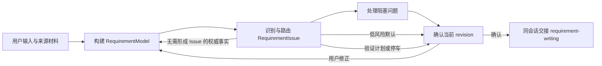
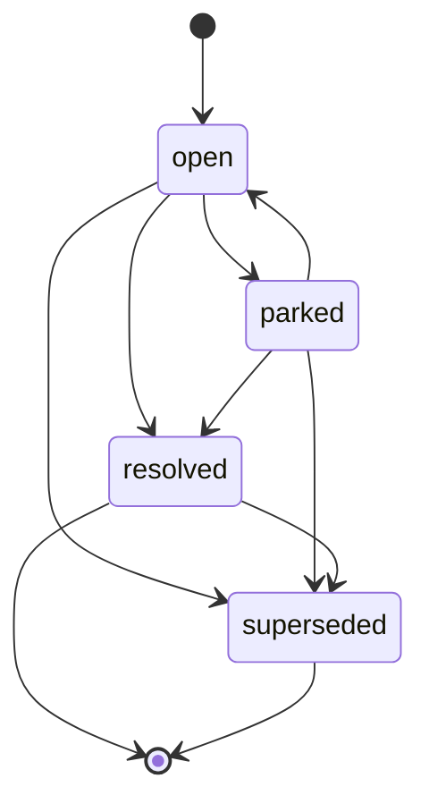
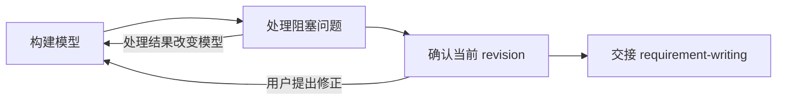

# Requirement Understanding V2 Skill 技术设计

> 状态：已完成方案对齐，待实现  
> 设计目标：`plugin/skills/requirement-understanding-v2/`  
> 兼容策略：保留现有 `requirement-understanding` V1，不在原目录上增量改造  
> 运行边界：需求理解与需求撰写在同一 Session 内串联，不依赖中间状态落盘

## 1. 摘要

Requirement Understanding V2 用于帮助需求 Agent 在同一 Session 内完成：

1. 从用户输入、来源材料和可验证证据中建立结构化需求模型；
2. 识别缺失、歧义、冲突、决策、验证、范围和术语问题；
3. 仅向用户提出高价值问题，低价值且可逆的问题允许 AI 给出显式默认；
4. 保留用户看过的选项、AI 推荐、用户选择、后续反转和最终解决结果；
5. 通过简短的最终门禁确认精确的需求模型版本；
6. 在同一 Session 内将已确认模型交给 requirement-writing 撰写 PRD。

V2 只保留两个核心领域模型：

- `RequirementModel`：当前被理解的需求全貌；
- `RequirementIssue[]`：理解过程中发现、处理和保留历史的问题集合。

V2 不建立独立的 `DecisionRecords`、`Examples`、`AssumptionList`、`AskList`、`ValidateList`、`Frontier` 或持久化工作流模型。相关视图均从两个核心模型派生。

状态设计遵循最小化原则：

- 只有 `RequirementIssue` 拥有显式状态机；
- `RequirementModel` 状态由 `revision`、`confirmed_revision` 和门禁条件派生；
- 工作流只是一组执行步骤，不存储 `workflow_phase`。

---

## 2. 背景与问题

### 2.1 现有 V1 的有效能力

V1 已具备以下可复用思想：

- 区分可调查事实、用户决策和低成本默认；
- 通过返工成本控制澄清深度；
- 使用决策树、Example Mapping、GWT、状态图、表格和低保真制品降低抽象沟通成本；
- 最终通过显式对齐门禁再衔接 requirement-writing；
- references 按需加载，避免入口 Skill 过长。

### 2.2 V2 要解决的问题

V1 的问题不在于缺少澄清技巧，而在于缺少统一、精确的领域模型：

- `Ask`、`Assume`、frontier、决策、假设、范围三态等概念分散在多个文档中；
- 输入来源、当前认知状态和确认方式容易混用；
- “当前没人知道”的问题容易被错误压缩成 Ask 或 AI 假设；
- 用户确认过哪些问题、看到过哪些选项、选择了什么、后来是否反转，缺少统一记录；
- Issue 状态、Model 状态和 Workflow 状态可能重复表达同一事实；
- 上下游交接容易依赖聊天摘要，而不是精确确认的需求模型版本。

V2 以统一模型替代分散清单，并通过派生视图而不是新增模型控制复杂度。

---

## 3. 设计目标与非目标

### 3.1 设计目标

1. **简单**：只有两个核心模型和一个显式状态机。
2. **精确**：字段名称见文知义，枚举维度互不混杂。
3. **不造假**：允许 `unresolved`、`unverified` 和 `conflicted` 被显式表达。
4. **低疲劳**：只向用户提出高价值问题；最终确认可扫一眼完成。
5. **可追溯**：记录来源、问题、交互、推荐、用户选择、模型修改和决策反转。
6. **版本化确认**：用户确认 `RequirementModel.revision`，不是脱离模型的聊天摘要。
7. **同会话交接**：不要求生成中间文档或恢复跨 Session 状态。
8. **按需加载**：入口 Skill 保持精简，细节放入 references。

### 3.2 非目标

V2 不负责：

- 跨 Session 恢复、任务调度或多人协作状态；
- 将中间模型持久化到磁盘或数据库；
- 撰写最终 PRD；
- 建立完整需求管理平台或统计平台；
- 把每条输入事实包装成 Issue；
- 为所有低价值细节向用户提问；
- 强制所有问题选项化；
- 生成高保真 HTML 页面原型。

---

## 4. 约束与设计原则

### 4.1 已确认约束

- requirement-understanding 与 requirement-writing 挂载给同一个需求 Agent，并在同一 Session 内串联；
- 平台没有 `AskUserQuestion`，因此交互契约必须是通道无关的行为规范；
- 平台支持 Markdown 表格和 Mermaid；
- references 支持按需加载；
- 最终确认必须短小精悍，用户应能快速扫读；
- 澄清深度有成本，只处理高价值问题；
- 低价值默认必须显式暴露，并在最终门禁中统一确认；
- 高风险未知不得因用户要求停止追问而伪装成 AI 默认；
- V1 与 V2 必须并存，分别挂载到不同 Agent 测试。

### 4.2 核心原则

#### 原则 A：来源、认知状态、确认方式分离

例如，一个 AI 默认被用户最终确认后应表示为：

```yaml
origin: ai_default
understanding_status: confirmed
confirmation_mode: batch_confirmation
```

用户确认不会把来源改写成 `user_statement`。

#### 原则 B：Issue 是领域对象，Queue 是派生视图

“待处理问题”只是：

```text
issue_status == open
```

不建立独立 Issue Queue，也不维护重复顺序状态。

#### 原则 C：历史追加，不覆盖过去

用户改变已经作出的决定时：

- 创建新 Issue；
- 新 Issue 的 `supersedes_issue_id` 指向旧 Issue；
- 旧 Issue 变为 `superseded`；
- 旧 Interaction 和 Resolution 保留。

#### 原则 D：未知不等于假设

当前没人能给出答案时，必须选择：

- 保持 blocker；
- 建立验证计划；
- 明确停车；
- 由用户明确接受风险。

不得自动降级为 AI 默认。

#### 原则 E：工作流状态不进入领域模型

同一 Session 内由 LLM 串行执行，不需要记录 `intake`、`modeling`、`awaiting_confirmation` 等运行时阶段。

---

## 5. 总体架构



### 5.1 内部状态容器

```ts
interface RequirementUnderstandingState {
  schema_version: "2.0";
  requirement_model: RequirementModel;
  requirement_issues: RequirementIssue[];
}
```

该容器是 LLM 在当前 Session 中维护的概念结构：

- 不要求以 JSON 原样输出；
- 不要求写文件；
- 不要求跨 Session 恢复；
- 字段契约用于保证 Skill 各 reference 的概念一致性。

---

## 6. RequirementModel

### 6.1 根结构

```ts
interface RequirementModel {
  requirement_model_id: string;

  // 从 1 开始；仅需求语义变化时递增
  revision: number;

  // 用户最近一次确认的语义版本；未确认时为 null
  confirmed_revision: number | null;

  intent: RequirementIntent;
  scope_items: ScopeItem[];
  vocabulary_terms: VocabularyTerm[];
  requirements: RequirementItem[];
}
```

`RequirementModel` 不保存 `model_status`。`draft`、`ready`、`confirmed` 均为派生视图。

### 6.2 RequirementIntent

```ts
interface RequirementIntent {
  problem: IntentStatement | null;
  desired_outcome: IntentStatement | null;
  target_users: IntentStatement[];
  success_signals: IntentStatement[];
}

interface IntentStatement extends UnderstandingFields {
  intent_item_id: string;
  statement: string;
}
```

字段定义：

| 字段 | 含义 |
|---|---|
| `problem` | 当前存在什么问题，为什么值得处理 |
| `desired_outcome` | 希望产生什么业务或用户结果，不等于预设方案 |
| `target_users` | 使用者、受影响者、责任人或下游系统 |
| `success_signals` | 如何判断需求产生预期效果，不强制要求完整 KPI |

进入最终确认前，必须存在：

- `problem`；
- `desired_outcome`；
- 至少一个 `target_users`。

纯技术需求的 target user 可以是调用系统、运维人员、管理员或下游服务。

### 6.3 ScopeItem

```ts
interface ScopeItem extends UnderstandingFields {
  scope_item_id: string;

  scope_disposition:
    | "in_scope"
    | "out_of_scope";

  statement: string;
  rationale: string | null;
}
```

不增加 `undecided`。范围尚未决定时创建 `issue_type=scope` 的 Issue，避免把问题藏在 ScopeItem 内。

### 6.4 VocabularyTerm

```ts
interface VocabularyTerm extends UnderstandingFields {
  vocabulary_term_id: string;
  term: string;
  definition: string;
  aliases: string[];
}
```

只记录影响范围、业务规则、决策或验收的术语，不建立普通名词词典。

### 6.5 RequirementItem

```ts
interface RequirementItem extends UnderstandingFields {
  requirement_id: string;

  requirement_type:
    | "functional"
    | "business_rule"
    | "data"
    | "integration"
    | "quality_attribute"
    | "constraint";

  statement: string;
  rationale: string | null;

  delivery_priority:
    | "must"
    | "should"
    | "could"
    | "unspecified";
}
```

`delivery_priority` 规则：

- 用户或权威来源明确给出时如实记录；
- 未提供时使用 `unspecified`；
- 不得擅自把所有需求标为 `must`；
- 不得仅因未指定优先级就追问用户；
- `out_of_scope` 由 ScopeItem 表达，不增加 `wont`。

### 6.6 通用认知字段

```ts
interface UnderstandingFields {
  origin:
    | "user_statement"
    | "source_document"
    | "ai_default"
    | "verified_evidence";

  understanding_status:
    | "proposed"
    | "confirmed"
    | "unresolved"
    | "unverified"
    | "conflicted";

  confirmation_mode:
    | "none"
    | "direct_statement"
    | "selected_option"
    | "batch_confirmation"
    | "source_authority"
    | "evidence_verification";

  confidence:
    | "high"
    | "medium"
    | "low";

  source_refs: SourceReference[];
  related_issue_ids: string[];
}
```

四个维度不可混用：

| 字段 | 回答的问题 |
|---|---|
| `origin` | 内容最初来自哪里 |
| `understanding_status` | 当前认知处于什么状态 |
| `confirmation_mode` | 为什么可以将它视为已确认 |
| `confidence` | AI 对当前解释准确性的判断有多强 |

`understanding_status` 的精确定义：

| 状态 | 含义 |
|---|---|
| `proposed` | 已形成候选理解，但尚未批准 |
| `confirmed` | 已由用户、权威来源或证据确认 |
| `unresolved` | 当前没有确定答案或决定 |
| `unverified` | 已有候选答案，但仍需证据验证 |
| `conflicted` | 同时存在无法兼容的理解 |

确认后的 RequirementModel：

- 允许 `confirmed`；
- 允许 `unresolved`，但必须关联 parked 或 accepted-risk Issue；
- 允许 `unverified`，但必须关联 validation-plan Issue；
- 不允许 `proposed`；
- 不允许 `conflicted`。

### 6.7 SourceReference

```ts
interface SourceReference {
  source_ref_id: string;

  source_type:
    | "user_message"
    | "source_document"
    | "external_evidence"
    | "prototype";

  source_name: string | null;

  // 消息轮次、文件路径、文档章节、页码、URL、原型节点等
  locator: string;

  // 只在原文保真或冲突处理需要时记录
  quoted_text: string | null;

  authority_level:
    | "authoritative"
    | "supporting"
    | "unknown";
}
```

`authority_level` 表示该来源对当前被引用信息是否有裁决权，不是来源的全局等级。例如，用户对产品偏好可能是 authoritative，对未经验证的技术事实则可能只是 supporting。

---

## 7. RequirementIssue

### 7.1 根结构

```ts
interface RequirementIssue {
  issue_id: string;

  issue_type:
    | "missing_information"
    | "ambiguity"
    | "conflict"
    | "decision"
    | "validation"
    | "scope"
    | "terminology";

  title: string;
  description: string;

  target_refs: TargetReference[];

  resolution_route:
    | "investigate_evidence"
    | "ask_user"
    | "apply_ai_default"
    | "define_validation_plan"
    | "record_user_decision";

  question_mode:
    | "none"
    | "open_ended"
    | "option_selection";

  decision_owner:
    | "user"
    | "ai"
    | "external_authority"
    | "unknown";

  error_impact:
    | "high"
    | "medium"
    | "low";

  reversibility:
    | "easy"
    | "moderate"
    | "hard";

  evidence_confidence:
    | "high"
    | "medium"
    | "low"
    | "not_applicable";

  blocks_confirmation: boolean;

  issue_status:
    | "open"
    | "resolved"
    | "parked"
    | "superseded";

  depends_on_issue_ids: string[];
  supersedes_issue_id: string | null;

  source_refs: SourceReference[];
  interactions: Interaction[];
  parking: Parking | null;
  resolution: Resolution | null;
}
```

### 7.2 Issue 类型

| issue_type | 使用条件 |
|---|---|
| `missing_information` | 必要信息缺失 |
| `ambiguity` | 已有表达存在多种合理解释 |
| `conflict` | 两个或多个认知无法同时成立 |
| `decision` | 存在多个可行方案，需要确定采用哪一个 |
| `validation` | 当前没人能确认，需要后续验证 |
| `scope` | 是否纳入本次需求尚未确定 |
| `terminology` | 术语含义或口径不一致 |

用户主动拍板仍属于 `decision`，不增加 `direct_decision` 类型。主动拍板由以下组合表达：

```yaml
issue_type: decision
resolution_route: record_user_decision
interaction_type: unsolicited_decision
resolution_type: user_decision
```

### 7.3 Resolution Route

| resolution_route | 行为 |
|---|---|
| `investigate_evidence` | 从材料、系统或外部证据查明 |
| `ask_user` | 向用户获取信息或作出决策 |
| `apply_ai_default` | 使用低风险 AI 默认，等待最终确认 |
| `define_validation_plan` | 当前无法闭合，制定后续验证计划 |
| `record_user_decision` | 用户已主动决定，直接记录而不重复提问 |

字段使用统一的“动词 + 对象”命名，避免把问题类型、处理方法和生命周期混在同一枚举中。

### 7.4 TargetReference

```ts
interface TargetReference {
  target_type:
    | "intent_item"
    | "scope_item"
    | "vocabulary_term"
    | "requirement";

  target_id: string;

  // 指向整个对象时为 null
  target_field: string | null;
}
```

---

## 8. 唯一显式状态机：RequirementIssue



### 8.1 状态定义

| issue_status | 精确含义 |
|---|---|
| `open` | 尚未解决，可能正在调查、等待用户、等待证据或等待批量确认 |
| `resolved` | 已形成 Resolution，不再需要处理 |
| `parked` | 明确延期，不阻塞本轮确认，但保留风险和回访条件 |
| `superseded` | 已被后续 Issue 替代，仅保留历史 |

不保存 `in_progress`、`waiting_for_user`、`waiting_for_evidence`、`waiting_for_confirmation`。这些过程状态可由现有字段推断：

| 实际情况 | 推断方式 |
|---|---|
| 等待用户回答 | `open + ask_user`，且最新提问 Interaction 没有 UserResponse |
| 等待证据 | `open + investigate_evidence` |
| AI 默认等待门禁 | `open + apply_ai_default` |
| 正在内部处理 | 当前 Agent 行为，无需写入领域模型 |
| 已建立验证计划 | `resolved + validation_plan` |
| 已接受风险 | `resolved + accepted_risk` |

### 8.2 状态不变量

- `resolved`：`resolution != null` 且 `parking == null`；
- `parked`：`parking != null` 且 `resolution == null`；
- `superseded`：必须有后续 Issue 的 `supersedes_issue_id` 指向它；
- `parked` 必须满足 `blocks_confirmation=false`；
- `open + blocks_confirmation=true` 阻止最终确认；
- 已解决 Issue 的结论变化时创建新 Issue，不重新打开旧 Issue；
- 同一处理轮内允许 `open → resolved`，无需制造中间状态。

---

## 9. RequirementModel 派生状态

RequirementModel 不保存状态字段。需要描述当前状态时，按以下优先级实时派生：

```ts
type DerivedModelState =
  | "draft"
  | "ready"
  | "confirmed";
```

### 9.1 confirmed

```text
confirmed_revision === revision
```

前提不变量：如果出现新的 blocker、冲突或语义修改，必须先增加 `revision`，因此已确认旧版本不会继续显示为当前 confirmed。

### 9.2 ready

同时满足：

1. `confirmed_revision !== revision`；
2. problem、desired outcome 和至少一个 target user 已建立；
3. 不存在 `open + blocks_confirmation=true` 的 Issue；
4. 除等待本次门禁批准的 `open + apply_ai_default` 外，不存在其他 open Issue；非阻塞未知必须先归一化为 parking、validation plan 或 accepted risk；
5. 不存在 `conflicted` 模型条目；
6. 高风险未知已转化为验证计划、明确停车或用户接受风险；
7. 所有 AI 默认、unresolved、unverified 和 parked 项均可在门禁中展示；
8. 所有拟确认内容已经写入当前 revision。

### 9.3 draft

不满足 `confirmed` 或 `ready` 的其他情况。

### 9.4 Revision 规则

以下变化必须 `revision += 1`：

- 改变需求语义；
- 新增或删除 Intent、Scope、Vocabulary、Requirement 条目；
- 修改范围、规则、目标用户、术语定义或优先级；
- 将 Issue 处理结果应用到模型；
- 用户在最终门禁提出语义修正。

以下变化不增加 revision：

- 更新 Issue 的交互历史；
- 添加纯审计引用；
- 将门禁覆盖的 `proposed` 改为 `confirmed`；
- 写入 `confirmation_mode=batch_confirmation`；
- 更新 `confirmed_revision`。

Revision 表示需求语义版本，不是对象修改次数。

### 9.5 示例

首次建模：

```yaml
revision: 1
confirmed_revision: null
```

用户确认 revision 1：

```yaml
revision: 1
confirmed_revision: 1
```

用户之后修正需求：

```yaml
revision: 2
confirmed_revision: 1
```

用户确认修订：

```yaml
revision: 2
confirmed_revision: 2
```

不保存 `model_status`，从而避免 `model_status=confirmed` 但版本号不一致。

---

## 10. 无状态执行流程

工作流不进入 `RequirementUnderstandingState`，只作为 Skill 行为顺序：



### 10.1 第一步：构建模型

- 读取用户输入和已提供材料；
- 识别 problem、desired outcome、target users 和 success signals；
- 建立范围、术语和需求条目；
- 对输入中无冲突且 authority 已知的规则直接建模；
- 不为每条正常规则创建 Issue。

### 10.2 第二步：识别并处理 Issue

- 只为真正存在缺失、歧义、冲突、决策、验证、范围或术语问题的内容创建 Issue；
- 先处理依赖项，再处理受其影响的问题；
- 只向用户提出高价值问题；
- 能查证的事实优先调查，不转嫁给用户；
- 低风险默认写入模型并等待门禁统一批准；
- 当前没人知道的内容进入验证、停车或接受风险路径。

### 10.3 第三步：确认当前 revision

- 展示当前模型的短摘要；
- 显式展示 AI 默认、unresolved、unverified、parked 和 accepted risk；
- 用户确认精确 revision；
- 任何语义修正都增加 revision 并重新确认。

### 10.4 第四步：同会话交接

当 `confirmed_revision === revision` 时，将当前内存中的模型和有效 Issue 交给 requirement-writing，不要求落盘中间文档。

---

## 11. Issue 识别与路由策略

### 11.1 四类认知路由

| 认知情况 | 首选处理 |
|---|---|
| 可通过材料或证据查明的事实 | `investigate_evidence` |
| 只有用户能提供的信息或作出的决定 | `ask_user` |
| 低风险、易逆转、可合理默认 | `apply_ai_default` |
| 当前没人知道或必须在真实环境验证 | `define_validation_plan` |

用户已经主动给出明确决定时使用 `record_user_decision`，不重复询问。

### 11.2 高价值问题判定

是否向用户提问由“错误返工成本 × 可推断性”共同决定。

返工成本由以下字段表达：

- `error_impact`：判断错了影响有多大；
- `reversibility`：判断错了是否容易修正。

可推断性主要由以下信息判断：

- `evidence_confidence`；
- 来源是否 authoritative；
- 是否存在可调查证据；
- 是否属于用户偏好或业务取舍。

| 返工成本 | 可推断性 | 默认动作 |
|---|---|---|
| 高 | 低 | 问用户或保持 blocker |
| 高 | 高 | 先调查/建模，必要时让用户确认 |
| 低 | 低 | AI 显式默认，最终门禁统一确认 |
| 低 | 高 | 直接建模，不制造额外交互 |

禁止只根据“惊讶程度”决定是否提问；惊讶测试只能作为风险识别信号。

### 11.3 `blocks_confirmation` 判定

通常阻塞确认：

- 会改变目标、核心范围、关键业务规则或数据语义；
- 错误后返工成本高且难以逆转；
- 不同答案会导致完全不同的 PRD 或技术边界；
- 存在未消除的权威来源冲突；
- 缺少答案导致无法写出可执行需求。

通常不阻塞确认：

- 低风险展示细节；
- 易于后续调整且默认值已显式暴露；
- 已建立明确验证计划；
- 已明确停车并记录责任人与回访触发器；
- 用户明确接受风险。

---

## 12. Interaction 交互契约

### 12.1 Interaction

```ts
interface Interaction {
  interaction_id: string;

  // 在当前 Issue 内从 1 开始递增
  interaction_sequence: number;

  interaction_type:
    | "open_question"
    | "choice_question"
    | "unsolicited_decision"
    | "artifact_review";

  question_text: string | null;
  options: InteractionOption[];
  ai_recommendation: AIRecommendation | null;
  user_response: UserResponse | null;

  // 本次交互额外暴露出的新 Issue
  created_issue_ids: string[];
}
```

### 12.2 InteractionOption

```ts
interface InteractionOption {
  option_key: string;  // A、B、C
  label: string;       // 短标题，便于扫读
  description: string; // 完整语义及主要影响
}
```

展示示例：

```md
A. 拒绝请求
   余额为 0 时提示充值，不扣调用次数。

B. 允许一次透支
   本次请求继续执行，余额进入负数。
```

标题、完整规则、理由和推荐标记不得全部塞进同一行。

### 12.3 AIRecommendation

```ts
interface AIRecommendation {
  option_key: string;
  rationale: string;

  confidence:
    | "high"
    | "medium"
    | "low";
}
```

规则：

- 只有 `choice_question` 才允许推荐选项；
- `open_question` 不得伪造推荐答案；
- 推荐理由与选项描述分开；
- 推荐必须说明判断依据和主要权衡；
- 最终模型审批门禁不标推荐项，避免诱导批准。

### 12.4 UserResponse

```ts
interface UserResponse {
  response_type:
    | "selected_option"
    | "custom_answer"
    | "deferred";

  selected_option_key: string | null;
  free_text: string | null;
}
```

用户可以选择某个选项并补充限制条件：

```yaml
response_type: selected_option
selected_option_key: A
free_text: "普通用户拒绝，内部测试账号允许透支"
```

此时可统计为“即时选择推荐项”，但是否最终保留由 Resolution 和后续 supersede 链决定。

### 12.5 提问行为规范

#### Open-ended

适用于需要引出用户掌握但 AI 无法合理枚举的信息：

```text
问题标题
为什么现在必须确认：一句话说明影响
请补充：一个聚焦问题
```

不得为了形式统一强行给选项或推荐。

#### Option selection

适用于可枚举的决策：

```text
问题标题
为什么现在必须确认：一句话说明影响
A/B/C：1–3 个互斥或清晰区分的选项
AI 建议：单独说明推荐项、理由与信心
其他：允许用户补充自定义答案
```

问题应按依赖关系和主题小批次提出，避免一次展示长问卷。

---

## 13. Parking 与 Resolution

### 13.1 Parking

```ts
interface Parking {
  reason: string;
  risk_if_unresolved: string;

  follow_up_owner:
    | "user"
    | "delivery_team"
    | "external_authority"
    | "unknown";

  revisit_trigger: string;
}
```

`parked` 表示：

- 当前仍无答案；
- 不影响本轮需求模型确认；
- 已说明为什么可以延期；
- 已明确风险、后续责任人和重新处理条件。

它不表示问题已解决，也不等于用户接受风险。

### 13.2 Resolution

```ts
interface Resolution {
  resolution_type:
    | "verified_fact"
    | "user_decision"
    | "accepted_default"
    | "validation_plan"
    | "accepted_risk"
    | "no_model_change";

  answer: string;
  rationale: string;

  resolved_by:
    | "user"
    | "ai"
    | "external_authority";

  confirmation_mode:
    | "direct_statement"
    | "selected_option"
    | "batch_confirmation"
    | "source_authority"
    | "evidence_verification";

  selected_option_key: string | null;
  rejected_option_keys: string[];

  model_changes: ModelChange[];

  // 处理结果被写入哪个模型语义版本
  resolved_model_revision: number;

  confirmation_interaction_id: string | null;
  confirmation_source_ref_ids: string[];

  // 通过最终门禁确认时记录，否则为 null
  confirmation_model_revision: number | null;
}
```

Resolution 类型：

| resolution_type | 含义 |
|---|---|
| `verified_fact` | 已通过证据查明事实 |
| `user_decision` | 用户选择选项、提供自定义答案或主动拍板 |
| `accepted_default` | AI 默认被用户直接或批量批准 |
| `validation_plan` | 事实仍未知，但验证对象、方法、责任人或时机已明确 |
| `accepted_risk` | 事实仍未知或风险仍存在，但用户明确同意继续 |
| `no_model_change` | Issue 已处理，但无需修改 RequirementModel |

高风险未知不能因为用户说“够了”变成 `accepted_default`。只能继续阻塞、建立 validation plan，或者由用户明确 accepted risk。

### 13.3 ModelChange

```ts
interface ModelChange {
  operation:
    | "add"
    | "replace"
    | "remove";

  target_type:
    | "intent_item"
    | "scope_item"
    | "vocabulary_term"
    | "requirement";

  target_id: string;
  target_field: string;
  previous_value: unknown | null;
  new_value: unknown | null;
}
```

ModelChange 用于解释 Issue 如何改变 RequirementModel，也是决策历史视图的来源。

---

## 14. 原型与认知制品

### 14.1 使用条件

当用户难以通过抽象语言回答，或不同答案的差异需要可视化时，使用低保真制品替代继续口头追问。

典型触发：

- 用户说“都可以”“你看着办”；
- 流程分支多，口头描述容易漏项；
- 状态、角色、条件组合存在隐性冲突；
- 界面结构或信息层级影响需求理解；
- 用户需要看到整体后才能提出修正。

### 14.2 支持的制品

平台能力范围内优先使用：

- Markdown 示例表；
- 决策表；
- 状态转换表；
- Mermaid flowchart、stateDiagram、sequenceDiagram；
- ASCII 或 Markdown 低保真线框；
- Given/When/Then 场景；
- 角色 × 状态 × 动作矩阵。

不假设平台支持高保真 HTML 页面原型。HTML 原型只有在运行环境明确支持时才可作为额外能力，不进入 V2 基础契约。

### 14.3 制品与模型关系

原型不是第三个核心模型：

- 作为 `SourceReference.source_type=prototype` 被引用；
- 用户审阅记录为 `interaction_type=artifact_review`；
- 审阅产生的新问题写入 `created_issue_ids`；
- 审阅结论通过 Resolution 更新 RequirementModel。

---

## 15. 最终对齐门禁

### 15.1 门禁目标

确认的是当前 `RequirementModel.revision`，而不是聊天摘要是否“看起来差不多”。

门禁必须：

- 短小、可扫读；
- 覆盖 Why、What、Who、范围和关键规则；
- 暴露 AI 默认和未完全闭合事项；
- 不重新展开完整推理过程；
- 不给审批选项标注推荐。

### 15.2 推荐展示结构

```md
## 需求理解确认 · Revision N

目标：一句话说明 problem → desired outcome
用户：目标用户/参与者
范围：核心 in-scope；关键 out-of-scope
关键需求：3–7 条最重要能力或规则
AI 默认：仅列会影响交付且尚待批量批准的默认
未闭合事项：unresolved / unverified / parked / accepted risk

A. 确认并继续撰写 PRD
B. 确认，但暂不撰写 PRD
C. 需要修改
```

必要时可扩展，但默认应控制在一个屏幕、约 20 行左右。完整模型保留在当前上下文中，不必全部重复展示。

### 15.3 用户确认后的原子更新

用户确认 revision N 后：

1. `confirmed_revision = N`；
2. 门禁覆盖的 `proposed` 条目改为 `confirmed`；
3. 对应 `confirmation_mode` 改为 `batch_confirmation`；
4. 等待批准的 AI 默认 Issue 以 `accepted_default` 解决；
5. 对应 Resolution 写入 `confirmation_model_revision=N`；
6. 上述纯确认元数据变化不增加 revision。

### 15.4 用户修正

任何改变语义的修正都必须：

1. 更新 RequirementModel；
2. `revision += 1`；
3. 新建或更新对应 Issue；
4. 重新生成精简门禁；
5. 确认新 revision。

不得沿用对旧 revision 的批准。

---

## 16. 同会话 Handoff

### 16.1 Handoff 前提

只有满足以下条件才可正常交接：

```text
requirement_model.confirmed_revision
  == requirement_model.revision
```

且不存在任何 `issue_status == open` 的 Issue。进入门禁时唯一允许暂时保持 open 的 AI 默认 Issue，必须在用户批准该 revision 时原子更新为 `resolved + accepted_default`，随后才能交接。

### 16.2 Handoff 不是第三个模型

Handoff 是当前状态的派生视图，不建立独立 `RequirementHandoff` 持久化对象。requirement-writing 在同一 Session 中直接消费：

- 当前 RequirementModel；
- 非 superseded 的 RequirementIssues；
- 当前聊天中的来源材料和用户确认上下文。

### 16.3 下游消费映射

| V2 状态 | requirement-writing 行为 |
|---|---|
| `confirmed` | 可直接转写为 PRD 内容和验收依据 |
| `unresolved` + parked | 写入非阻塞 Open Questions 或后续事项 |
| `unresolved` + accepted risk | 显式写入已接受风险，不伪装成已确认规则 |
| `unverified` + validation plan | 写入验证要求、责任人和时机 |
| `proposed` | 正常 handoff 中不得存在 |
| `conflicted` | 正常 handoff 中不得存在 |
| `superseded` Issue | 仅用于历史，不影响当前 PRD |

AI 默认即使已确认，也必须保留：

```yaml
origin: ai_default
understanding_status: confirmed
confirmation_mode: batch_confirmation
```

下游可以直接消费已批准默认，但不得把来源改写成用户原始陈述。

### 16.4 下游发现新问题

requirement-writing 如果发现会改变需求语义的阻塞缺口：

- 暂停当前撰写；
- 回到本设计的建模/Issue 处理流程；
- 修改 RequirementModel 并增加 revision；
- 重新确认；
- 再继续写作。

这是一段同会话循环，不需要落盘或切换到持久化工作流。

---

## 17. 派生视图与统计

### 17.1 不建立 DecisionRecords

重要决策历史可从以下字段派生：

- `issue_type=decision`；
- Interaction 中的选项和推荐；
- UserResponse；
- Resolution；
- ModelChange；
- `supersedes_issue_id` 决策替代链。

独立 DecisionRecords 会造成 Issue 与 Decision 双写和同步漂移，因此不采用。

### 17.2 不建立独立 Examples

案例只在以下位置存在：

- Interaction 的问题说明或选项；
- 原型/示例表 SourceReference；
- RequirementItem 正式业务规则；
- Resolution 的证据和 rationale。

案例不是独立生命周期对象。

### 17.3 推荐指标

所有指标按需派生，不存聚合字段：

| 指标 | 计算含义 |
|---|---|
| 即时接受率 | 用户首次响应选择 AI 推荐项的比例 |
| 最终保留率 | 当前有效 Issue 链的最终 Resolution 仍采用推荐项的比例 |
| 推荐反转率 | 最初选择推荐项，但后续 supersede 后采用其他方案的比例 |
| 自定义答案率 | `response_type=custom_answer` 的比例 |
| AI 默认批准率 | `apply_ai_default` 最终形成 `accepted_default` 的比例 |

这些指标描述推荐的接受和保留情况，不称为“准确率”。用户选择推荐项可能受到锚定、疲劳或信息不充分影响。

---

## 18. Skill 文件结构设计

建议实现目录：

```text
plugin/skills/requirement-understanding-v2/
├── SKILL.md
└── references/
    ├── state-model.md
    ├── flow.md
    ├── interaction-contract.md
    ├── prototyping.md
    └── alignment-handoff.md
```

### 18.1 SKILL.md

只保留：

- description 和触发条件；
- 目标、边界和硬约束；
- 两个核心模型的最小概览；
- 无状态四步主流程；
- reference 按需加载表；
- 必须遵守的不变量。

不得复制所有完整类型定义和示例。

### 18.2 state-model.md

包含：

- RequirementUnderstandingState；
- RequirementModel；
- RequirementIssue；
- 所有嵌套类型和枚举；
- Issue 状态机；
- Model 派生状态；
- 数据不变量和 revision 规则。

### 18.3 flow.md

包含：

- 构建模型；
- Issue 识别；
- 高价值问题判定；
- 五种 Resolution Route；
- 依赖处理；
- 收敛条件；
- 红线行为。

### 18.4 interaction-contract.md

包含：

- open-ended 与 option-selection 的使用条件；
- A/B/C 选项展示规范；
- AI recommendation；
- UserResponse 记录；
- 小批次提问和防疲劳规则；
- 无 AskUserQuestion 时的通道无关降级行为。

### 18.5 prototyping.md

包含：

- 何时从抽象追问切换到制品；
- Markdown 表格、Mermaid、ASCII、GWT 的选择方式；
- artifact review 如何产生 Issue 和模型更新；
- 不假设 HTML 渲染能力。

### 18.6 alignment-handoff.md

包含：

- ready 派生门禁；
- 最终确认模板；
- revision 确认原子更新；
- 用户修正循环；
- requirement-writing 同会话 handoff 映射。

### 18.7 Reference 加载策略

| 时机 | 加载 reference |
|---|---|
| 首次建立或修改内部模型 | `state-model.md` |
| 默认执行需求理解流程 | `flow.md` |
| 准备向用户提问 | `interaction-contract.md` |
| 抽象沟通失效或需可视化 | `prototyping.md` |
| 准备最终确认和交接 | `alignment-handoff.md` |

入口 Skill 不要求每轮加载全部 references。

---

## 19. V1/V2 兼容与测试隔离

### 19.1 目录隔离

- V1：`plugin/skills/requirement-understanding/`
- V2：`plugin/skills/requirement-understanding-v2/`

实现 V2 时不得修改或重命名 V1 文件。

### 19.2 Agent 隔离

V1 和 V2 description 都可能命中需求理解场景，不能同时挂载到同一个 Agent。

推荐：

- Agent A：V1 requirement-understanding + 对应 requirement-writing；
- Agent B：V2 requirement-understanding + 能识别 V2 handoff 语义的 requirement-writing。

### 19.3 下游兼容

当前 requirement-writing 使用同会话上下文，不要求上游落盘，这是可以复用的基础。

如果其文案仍强绑定 V1 的 `confirmed/assumed` 清单结构，应在实现测试阶段创建独立测试副本或增加 V2 契约，而不是为了 V2 A/B 测试直接破坏 V1 组合。V2 的标准语义映射以本设计第 16 节为准。

---

## 20. 关键场景验证

V2 实现完成后至少用以下场景进行行为验证。

### 场景 1：信息完整的明确需求

预期：

- 直接构建 RequirementModel；
- 不为每条正常规则创建 Issue；
- 不进行形式化追问；
- 快速进入 revision 确认。

### 场景 2：高风险核心歧义

预期：

- 创建 `ambiguity` Issue；
- `blocks_confirmation=true`；
- 根据是否可枚举选择 open-ended 或 option-selection；
- 未处理前不能确认模型。

### 场景 3：低风险细节缺失

预期：

- 创建 `apply_ai_default` Issue，或在足够明确时直接形成 proposed 条目；
- 不立即打断用户；
- 最终门禁显式展示；
- 批准后 origin 仍为 ai_default。

### 场景 4：用户主动拍板

预期：

- 不重复提问；
- 创建 `decision + record_user_decision` Issue；
- 记录 `unsolicited_decision` Interaction；
- 立即形成 `user_decision` Resolution。

### 场景 5：当前没人知道答案

预期：

- 不伪装为用户问题或 AI 默认；
- 建立 validation Issue；
- 选择 blocker、validation plan、parking 或 accepted risk；
- handoff 中保留 unverified/unresolved 语义。

### 场景 6：用户说“别问了，直接做”

预期：

- 低风险项可使用显式默认；
- 高风险 blocker 不自动降级；
- 必须建立验证计划或让用户明确接受风险。

### 场景 7：用户选择 AI 推荐后反转

预期：

- 原 Issue 和 Interaction 保留；
- 创建新 Issue 并 supersede 旧 Issue；
- 最终保留率和反转率可派生。

### 场景 8：最终门禁提出修正

预期：

- 当前 revision 不能沿用批准；
- 修改模型并增加 revision；
- 重新生成门禁并确认新版本。

### 场景 9：抽象问题难以回答

预期：

- 切换到 Mermaid、表格、GWT 或低保真线框；
- 记录 artifact review；
- 将制品审阅结果更新到 Issue 和 RequirementModel。

### 场景 10：来源冲突

预期：

- SourceReference 分别记录来源和 authority；
- 创建 conflict Issue；
- authority 不明时不能擅自选边；
- 解决后保留来源、rationale 和 ModelChange。

### 场景 11：正常同会话交接

预期：

- `confirmed_revision === revision`；
- 没有 open blocker；
- requirement-writing 能区分 confirmed、unresolved、unverified 和已接受风险；
- 不要求中间文件。

---

## 21. 风险与缓解

| 风险 | 缓解措施 |
|---|---|
| 字段过多导致模型执行负担 | SKILL.md 只放最小契约，完整字段按需加载；不要求每轮显式打印全部对象 |
| AI 把所有输入都包装成 Issue | 明确“无冲突且 authority 已知的规则直接建模” |
| AI 把低信心等同于必须提问 | 使用返工成本 × 可推断性矩阵，而不是单看 confidence |
| AI 默认被误写成用户确认事实 | origin、status、confirmation mode 分离 |
| 用户喊停导致高风险未知被掩盖 | 高风险只能 blocker、validation plan 或 accepted risk |
| 三套状态再次出现 | 只有 Issue 保存状态；Model 状态派生；Workflow 不落字段 |
| 门禁过长导致确认疲劳 | 一个屏幕、约 20 行；只列关键全貌、默认和未闭合项 |
| 推荐造成锚定 | open-ended 不推荐；门禁审批不推荐；推荐理由单独展示 |
| V1/V2 同时触发 | 使用不同 Agent，不同时挂载 |
| requirement-writing 误读 V2 | 使用第 16 节映射，并在 A/B 测试时隔离下游 Skill 版本 |

---

## 22. 实施顺序

1. 创建 `requirement-understanding-v2/references/state-model.md`，冻结字段和不变量；
2. 创建 `references/flow.md`，实现 Issue 识别、路由和收敛规则；
3. 创建 `references/interaction-contract.md`，实现提问和推荐规范；
4. 创建 `references/prototyping.md`，实现认知制品切换；
5. 创建 `references/alignment-handoff.md`，实现版本确认与下游交接；
6. 最后编写精简 `SKILL.md`，只编排 references；
7. 检查所有文件中的字段名和枚举完全一致；
8. 检查不存在旧版 `frontier`、Ask 清零、AssumptionList 等 canonical 概念残留；
9. 使用第 20 节场景进行 V2 行为测试；
10. 在独立 Agent 上与 V1 做对照测试。

---

## 23. 设计验收标准

技术设计及后续实现必须同时满足：

- [ ] 只有 `RequirementModel` 和 `RequirementIssue[]` 两个核心模型；
- [ ] 只有 RequirementIssue 有显式状态机；
- [ ] Issue 状态仅为 `open/resolved/parked/superseded`；
- [ ] RequirementModel 不保存 `model_status`；
- [ ] 根状态不保存 `workflow_phase`；
- [ ] 模型确认由 `revision/confirmed_revision` 表达；
- [ ] origin、understanding status、confirmation mode、confidence 相互独立；
- [ ] 当前没人知道的问题可进入 validation、parking 或 accepted risk；
- [ ] 高风险未知不能被用户喊停自动洗成 AI 默认；
- [ ] 用户看过的选项、AI 推荐、用户响应和最终反转可追溯；
- [ ] 最终门禁确认精确 revision；
- [ ] 门禁不标推荐选项；
- [ ] handoff 不要求落盘；
- [ ] V1 文件保持不变；
- [ ] V1/V2 不在同一 Agent 同时启用。

---

## 24. 已冻结设计决策

1. 使用 `RequirementModel + RequirementIssue[]`，不建立更多核心模型；
2. 不建立独立 DecisionRecords，决策历史从 Issue 派生；
3. 不建立独立 Examples，案例作为交互、证据或正式规则的一部分；
4. 不建立 Issue Queue，待处理队列从 open Issue 派生；
5. 不建立 Workflow 状态机，流程由 Agent 在同一 Session 内执行；
6. RequirementModel 状态由版本和门禁条件派生；
7. 只有 RequirementIssue 使用四状态显式状态机；
8. 用户主动决定是普通 decision，通过 route 和 interaction 表达，不增加 direct-decision 类型；
9. parked 与 accepted risk 互斥；
10. 已确认模型允许 unresolved 和 unverified，但不允许 proposed 和 conflicted；
11. authority 只保留在 SourceReference；
12. delivery priority 保留并允许 unspecified；
13. 选项使用短 label 与独立 description，AI 推荐理由另行展示；
14. 推荐效果使用接受率、保留率和反转率，不称准确率；
15. V2 新目录实现，V1 保留用于独立对照测试。
