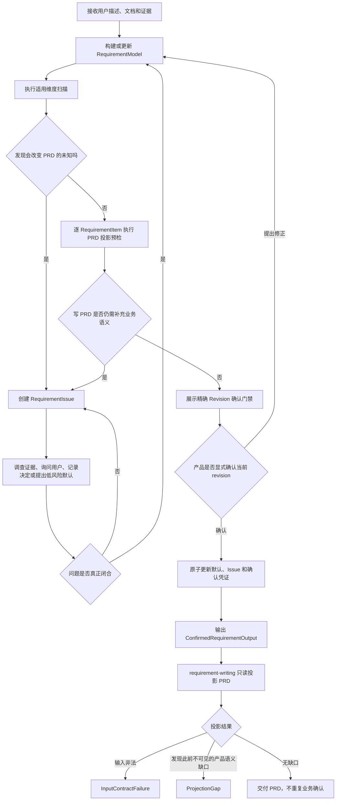

# 需求理解 Skill：主流程、核心决策与问题闭环

> 本文总结 `requirement-understanding-v2` 的当前设计，并把本次讨论形成的目标规则整理为一套完整方法：如何理解需求、发现关键问题、深挖高风险问题、完成澄清，以及如何判断需求已经可以无损投影为 PRD。
>
> 文中会明确区分“当前已经实现的规则”和“仍需统一的目标规则”，避免把建议误写成现状。

## 1. 一句话定位

需求理解 Skill 的职责不是尽快生成一份 PRD，也不是把用户的话改写成 GWT，而是：

> 将分散、模糊、可能冲突的业务输入，收敛为一份经过确认、语义闭合、无需写作端补充业务事实即可投影为 PRD 的 `RequirementModel`。

它负责回答四个问题：

1. **理解了什么**：目标、用户、范围、术语和全部需求是什么；
2. **还缺什么**：哪些缺失、歧义、冲突、决策、事实核验或范围问题会改变 PRD；
3. **何时算问透**：高风险问题是否已经得到有边界、有依据、可回写模型的答案；
4. **何时可以交付**：当前模型是否已经 PRD-ready，并由产品对精确 revision 完成一次业务确认。

---

## 2. 系统边界：只有两个 canonical model

需求理解端只维护两个核心领域模型：

```text
RequirementModel
RequirementIssue[]
```

其中：

- `RequirementModel` 是当前需求语义的唯一 canonical model；
- `RequirementIssue[]` 保存理解过程中发现的问题、交互、结论和历史；
- `ConfirmedRequirementOutput` 只是模型、Issue、来源和确认凭证的传递视图，不是第三个模型；
- Example、GWT、决策表、状态图、流程图和线框都是认知制品，不是 canonical model；
- PRD 是 `RequirementModel` 的信息投影，不是另一套业务事实。

`RequirementModel` 主要承载：

- Intent：problem、desired outcome、target users、success signals；
- Scope：in-scope 与 out-of-scope 边界；
- Vocabulary：影响范围、规则或验收的术语；
- RequirementItem：functional、business rule、data、integration、quality attribute、constraint。

`RequirementIssue` 主要承载：

- 问题类型与影响对象；
- 影响程度、可逆性和是否阻塞确认；
- 处理路径、提问记录和证据；
- 最终 Resolution；
- 问题之间的依赖、替代和历史关系。

Issue 只有三种显式状态：

```text
open | resolved | superseded
```

RequirementModel 不保存工作流状态，而是派生为：

```text
draft | ready | confirmed
```

---

## 3. 主流程



### Step 1：建立需求全貌

从现有输入中提取并组织：

- 为什么做：problem；
- 希望改变什么：desired outcome；
- 谁使用、受影响或参与：target users；
- 如何知道产生了价值：success signals；
- 本期做什么、不做什么：scope；
- 影响判断的术语：vocabulary；
- 全部功能、规则、数据、集成、质量属性和约束：RequirementItem。

这里的关键不是“先填满字段”，而是形成可追踪的业务语义。无法可靠推断的高风险内容不能由 AI 补写。

### Step 2：发现问题

通过适用维度扫描、逐 RequirementItem 语义闭合检查和 PRD 投影预检发现问题。真实问题进入 `RequirementIssue`；明确、无冲突且来源可信的事实直接进入模型，不为正常事实制造 Issue。

### Step 3：深挖与澄清

根据问题性质选择：

- 调查材料、系统、数据或权威人员；
- 向拥有信息或决策权的用户提问；
- 记录用户已经作出的决定；
- 对低影响、易反转、非核心内容提出显式 AI default，留到最终门禁批准。

问题的答案必须写回 RequirementModel。只在 Issue 历史里留下对话，不算完成需求澄清。

### Step 4：PRD 投影预检

在最终确认前，内部回答：

> 如果现在让我写 PRD，我是否还需要自行补充任何业务语义？

如果仍缺少功能结果、关键分支、异常行为、权限规则、数据口径、成功信号或范围决定，应创建 RequirementIssue，而不是进入确认。

### Step 5：一次业务确认

理解端展示当前精确 revision，产品确认完整业务语义。确认后输出 `ConfirmedRequirementOutput`。

### Step 6：写作端无损投影

`requirement-writing` 只做 Validate、Scope、Project、Check：

- 不重新理解需求；
- 不做产品决定；
- 不创建 RequirementIssue；
- 不应用默认；
- 不修改 revision；
- 不自行补一个 GWT 再请产品确认。

---

## 4. 核心决策

### 4.1 RequirementModel 是唯一需求事实源

PRD、GWT、图表和原型都不能与 RequirementModel 形成并行事实。任何已经确认的新规则、边界或例外，最终都必须写回对应的 RequirementItem、ScopeItem 或 rationale。

### 4.2 Example/GWT 是发现工具，不是 canonical model

推荐闭环：

```text
例子只是发现工具
→ 从例子中抽取规则、边界和例外
→ 将结论写入 RequirementItem
→ 例子可以丢弃或仅作历史参考
```

因此：

- 简单、清晰需求不生成 GWT；
- GWT 不追求场景穷举或测试覆盖；
- Example Mapping 可以继续作为 `prototyping.md` 中的认知方法；
- Rules/Examples/Questions 不成为第三套领域模型；
- 未确认的示例不能直接写入 confirmed RequirementItem；
- 示例暴露的新未知必须转成 RequirementIssue。

### 4.3 验收表达按需求类型选择，不统一强制 GWT

每个 in-scope RequirementItem 都必须足以形成至少一个可判定真假的完成条件，但表达方式应服从需求结构：

| 需求类型 | 推荐验收表达 |
|---|---|
| 简单直接功能 | 完整功能描述、清晰验收结果或验收结果列表 |
| 条件分支、异常、边界 | 少量 GWT 或反例 |
| 条件组合密集 | 决策表 |
| 状态生命周期 | 状态转换表或状态图 |
| 数据口径 | 口径表、计算规则、来源和一致性说明 |
| 质量属性 | 指标、阈值、适用范围和测量条件 |
| 约束 | 明确的允许条件、禁止条件及适用边界 |
| 集成需求 | 业务事件、交互对象、业务结果和失败处理 |

GWT 只是其中一种表达，不是需求完整性的代名词。

### 4.4 产品只确认一次完整业务语义

理想流程是：

```text
需求理解
→ 产品确认完整业务语义
→ 写作端无损投影 PRD
→ 交付 PRD
```

产品可以阅读和评审 PRD 的表达质量，但不需要再次逐条审批同一批业务规则或 GWT。

写作端若发现模型中不存在、但生成 PRD 又必须具备的产品语义，只能返回：

```text
ProjectionGap
```

不能：

```text
自行补充规则或 GWT
→ 把猜测写进 PRD
→ 再要求产品确认猜测内容
```

### 4.5 未知业务语义不能用风险声明代替答案

凡是会改变以下任一内容的未知，都必须保持 open，不能进入 confirmed：

- 功能行为；
- 本期范围；
- 业务规则；
- 权限与角色边界；
- 数据定义和计算口径；
- 集成失败行为；
- 可观察验收结果。

产品本人不知道时，应由产品寻找业务、财务、运营、法务或其他 authority 确认，再回到需求澄清更新模型。

以下内容都不能替代业务答案：

- Parking；
- accepted risk；
- validation plan；
- “后面再看”；
- AI 猜测；
- 把未知包装为假设后直接确认。

### 4.6 AI default 只处理低风险、易反转、非核心语义

AI default 不是通用补全机制，只能用于：

- `error_impact=low`；
- `reversibility=easy`；
- 不涉及 problem、desired outcome、核心范围、关键业务规则或关键数据语义；
- 每个可独立批准或反转的默认都有独立 Issue；
- 在最终 revision 门禁中完整展示并由用户批准。

---

## 5. 发现闭环：关键问题如何被系统发现

发现问题不能只依赖“AI 灵感”，应由三层检查共同完成。

### 5.1 第一层：适用维度扫描

AI 先判断哪些维度适用于当前需求，而不是把所有维度做成长问卷：

```text
□ 用户与角色
□ 主流程
□ 条件与业务规则
□ 异常与失败
□ 边界值与重复操作
□ 状态变化
□ 权限
□ 数据口径
□ 上下游依赖
□ 质量要求
□ 成功信号
□ 范围边界
```

每个适用维度只能得到三种结果：

```text
已在模型中明确
不适用，并能说明理由
形成 RequirementIssue
```

扫描是行为，不必增加持久化的“扫描模型”或第三套状态。

### 5.2 第二层：逐 RequirementItem 语义闭合检查

#### Functional

至少能回答：

- 谁或什么系统使用；
- 在什么情境下触发；
- 系统提供什么能力；
- 产生什么可观察结果；
- 存在关键异常或边界时如何处理。

#### Business Rule

至少能回答：

- 什么条件下适用；
- 应执行什么判断或产生什么结果；
- 是否有重要例外；
- 与哪些功能关联。

#### Data

至少能回答：

- 数据的业务含义；
- 来源与使用范围；
- 关键计算或统计口径；
- 必要的生命周期、一致性或时效要求。

#### Integration

至少能回答：

- 与谁交互；
- 由什么业务事件触发；
- 传递什么业务语义；
- 成功后的业务结果；
- 失败时产品侧预期如何处理。

#### Quality Attribute

至少能回答：

- 关注什么质量属性；
- 适用于哪些对象和场景；
- 用什么边界、阈值或条件判断是否达成。

#### Constraint

至少能回答：

- 允许什么、禁止什么；
- 约束适用于谁、什么场景和什么范围；
- 违反约束时应产生什么可观察结果。

这些内容可以写在自然语言 `statement` 中，不要求拆出更多字段。

### 5.3 第三层：PRD 投影预检

对每个 in-scope RequirementItem 尝试选择合适的验收表达。如果无法仅凭 confirmed 模型形成至少一个可判定真假的完成条件，就说明需求尚未闭合，应创建 Issue。

这一步重点检查：

- 是否需要擅自补功能结果；
- 是否遗漏关键分支或异常；
- 权限规则是否未知；
- 数据口径是否导致结果无法判断；
- 成功信号是否缺失；
- 本期范围是否仍未决定；
- 集成失败时是否没有产品预期。

### 5.4 只有高价值问题才向用户提问

提问必须同时满足：

```text
答案会改变 PRD
AND 无法从现有材料可靠推断
AND 错误后会造成明显返工
```

否则优先：

- 从已有证据直接建模；
- 调查可获得的事实；
- 对低风险、易反转、非核心项提出显式默认；
- 对明显不适用的维度记录理由并跳过。

### 5.5 发现闭环的完成标准

一个问题只有在以下链路完整时才算“被系统发现”：

```text
触发信号
→ 定位受影响的模型条目或字段
→ 判断它是否会改变 PRD
→ 选择正确的问题类型与 owner
→ 创建可追踪的 RequirementIssue
```

只觉得“这里可能有问题”，但没有定位影响、没有创建 Issue，不构成发现闭环。

---

## 6. 深挖闭环：高风险问题何时算真正问透

“用户回答了”不等于“问题闭合”。深挖的目标是把模糊回答转成可以进入模型、影响边界明确、具备确认依据的业务结论。

### 6.1 先按风险决定深挖强度

| 返工影响 | 可推断性 | 行动 |
|---|---|---|
| 高 | 低 | 找正确的决策者或 authority；答案取得前保持 blocker |
| 高 | 高 | 先调查证据，再确认解释和适用边界 |
| 低 | 低 | 可提出显式 AI default，最终门禁统一批准 |
| 低 | 高 | 直接建模，不额外打扰用户 |

高风险通常包括：核心范围、关键业务规则、资金或数据口径、权限、不可逆状态、外部集成失败策略、合规约束和发布/验收门槛。

### 6.2 按信号选择深挖方法

| 信号 | 推荐方法 | 目标 |
|---|---|---|
| 用户直接给方案，没有说明问题 | 5 Whys / JTBD | 找到真实问题、用户任务和期望结果 |
| 功能列表无法追溯价值 | Impact Mapping | 建立目标—角色—行为—能力链路 |
| 存在强假设或绝对化断言 | 苏格拉底追问 / Defeater | 找反例、失效条件和证据边界 |
| 条件与例外很多 | 决策表 | 暴露组合空白、冲突和优先级 |
| 生命周期复杂 | 状态图 | 暴露状态、转换、重试和不可达路径 |
| 抽象描述反复说不清 | 低保真流程图或线框 | 让隐含流程、信息和动作外显 |
| 边界行为不明确 | 少量 GWT / 反例 | 识别边界、重复、幂等和例外 |
| 产品不知道业务事实 | 保持 open，找 authority | 获得真实业务答案，不让 Agent 假装知道 |

问卷、焦点小组和现场观察不能由 Agent 假装已经执行。Agent 最多生成调研建议；如果调研结果会影响当前 PRD，对应 Issue 仍然阻塞。

### 6.3 高风险问题的闭合判据

一个高风险 Issue 至少应满足：

1. **答案明确**：不是“看情况”“一般可以”这类无法执行的表述；
2. **适用范围明确**：结论适用于哪些用户、状态、数据或业务场景；
3. **边界与例外明确**：关键反例、失败和特殊对象如何处理；
4. **结果可观察**：可以判断系统是否按结论工作；
5. **权威性匹配**：回答者拥有信息或决策权，事实性结论有可追溯证据；
6. **关联影响已处理**：对范围、其他规则、数据口径和验收结果的连带影响已更新；
7. **结论已回写模型**：Resolution 不是只存在于聊天记录中；
8. **依赖问题已闭合**：不存在仍会推翻当前答案的上游 open Issue。

事实核验必须以 `verified_fact` 解决；用户取舍必须以 `user_decision` 解决。不能把尚未查明的外部事实伪装成用户选择。

### 6.4 深挖停止条件

满足以下条件后应停止继续追问：

- 当前答案已足以形成明确 RequirementItem 和可判定完成条件；
- 关键适用范围、例外和失败行为已明确；
- 不再存在会改变当前 PRD 的高价值未知；
- 继续追问只会进入 UI 细节、测试用例穷举或技术设计；
- 剩余内容属于低风险、易反转、非核心默认，并可在最终门禁显式批准。

深挖不是问题越多越好，而是在最少交互中消除高返工风险。

---

## 7. 澄清闭环：问题如何被正确解决

### 7.1 RequirementIssue 类型

| 类型 | 适用情况 |
|---|---|
| `missing_information` | 必要信息缺失，正确 owner 可以直接补充 |
| `ambiguity` | 同一句话存在多种合理解释 |
| `conflict` | 多个来源或规则无法同时成立 |
| `decision` | 存在多个可行方案，需要拥有决策权的人取舍 |
| `validation` | 确认 PRD 前必须由证据查明的事实 |
| `scope` | 是否属于本期仍未决定 |
| `terminology` | 术语含义或计算口径不一致 |

### 7.2 四种处理路径

```text
investigate_evidence  调查证据
ask_user              询问信息或决策 owner
apply_ai_default       提出低风险默认，等待门禁批准
record_user_decision   记录用户已主动作出的决定
```

关键约束：

- `validation` 只能调查证据，在证据足够前保持 open blocker；
- 用户延后回答不会自动解决 Issue；
- 用户主动拍板后，采用结论和边界必须写回模型；
- 决定反转时创建新 Issue supersede 旧 Issue，不覆盖历史；
- 已确认 revision 中发现产品语义缺口，必须先使旧确认失效并增加 revision。

### 7.3 澄清闭环的完成标准

```text
RequirementIssue 已定位
→ 正确 owner 或证据给出答案
→ 答案经过边界与反例检查
→ 形成合法 Resolution
→ 结论写回 RequirementModel
→ 相关完成条件可判定
→ Issue resolved
```

只关闭 Issue、不更新模型，或只更新模型、不保留确认依据，都不算完整闭环。

---

## 8. 统一的 PRD-ready 判断

建议理解端和写作端共享同一语义谓词：

```text
is_prd_projectable(requirement_model, requirement_issues)
```

它只是检查现有两个模型，不新增第三个模型，也不要求真的实现为某个持久化对象。

### 8.1 Intent 完整

目标规则：

- 有明确 problem；
- 有明确 desired outcome；
- 至少一个 target user；
- 至少一个 success signal，可以是定性信号，不强制量化 KPI。

量化指标规则：

- 用户明确给出量化指标时必须保真；
- 没有量化指标时允许保留定性 success signal；
- 不得为了填 PRD 编造基线、目标或数字；
- 不需要为每个小需求单独确认“没有量化指标”；
- 只有当指标本身作为验收或发布门槛，而缺少口径导致无法判定时，才形成 blocker。

### 8.2 Scope 完整

至少满足：

- 有一个明确的 in-scope ScopeItem；
- 关键 out-of-scope 边界已经表达；
- 每个 RequirementItem 都关联有效且 disposition 一致的 ScopeItem；
- 不存在“是否属于本期”仍未决定的需求。

不得为了填“非目标”而编造 out-of-scope；但对明显会造成范围误解的关键边界，必须主动澄清。

### 8.3 至少一条 in-scope Requirement

不能只确认目标和范围而没有可交付需求。至少存在一条派生 scope 为 in-scope 的 RequirementItem。

### 8.4 每条 RequirementItem 语义闭合

按第 5.2 节逐类型检查，并且每条 in-scope RequirementItem 都能形成至少一个可判定真假的完成条件。完成条件不要求拆成独立 canonical 字段，也不强制 GWT。

### 8.5 不存在业务语义未知

任何会改变功能、范围、规则、权限、数据口径、集成失败行为或验收结果的未知都必须保持 open，不能进入 confirmed。

### 8.6 适用维度扫描通过

每个适用维度只能是：

- 已明确；
- 不适用且有理由；
- 已创建并最终闭合 RequirementIssue。

进入 PRD-ready 时不能残留 open Issue。

### 8.7 PRD 投影预检通过

若写作端仍需要自行创造业务含义，模型就不是 PRD-ready。理解端应在确认前尽可能把这类问题转成 RequirementIssue 并闭合。

### 8.8 当前 revision 已完整包含拟确认语义

所有 RequirementIssue 的有效结论、规则、范围和边界都已经写入当前 revision，不存在只留在对话或 Resolution 中、尚未回写模型的结论。

`is_prd_projectable(...)` 判断的是**当前模型在业务语义上是否可投影**，不把最终确认凭证混入该谓词：

```text
is_prd_projectable(...) == true
→ RequirementModel 进入 ready
→ 理解端展示当前 revision 的确认门禁
→ 用户显式确认后设置 confirmed_revision = revision
→ 写作端同时校验 projectable 谓词和确认凭证
```

因此：

- 理解端在确认前用该谓词判断能否进入门禁；
- 写作端在投影前还必须检查 `confirmed_revision === revision` 和可追溯确认凭证；
- 沉默、“差不多”、暂停或确认同时提出修正，都不算对当前 revision 的有效确认。

---

## 9. 最终确认门禁应该展示什么

最终门禁不需要展示完整 GWT，也不应为了固定屏数隐藏需求。建议展示：

- 目标与用户；
- 完整 in-scope / 关键 out-of-scope；
- 全部 in-scope Requirement 索引；
- 关键业务规则、范围取舍和产品决策；
- 所有待批准 AI defaults；
- 不改变当前业务语义的后续调研或交付验证事项。

最后一类事项不能是仍影响 PRD 的 open RequirementIssue；否则模型还不能确认。

展示长度应随复杂度变化：

- Micro 可以很短；
- Normal 必须覆盖全部业务需求；
- 不应再用“约 20 行”或“只展示 3–7 条关键需求”作为硬限制；
- 可以用索引、表格和分组提高可扫描性，但不能静默省略 in-scope Requirement。

---

## 10. 写作端输出边界

`requirement-writing` 有三种互斥结果：

### 完整 PRD

输入合法，所有 in-scope Requirement 都得到保真投影，且每条需求都有合适的可验证完成条件。

### InputContractFailure

进入投影前就能判断输入违反契约，例如：

- revision 未确认；
- 存在 open Issue；
- 模型条目不是 confirmed；
- scope 引用无效；
- AI default 没有合法支撑；
- in-scope Requirement 无法形成可验证完成条件。

写作端只报告失败，不修复输入，也不自行发起澄清。

### ProjectionGap

输入表面合法，但具体投影时才暴露此前不可见、必须补充、决定、验证或纠正的产品语义。

ProjectionGap：

- 是只读诊断；
- 不是 RequirementIssue；
- 不修改模型或 revision；
- 不允许写作端补规则；
- 当前实现也不会自动编排回流，调用方需要把缺口交回理解端处理。

---

## 11. 当前实现与本次目标规则的对照

### 11.1 当前已经基本具备

- 只维护 `RequirementModel + RequirementIssue[]`；
- RequirementModel 的 draft/ready/confirmed 派生状态；
- 精确 revision 的显式确认门禁；
- 至少一个 in-scope ScopeItem 和 RequirementItem；
- 适用维度扫描；
- 每个 in-scope RequirementItem 可形成可判定完成条件；
- 未知业务事实保持 open blocker；
- AI default 仅限低风险、易反转、非核心内容；
- Example/GWT/决策表/状态图作为诊断制品；
- 结论回写 RequirementItem；
- 写作端只读投影；
- InputContractFailure / ProjectionGap 边界；
- PRD 不要求二次业务审批；
- 验收表达不统一强制 GWT。

### 11.2 仍需明确或统一

1. **success signal 最小要求存在冲突**  
   当前 `state-model.md` 允许 `success_signals=[]` 仍进入 ready；本次目标规则要求至少一个成功信号，但允许是定性的。需要选定一个统一规则，并同时修改理解端和写作端门禁。

2. **统一谓词目前是语义契约，不是共享实现**  
   两端规则已经高度一致，但尚没有一个名为 `is_prd_projectable(...)` 的共同实现。若后续实现，应避免复制两套逐渐漂移的判断逻辑。

3. **ProjectionGap 尚未自动回流**  
   当前写作端只报告缺口，不调用理解端。若未来需要自动闭环，应由外部编排负责，不能让写作端越权修改 canonical model。

4. **Example Mapping 尚未作为明确方法展开**  
   当前 `prototyping.md` 已规定 GWT/Example 只作诊断工具，但没有完整展开 Example Mapping 的 Rules / Examples / Questions 操作方式。若需要强化，可补充方法说明，但仍不能新增 Example canonical model。

5. **关键 out-of-scope 的要求需要保持适度**  
   目标是澄清会造成范围误解的关键边界，而不是机械要求每个需求都编造非目标。

---

## 12. 最终原则

这套 Skill 的核心不是“多问”，而是建立三个闭环：

```text
发现闭环：
高价值缺口被系统扫描、定位并转成 RequirementIssue

深挖闭环：
高风险问题获得有依据、有边界、能处理反例的明确答案

澄清闭环：
答案形成 Resolution，写回 RequirementModel，并使完成条件可判定
```

最终交付标准可以浓缩为一句话：

> 产品确认的是一份完整、可投影的业务语义模型；PRD 写作端只负责无损表达，不负责猜测、补充或再次确认同一份业务事实。
